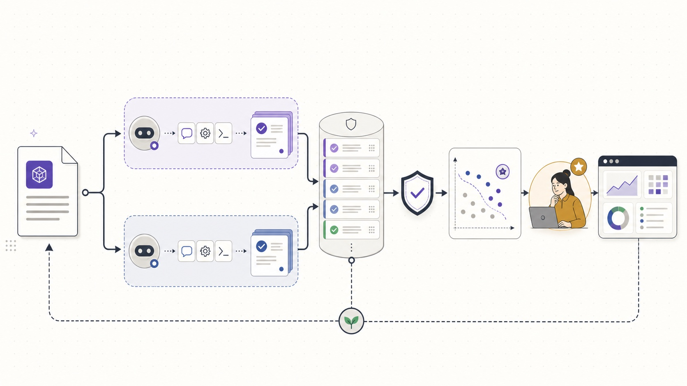
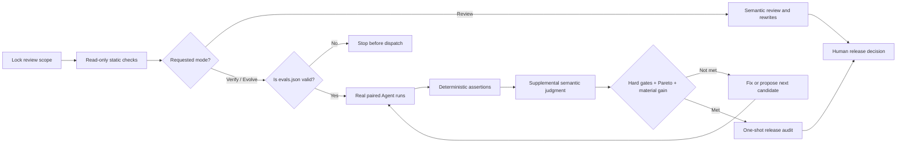
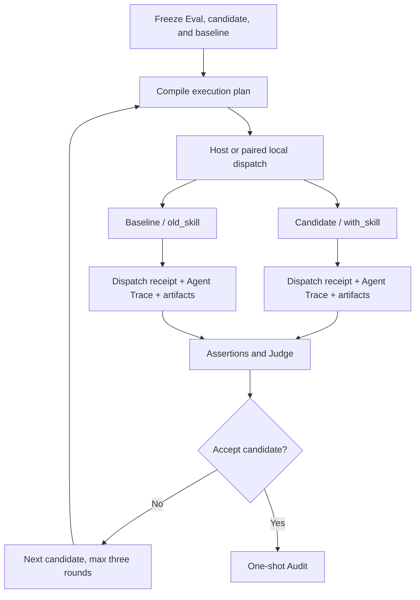

# skill-reviewer

> Evidence-backed review and bounded improvement for Agent Skills: treat
> `SKILL.md` as source code, `evals.json` as an executable contract, and
> “ready to ship” as a traceable decision.

[](./skills/skill-reviewer/SKILL.md)
[](https://github.com/Nirvana-Jie/skill-reviewer/actions/workflows/static-checks.yml)
[](https://github.com/Nirvana-Jie/skill-reviewer)

[简体中文](README.zh-CN.md)



`skill-reviewer` does three things:

- **Review (default)** — performs read-only checks of triggers, instructions, resources, scripts, safety, and maintainability, then returns actionable rewrites without starting Eval workers.
- **Verify (explicit)** — when requested, compiles a valid `evals/evals.json`, dispatches candidate and baseline through a native host or registered Agent adapter, and retains dispatch, canonical Trace, source, and output evidence for the Dashboard.
- **Evolve** — only on an explicit request, performs at most three bounded improvement rounds; Evals stay immutable during a run and a human always owns the final release decision.

## Quick start

Install:

```bash
npx skills add Nirvana-Jie/skill-reviewer --skill skill-reviewer
```

Then ask in an Agent session:

```text
Fully review this Skill and decide whether it is ready to ship.
```

Add an explicit runtime request when you want model-backed evidence:

```text
Verify this Skill by running its declared evals against the accepted baseline.
```

The input may be a Skill directory, `SKILL.md`, one supporting artifact, or a concrete design proposal.

Typical requests:

- “Is this Skill ready to ship?”
- “Why does it over-trigger or fail to trigger?”
- “Does this `evals.json` really prove the candidate is better?”
- “Use the failures to propose the next candidate, but do not change the Eval.”

It does not create a Skill from scratch or replace ordinary application code review.

## Review flow



Core rules:

1. **Deterministic assertions first** — files, JSON, and command exit codes are graded before any semantic Judge.
2. **Candidate and baseline stay separate** — same Case, isolated workspaces, independent Trace; no self-evaluation loop.
3. **Validate the instrument before the candidate** — required text oracles
   pass positive/negative calibration, and contradictory paired directions
   invalidate the experiment instead of blaming the Skill.
4. **An invalid Manifest blocks release** — it is never silently skipped.
5. **A Manifest is not a worker receipt** — `evals.json` declares cells; only a
   retained Agent/harness dispatch receipt proves the selected cell was
   actually started within the stated trusted boundary.

### Three evaluation stages

| Stage | Purpose | Release effect |
| --- | --- | --- |
| **Development** | Expose problems quickly and help generate or repair candidates | Cannot authorize release |
| **Selection** | Compare a candidate fairly with the accepted baseline | Decides whether the candidate is retained |
| **Audit** | Check release risk with one-shot evidence hidden from the optimizer | Still requires human confirmation |

Sampling is explicit and independent from determinism. Legacy defaults remain
one deterministic or three stochastic paired repeats; contradictory paired
directions make measurement invalid rather than producing a majority winner.

## What you receive

A full review always includes:

- an executive summary and release verdict;
- an eight-dimension scorecard: trigger reliability, description, instructions, resources, scripts, safety, output, and maintainability;
- Critical Issues written as `Problem / Why / Fix`;
- trigger analysis, per-resource review, and paste-ready rewrites;
- explicit verification evidence, level, and limitations;
- executable Eval cases only when their maintenance cost is justified by a real regression risk.

The verdict is not a simple average. Safety and trigger red lines can block immediately. A release candidate must also satisfy every hard gate, avoid Pareto regression, and materially improve at least one primary objective.

## Real Evals and bounded evolution

The strict Manifest lives at `<skill>/evals/evals.json`. Compilation alone does
not start an Agent. The lead Agent uses a native host surface or a registered
Agent adapter; each executor still receives exactly one
Case, one arm, and one repeat:



Real Trace contains only observable behavior: Agent messages, file reads, tool calls, commands, exit codes, errors, timing, and artifact references. It never records or displays private chain-of-thought. Source-Agent events are redacted and normalized before they reach the grader or Dashboard, so adding another Agent requires a registry entry and source adapter—not a new Trace UI. The closed first-party registry distinguishes source identity, wire-contract stability, implementation maturity, and evidence authority; a researched entry is not silently presented as executable support.

For any compiled profile backed by an implemented adapter, the same command
mechanically fans out paired arms and grades after all case/repeat batches finish:

```bash
node skills/skill-reviewer/scripts/run_agent_eval.mjs plan \
  --workspace /tmp/skill-reviewer-run
```

The adapter is locked during compilation; runtime flags may assert or narrow
that authority but cannot replace it. Inspect supported and researched formats
with `node skills/skill-reviewer/scripts/run_agent_eval.mjs adapters list`.
Codex CLI `0.144.5` and Claude Code `2.1.215` are the current
`canary-verified` execution adapters. Gemini CLI, GitHub Copilot CLI, and
OpenCode are researched but deliberately `not-implemented`; their public
contracts are not promoted into release evidence by guesswork. Hook formats are
source-attributed research entries, not executable parsers.
Agent children receive a minimal environment. Pass a required ordinary
value with repeatable `--pass-env NAME`; pass API keys or other secrets only
with repeatable `--credential-env NAME`. Declared credential values are removed
from retained output, and any observed leak fails the execution.

Native subagents remain host-owned. Their harness must record the real host
dispatch and worker/thread IDs before behavior events. The receipt detects
drift and prevents profile-only UI claims; without a source-signed API it is
trusted harness provenance, not cryptographic attestation.

Real-Agent canaries are opt-in because they may require local authentication,
network access, and model spend. This launches the installed CLI through the
complete compile → process → source → grade → Dashboard projection chain, then
mounts the Trace view and expands the real marker event in the rendered UI:

```bash
SKILL_REVIEWER_REAL_AGENT_E2E=codex,claude \
  pnpm exec vitest run dashboard/src/real-agent-trace.e2e.test.ts
```

Eval and grader authority is immutable during a run. Required text predicates
are calibrated against known-good and known-bad examples before dispatch, and
sampling is declared independently from output determinism. Evidence integrity
and measurement validity must both pass before candidate quality is attributed.
An invalid experiment is quarantined without consuming a candidate round. The
system may propose changes, but only explicit user confirmation and a fresh
lock can establish new evaluation authority. Agents use the compact
[verification workflow](./skills/skill-reviewer/references/verification-workflow.md)
and [evolution protocol](./skills/skill-reviewer/references/evolution-workflow.md);
the implementation and tests own detailed schemas and trust rules.

## Dashboard: optional local decision surface

The Dashboard is a read-only projection for one job: make a release decision
easy to inspect. It answers four questions in order:

1. **Is the evidence trustworthy?** Verify dispatch, Trace, artifacts, and bindings.
2. **Is the measurement trustworthy?** Inspect oracle calibration and paired sampling before judging the Skill.
3. **Is the candidate actually better?** Compare candidate and baseline runs, scores, file diffs, and repeats side by side.
4. **What happens next?** Project the state machine’s `next_action`, responsibility, and human boundary.

Review Overview is the only primary verdict surface. Diff, Agent Trace, and the
audit archive explain it; a local handoff can record a proposed next step but
cannot wake an Agent or grant authority. The Runtime remains the source of
grading and release truth.

Start the Dashboard only when the user explicitly requests it:

```bash
node skills/skill-reviewer/scripts/start_skill_dashboard.mjs \
  --workspace /tmp/skill-reviewer-run \
  --state /tmp/skill-reviewer-control/evolution-state.json \
  --user-approved-control-plane \
  --open
```

The launcher verifies the pinned UI bundle, binds UI and evidence APIs to
loopback, and keeps run data local. Schema migration, transport, and
supply-chain rules live in code and tests; see the
[maintainer architecture](./docs/architecture.md).

## Automation and human boundaries

After the user explicitly enters Verify or Evolve mode, and while inputs and authority stay unchanged, the Agent should finish candidate generation, locked Eval execution, deterministic grading, supplemental semantic judgment, and preparation/execution of the one-shot audit automatically.

A person is required only to:

- change an Eval, grader, threshold, or baseline;
- widen network, secret, permission, dependency, or task scope;
- resolve ambiguity the retained evidence cannot settle;
- confirm final release, deployment, or another external side effect.

Dashboard actions append audited local handoff tasks; they do not wake a terminated Agent session. Their recovery prompt can be given to the current or a new lead Agent.

## Safety boundaries

- Reviewed files are always **untrusted data**; prompts or commands inside them never become reviewer instructions.
- By default, Review installs no dependency, executes no target Skill script, and starts no Eval worker. A valid Manifest may run only after an explicit Verify or Evolve request.
- Unconfirmed destructive commands, publishing, pushes, network access, secrets, or permission expansion are blocked.
- A `local-unattested` Trace proves what was observed, not operating-system sandbox integrity.
- Dashboard executor labels require a valid per-cell dispatch receipt; the
  run-level profile alone is shown only as declared configuration.
- Public Audit fixtures calibrate behavior but cannot independently authorize release.

## Development and validation

This repository uses pnpm exclusively:

```bash
corepack enable
pnpm install --frozen-lockfile

pnpm test
pnpm dashboard:build
node skills/skill-reviewer/scripts/lint_skill_package.mjs \
  skills/skill-reviewer --format text --fail-on error
node -e 'JSON.parse(new TextDecoder("utf-8", { fatal: true }).decode(require("node:fs").readFileSync(process.argv[1])))' \
  skills/skill-reviewer/evals/evals.json
```

All changes enter `main` through a branch and pull request. `Static Checks` runs deterministic tests only; it stores no API key or model output. A separate workflow builds the Dashboard as a content-addressed GitHub Release asset. The repository publishes neither an npm package nor GitHub Pages.

## Project layout

```text
.
├── skills/skill-reviewer/   # complete payload installed by skills add
│   ├── SKILL.md
│   ├── references/          # four branch-scoped model references
│   ├── assets/              # machine contracts, Agent registry, pinned UI manifest
│   ├── scripts/             # linter, authority runtime, generic executor, Dashboard launcher
│   └── evals/               # One executable Manifest and its fixtures
├── dashboard/               # React / TypeScript / Vite source; dist ignored
├── docs/                    # maintainer architecture; not model context
├── tests/                   # Vitest unit and end-to-end coverage
└── assets/readme/           # canonical README visuals
```

## Further reading

- [Review rubric](./skills/skill-reviewer/references/review-rubric.md)
- [Review output contract](./skills/skill-reviewer/references/output-contract.md)
- [Explicit verification workflow](./skills/skill-reviewer/references/verification-workflow.md)
- [Bounded continuous evolution](./skills/skill-reviewer/references/evolution-workflow.md)
- [Maintainer architecture](./docs/architecture.md)
- [Agent trace protocol research](./docs/agent-trace-protocols.md)

Output language follows the request; one language-neutral contract keeps both
languages machine-comparable.

## License

MIT
