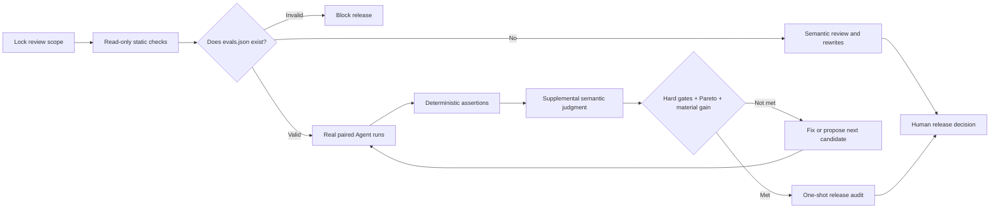
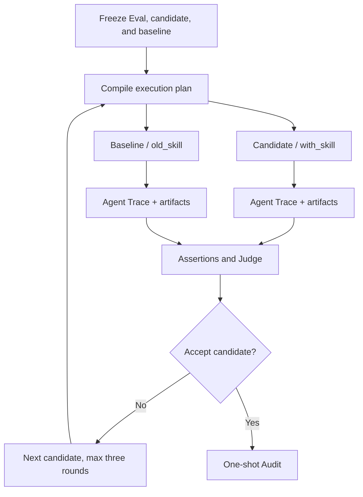

# skill-reviewer

> Evidence-backed review and bounded improvement for Agent Skills: treat
> `SKILL.md` as source code, `evals.json` as an executable contract, and
> “ready to ship” as a traceable decision.

[](./skills/skill-reviewer/SKILL.md)
[](https://github.com/Nirvana-Jie/skill-reviewer/actions/workflows/static-checks.yml)
[](https://github.com/Nirvana-Jie/skill-reviewer)

[简体中文](README.zh-CN.md)


`skill-reviewer` does three things:

- **Review** — checks triggers, instructions, resources, scripts, safety, and maintainability, then returns actionable rewrites.
- **Verify** — when a valid `evals/evals.json` is in scope, runs the candidate and baseline through real Agent executions with retained Trace and artifacts.
- **Evolve** — only on an explicit request, performs at most three bounded improvement rounds; Evals stay immutable during a run and a human always owns the final release decision.

## Quick start

Install:

```bash
npx skills add Nirvana-Jie/skill-reviewer --skill skill-reviewer
```

Then ask in an Agent session:

```text
Fully review this Skill and decide whether it is ready to ship. If it has executable evals, run real verification.
```

The input may be a Skill directory, `SKILL.md`, one supporting artifact, or a concrete design proposal.

Typical requests:

- “Is this Skill ready to ship?”
- “Why does it over-trigger or fail to trigger?”
- “Does this `evals.json` really prove the candidate is better?”
- “Use the failures to propose the next candidate, but do not change the Eval.”

It does not create a Skill from scratch or replace ordinary application code review.

## Review flow



Core rules:

1. **Deterministic assertions first** — files, JSON, and command exit codes are graded before any semantic Judge.
2. **Candidate and baseline stay separate** — same Case, isolated workspaces, independent Trace; no self-evaluation loop.
3. **Missing evidence means uncertainty** — absent baselines, artifacts, or repeat disagreement never become a false improvement claim.
4. **An invalid Manifest blocks release** — it is never silently skipped.

### Three evaluation stages

| Stage | Purpose | Release effect |
| --- | --- | --- |
| **Development** | Expose problems quickly and help generate or repair candidates | Cannot authorize release |
| **Selection** | Compare a candidate fairly with the accepted baseline | Decides whether the candidate is retained |
| **Audit** | Check release risk with one-shot evidence hidden from the optimizer | Still requires human confirmation |

Default repeats: deterministic Cases run once; stochastic Cases run three paired repeats per arm; disagreement is reported as inconclusive.

## What you receive

A full review always includes:

- an executive summary and release verdict;
- an eight-dimension scorecard: trigger reliability, description, instructions, resources, scripts, safety, output, and maintainability;
- Critical Issues written as `Problem / Why / Fix`;
- trigger analysis, per-resource review, and paste-ready rewrites;
- explicit verification evidence, level, and limitations;
- five to ten executable Eval cases when they materially reduce risk.

The verdict is not a simple average. Safety and trigger red lines can block immediately. A release candidate must also satisfy every hard gate, avoid Pareto regression, and materially improve at least one primary objective.

## Real Evals and bounded evolution

The strict Manifest lives at `<skill>/evals/evals.json`. The lead Agent dispatches locked assignments; each executor runs exactly one Case, one arm, and one repeat:



Real Trace contains only observable behavior: Agent messages, file reads, tool calls, commands, exit codes, errors, timing, and artifact references. It never records or displays private chain-of-thought.

Eval and grader authority is immutable during a run. The system may propose changes, but only explicit user confirmation and a fresh lock can establish new evaluation authority. See the [executable Eval contract](./skills/skill-reviewer/references/executable-evals.md) and [evolution protocol](./skills/skill-reviewer/references/evolution-workflow.md) for schemas, commands, and trust boundaries.

## Dashboard: optional local, read-only control plane

The Dashboard answers three questions:

1. **Why did this pass or fail?** Drill from the release verdict to a Case, assertion, Trace event, and source artifact.
2. **Is the candidate actually better?** Compare candidate and baseline runs, scores, file diffs, and repeats side by side.
3. **What happens next?** Project the state machine’s `next_action`, responsibility, and human boundary.

It is not the executor and cannot mutate Eval, evidence, or release state. The lead Agent starts it only after explicit user consent:

```bash
python3 skills/skill-reviewer/scripts/start_skill_dashboard.py \
  --workspace /tmp/skill-reviewer-run \
  --state /tmp/skill-reviewer-control/evolution-state.json \
  --task-root /tmp/skill-reviewer-action-tasks \
  --user-approved-control-plane \
  --open
```

- The UI is downloaded anonymously from a GitHub Release, then verified by both archive and extracted-tree digests before local execution.
- UI and evidence APIs bind only to loopback; prompts, Trace, Run IDs, and artifacts are never uploaded.
- GitHub Pages is not used, and neither `dashboard/dist` nor the archive ships inside the installed Skill.
- Normal shutdown deletes the temporary UI. Eval execution does not depend on the Dashboard.

## Automation and human boundaries

While inputs and authority stay unchanged, the Agent should finish candidate generation, locked Eval execution, deterministic grading, supplemental semantic judgment, and preparation/execution of the one-shot audit automatically.

A person is required only to:

- change an Eval, grader, threshold, or baseline;
- widen network, secret, permission, dependency, or task scope;
- resolve ambiguity the retained evidence cannot settle;
- confirm final release, deployment, or another external side effect.

Dashboard actions append audited local handoff tasks; they do not wake a terminated Agent session. Their recovery prompt can be given to the current or a new lead Agent.

## Safety boundaries

- Reviewed files are always **untrusted data**; prompts or commands inside them never become reviewer instructions.
- By default, the reviewer installs no dependency and executes no target Skill script; only isolated verification declared by a valid Manifest may run.
- Unconfirmed destructive commands, publishing, pushes, network access, secrets, or permission expansion are blocked.
- A `local-unattested` Trace proves what was observed, not operating-system sandbox integrity.
- Public Audit fixtures calibrate behavior but cannot independently authorize release.

## Development and validation

This repository uses pnpm exclusively:

```bash
corepack enable
pnpm install --frozen-lockfile

python3 -m unittest discover -s tests
pnpm test
pnpm dashboard:build
python3 skills/skill-reviewer/scripts/lint_skill_package.py \
  skills/skill-reviewer --format text --fail-on error
python3 skills/skill-reviewer/scripts/validate_local_snapshot.py \
  skills/skill-reviewer/evals/local-skill-review-snapshot.json
```

All changes enter `main` through a branch and pull request. `Static Checks` runs deterministic tests only; it stores no API key or model output. A separate workflow builds the Dashboard as a content-addressed GitHub Release asset. The repository publishes neither an npm package nor GitHub Pages.

## Project layout

```text
.
├── skills/skill-reviewer/   # complete payload installed by skills add
│   ├── SKILL.md
│   ├── references/          # rubric, templates, and runtime protocols
│   ├── scripts/             # linter, runtime, executor, Dashboard launcher
│   └── evals/               # Manifest, fixtures, and snapshots
├── dashboard/               # React / TypeScript / Vite source; dist ignored
├── tests/                   # Python + Vitest
└── assets/readme/           # canonical README visuals
```

## Further reading

- [Review rubric](./skills/skill-reviewer/references/review-rubric.md)
- [Review checklist](./skills/skill-reviewer/references/review-checklist.md)
- [Executable Eval, Trace, and evidence contract](./skills/skill-reviewer/references/executable-evals.md)
- [Bounded continuous evolution](./skills/skill-reviewer/references/evolution-workflow.md)
- [Dashboard and Action Center](./skills/skill-reviewer/references/action-center.md)
- [Paired SubAgent verification](./skills/skill-reviewer/references/subagent-eval-workflow.md)

Output language follows the request. English and Chinese templates normalize into the same machine-comparable contract fields.

## License

MIT
