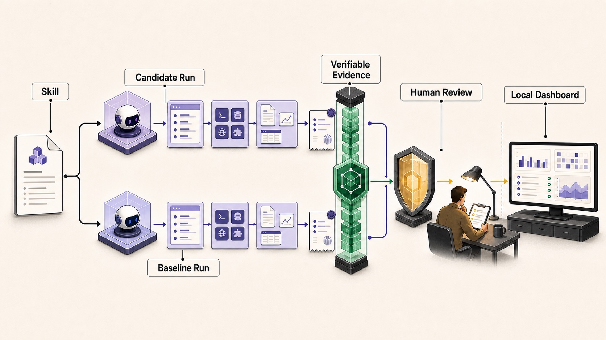

# skill-reviewer

> Evidence-backed review for Agent Skills.

[](./skills/skill-reviewer/SKILL.md)
[](https://github.com/Nirvana-Jie/skill-reviewer/actions/workflows/static-checks.yml)
[](https://github.com/Nirvana-Jie/skill-reviewer/releases/latest)
[](https://github.com/Nirvana-Jie/skill-reviewer)

[简体中文](README.zh-CN.md)



Agent Skills are executable workflows, not just prompt files. They influence how
an Agent understands a task, calls tools, handles permissions, and decides when
work is complete. A Skill can read well and still fail in execution.

`skill-reviewer` reviews an existing Skill as an engineering artifact. It starts
with a read-only package review, can run real paired Agent Evals when explicitly
requested, and retains the Diff, Trace, and artifacts needed to answer:

- **Is this Skill ready to use?**
- **Did the proposed change actually make it better?**

## When to use it

| Situation | Example request |
| --- | --- |
| Review before adoption or release | “Review this Skill and tell me whether it is ready to ship.” |
| Diagnose unreliable behavior | “Why does this Skill over-trigger, miss requests, or call the wrong tools?” |
| Validate a change | “Run the declared Evals against the accepted baseline and show me the evidence.” |
| Audit an Eval | “Does this `evals.json` actually measure the behavior it claims?” |
| Improve from failures | “Use the retained failures to propose the next candidate without changing the Eval.” |

It accepts a Skill directory, `SKILL.md`, a supporting artifact, or a concrete
design proposal. It does not create a Skill from scratch or replace application
code review.

## Three modes

| Mode | Purpose | Boundary |
| --- | --- | --- |
| **Review** (default) | Audit triggers, instructions, resources, scripts, safety, and maintainability; return actionable rewrites | Read-only; no Eval worker |
| **Verify** (explicit) | Run declared candidate and baseline Evals and retain observable evidence | Starts only when requested |
| **Evolve** (explicit) | Generate bounded candidates from retained failures and verify each one | Eval authority stays fixed; a person decides release |

## Quick start

Install the Skill:

```bash
npx skills add Nirvana-Jie/skill-reviewer --skill skill-reviewer
```

Then ask your Agent:

```text
Review this Skill and decide whether it is ready to use.
```

Request real execution evidence only when you need it:

```text
Verify this Skill by running its declared Evals against the accepted baseline.
```

## What you get

A review produces:

- a clear verdict with evidence level and limitations;
- an eight-dimension scorecard covering triggers, description, instructions,
  resources, scripts, safety, output, and maintainability;
- critical issues written as `Problem / Why / Fix`;
- trigger analysis, resource review, and paste-ready rewrites;
- for real Evals, paired results with retained Diff, Trace, and artifacts;
- an optional local Dashboard for inspecting the decision evidence.

## Design

1. **Static review comes first.** The default path does not execute the target
   Skill, install its dependencies, or start an Eval worker.
2. **Evidence strength is explicit.** Review stays read-only; Verify and Evolve
   require a direct request because they may use authentication, network access,
   model time, or local tools.
3. **Candidate and baseline run separately.** They receive the same Case in
   isolated workspaces and cannot grade themselves.
4. **The measurement is checked before the result.** Invalid manifests,
   uncalibrated assertions, missing dispatch receipts, or incomplete evidence
   block attribution to the Skill.
5. **The evidence model is Agent-neutral.** Source events are redacted and
   normalized into observable messages, tool calls, commands, exit codes,
   timing, and artifact references. Private chain-of-thought is never retained.
6. **Humans own the final decision.** The Runtime grades; the Dashboard explains;
   a person approves release or any other external side effect.

The Trace UI is not tied to Codex. Execution support is adapter-gated and
source-attributed: Codex CLI and Claude Code are currently canary-verified;
researched-only Agent formats are not presented as executable support.

## Local Dashboard

The Dashboard is a read-only decision surface:

- **Review** answers whether the candidate should be accepted and why.
- **Diff** shows what changed.
- **Trace** shows what the Agents actually did.
- **Audit** exposes the retained raw evidence.

It runs on loopback and keeps review evidence local. Start it only after an
explicit user request:

```bash
node skills/skill-reviewer/scripts/start_skill_dashboard.mjs \
  --workspace /tmp/skill-reviewer-run \
  --state /tmp/skill-reviewer-control/evolution-state.json \
  --user-approved-dashboard \
  --open
```

## Safety boundaries

- Reviewed files are always treated as untrusted data.
- Review mode does not run target scripts or widen permissions.
- Verify and Evolve cannot silently change the Eval, baseline, grader, or
  thresholds during a run.
- Credentials must be declared explicitly, are removed from retained output,
  and any observed leak fails the execution.
- Publishing, pushes, deployment, destructive commands, and permission expansion
  require human confirmation.

## Learn more

- [Skill instructions](./skills/skill-reviewer/SKILL.md)
- [Review rubric](./skills/skill-reviewer/references/review-rubric.md)
- [Verification workflow](./skills/skill-reviewer/references/verification-workflow.md)
- [Evolution workflow](./skills/skill-reviewer/references/evolution-workflow.md)
- [Maintainer architecture](./docs/architecture.md)
- [Contributing](./CONTRIBUTING.md)

## License

MIT
