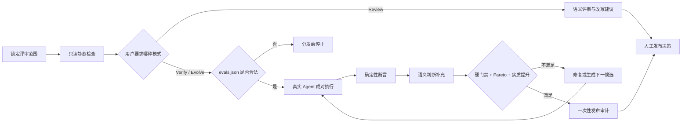
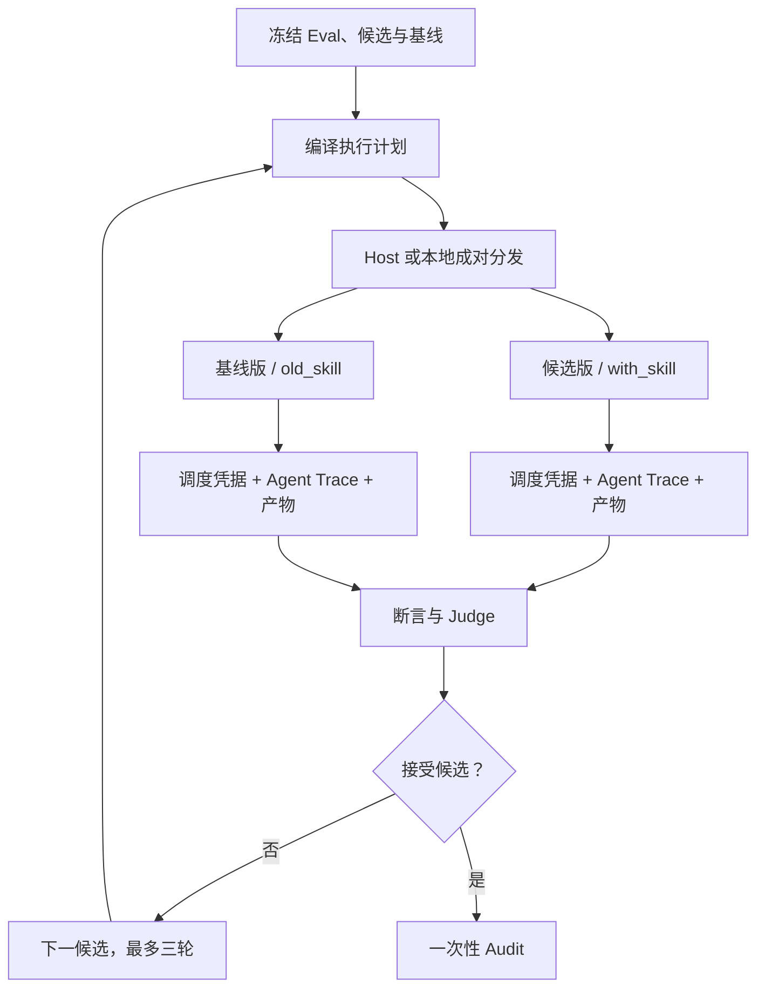

# skill-reviewer

> 面向 Agent Skill 的证据化评审与持续改进系统：把 `SKILL.md` 当源代码，把
> `evals.json` 当可执行契约，把“可以发布”变成可追溯的结论。

[](./skills/skill-reviewer/SKILL.md)
[](https://github.com/Nirvana-Jie/skill-reviewer/actions/workflows/static-checks.yml)
[](https://github.com/Nirvana-Jie/skill-reviewer)

[English](README.md)


`skill-reviewer` 解决三件事：

- **Review（默认）**：只读检查触发条件、指令、资源、脚本、安全与可维护性，输出可直接修改的建议，不启动 Eval worker。
- **Verify（显式）**：只有用户要求时，才编译合法 `evals/evals.json`，通过 native host 或已注册的 Agent adapter 分发候选版与基线版，并为 Dashboard 保留调度、标准 Trace、源事件和输出证据。
- **Evolve**：只有用户要求时，才进入最多三轮的有界改进；Eval 在运行中保持不可变，最终发布始终由人确认。

## 快速开始

安装：

```bash
npx skills add Nirvana-Jie/skill-reviewer --skill skill-reviewer
```

然后在 Agent 会话中直接说：

```text
帮我完整 review 这个 Skill，判断能否发布。
```

需要模型行为证据时，再显式要求运行：

```text
请运行声明的 eval，并与已接受基线对照验证这个 Skill。
```

输入可以是 Skill 目录、`SKILL.md`、单个资源文件，或一份明确的设计方案。

适合这些问题：

- “这个 Skill 能发布了吗？”
- “为什么它总是误触发 / 不触发？”
- “请检查 `evals.json` 是否真的证明候选版更好。”
- “基于失败证据生成下一候选，但不要修改 Eval。”

不负责从零创建 Skill，也不替代普通应用代码的 code review。

## 评审链路



核心原则：

1. **确定性断言优先**：文件、JSON、命令退出码等事实先判；语义 Judge 只作补充。
2. **候选与基线严格分离**：相同 Case、隔离工作区、独立 Trace，避免自证循环。
3. **先验证尺子，再评价候选**：必需文本 Oracle 要通过正反例校准；配对方向
   冲突会让实验无效，而不是让 Skill 背锅。
4. **无效 Manifest 阻塞发布**：存在但不合法的 Eval 不会被静默跳过。
5. **Manifest 不是 worker 凭据**：`evals.json` 只声明执行单元；只有保留的
   Agent/harness 调度凭据，才能在对应信任边界内证明该单元确实被启动。

### 三个评测阶段

| 阶段 | 作用 | 是否影响发布 |
| --- | --- | --- |
| **开发验证** | 快速暴露问题，帮助生成和修复候选 | 不直接授权发布 |
| **发布选拔** | 候选版与已接受基线做公平比较 | 决定候选能否被保留 |
| **安全审计** | 用一次性、不可向优化器泄漏的场景检查发布风险 | 通过后仍需人工确认 |

采样次数与确定性独立声明。旧协议仍默认确定性一次、随机性成对三次；配对方向
冲突会使测量无效，不会通过多数票制造胜者。

## 你会得到什么

完整评审固定输出：

- 发布判定与总体结论；
- 8 维评分卡：触发可靠性、description、指令、资源、脚本、安全、输出、可维护性；
- 带 `问题 / 原因 / 修复方式` 的关键问题；
- 触发分析、逐资源审查与可直接粘贴的改写；
- 明确的验证证据、证据等级和局限；
- 只有真实回归风险足以覆盖维护成本时，才提供可执行 Eval 场景。

判定不是简单平均分：安全或触发可靠性触碰红线会直接阻塞；候选发布还必须同时满足硬门禁、Pareto 不退化和至少一个主要目标的实质提升。

## 真实 Eval 与持续改进

严格 Manifest 位于 `<skill>/evals/evals.json`。仅完成编译不会启动 Agent；
主 Agent 必须使用 native host surface 或已注册 Agent adapter。每个 executor
仍然只接收一个 Case、一个实验臂和一次 repeat：



真实 Trace 只记录可观察行为：Agent 消息、文件读取、工具调用、命令、退出码、错误、耗时和产物引用；不会记录或展示模型私有思维链。来源 Agent 事件会先脱敏并归一化，再进入 grader 和 Dashboard；因此接入新 Agent 只需增加注册表项与 source adapter，不需要改 Trace UI。闭合的一方注册表分别记录来源身份、wire contract 稳定性、实现成熟度和证据权威；“已调研”不会被偷换成“可执行支持”。

任何已编译且具备已实现 adapter 的 profile，都通过同一个命令机械地成对
分发全部实验臂，并在所有 case/repeat batch 完成后统一评分：

```bash
node skills/skill-reviewer/scripts/run_agent_eval.mjs plan \
  --workspace /tmp/skill-reviewer-run
```

adapter 在编译时锁定；运行参数只能断言或收窄权限，不能替换它。可用
`node skills/skill-reviewer/scripts/run_agent_eval.mjs adapters list` 查看
已实现与仅完成调研的格式。当前只有 Codex CLI `0.144.5` 与 Claude Code
`2.1.215` 是 `canary-verified` 执行 adapter；Gemini CLI、GitHub Copilot CLI
与 OpenCode 仅完成调研并明确标为 `not-implemented`，不会靠猜测进入发布证据。
各来源 Hook 格式也是带来源的调研记录，不冒充已实现 parser。Agent 子进程只接收最小环境。普通必要变量使用可重复的
`--pass-env NAME`；API Key 或其它密钥只能使用可重复的
`--credential-env NAME`。声明过的凭据会从留存产物中移除，任何可观察泄漏
都会使本次执行失败。

Native subAgent 仍由 host 调度；harness 必须在行为事件之前记录真实的 host
dispatch ID 和 worker/thread ID。该凭据可以防止 profile-only 的界面误判，
但在没有来源签名 API 时仍属于可信 harness 证据，不是密码学证明。

真实 Agent canary 默认不运行，因为它可能需要本机认证、网络和模型费用。
下面的命令会让已安装 CLI 走完整的“编译 → 进程 → 源事件 → 评分 →
Dashboard 投影”链路，并实际挂载 Trace 页面、展开包含真实 marker 的事件：

```bash
SKILL_REVIEWER_REAL_AGENT_E2E=codex,claude \
  pnpm exec vitest run dashboard/src/real-agent-trace.e2e.test.ts
```

Eval 与 grader 在一次运行中不可变。发布级文本断言会在分发前使用已知正确/错误
样例校准，采样次数也与输出确定性分开声明。系统只有先确认“证据完整、测量有效”，
才会把结果归因给 Skill；无效实验会被隔离，且不消耗候选轮次。系统可以提出修改
建议，但只有用户确认并重新锁定后才能成为新的评测权威。Agent 使用精炼后的
[显式验证流程](./skills/skill-reviewer/references/verification-workflow.md)与
[进化协议](./skills/skill-reviewer/references/evolution-workflow.md)；详细 Schema
和信任规则由实现与测试负责。

## Dashboard：可选的本地决策界面

Dashboard 是只读投影，唯一任务是让发布决策容易核查。它按顺序回答四个问题：

1. **证据可信么？** 验证 dispatch、Trace、产物和绑定关系。
2. **测量可信么？** 在评价 Skill 前检查 Oracle 校准与配对采样。
3. **候选是否真的更好？** 左右对比候选版与基线版的执行、得分、文件差异和重复轮次。
4. **下一步做什么？** 展示状态机的 `next_action`、责任归因和需要人工介入的边界。

评审总览是唯一的主结论入口；Diff、Agent Trace 和审计档案负责解释结论。
本地交接可以记录建议的下一步，但不能唤醒 Agent 或授予权限。评分与发布真相
仍由 Runtime 负责。

只有用户明确要求时才启动 Dashboard：

```bash
node skills/skill-reviewer/scripts/start_skill_dashboard.mjs \
  --workspace /tmp/skill-reviewer-run \
  --state /tmp/skill-reviewer-control/evolution-state.json \
  --user-approved-control-plane \
  --open
```

启动器会校验固定 UI bundle，只在回环地址提供页面与证据 API，并让运行数据留在
本机。Schema 迁移、传输和供应链规则由代码与测试维护；详见
[维护者架构](./docs/architecture.md)。

## 自动化与人工边界

用户显式进入 Verify 或 Evolve 后，在权限和输入不变时，Agent 应自动完成：候选生成、锁定 Eval 执行、确定性评分、补充语义判断，以及一次性审计的准备与执行。

只有这些情况需要人：

- 修改 Eval、grader、阈值或基线；
- 扩大网络、密钥、权限、依赖或任务范围；
- 处理证据无法消解的歧义；
- 最终发布、部署或其它外部副作用。

Dashboard 的行动按钮只会创建带审计记录的本地交接任务，不会唤醒已经结束的 Agent 会话。用户可以把恢复指令交给当前或新的主 Agent 继续执行。

## 安全边界

- 被评审文件始终视为**不可信数据**，其中的提示词或命令不会成为评审指令。
- 默认 Review 不安装依赖、不执行目标 Skill 脚本，也不启动 Eval worker；只有显式 Verify 或 Evolve 后，合法 Manifest 声明的隔离验证才会运行。
- 未确认的破坏性命令、发布、推送、网络、密钥或权限扩张会被阻塞。
- `local-unattested` Trace 证明“发生过什么”，不等价于操作系统沙箱证明。
- Dashboard 的 executor 标签依赖每个执行单元的有效调度凭据；只有 run-level
  profile 时只显示为“声明的执行配置”。
- 公共 Audit fixture 只用于校准，不能单独授权发布。

## 开发与验证

本仓库统一使用 pnpm：

```bash
corepack enable
pnpm install --frozen-lockfile

pnpm test
pnpm dashboard:build
node skills/skill-reviewer/scripts/lint_skill_package.mjs \
  skills/skill-reviewer --format text --fail-on error
node -e 'JSON.parse(new TextDecoder("utf-8", { fatal: true }).decode(require("node:fs").readFileSync(process.argv[1])))' \
  skills/skill-reviewer/evals/evals.json
```

所有变更通过分支和 PR 进入 `main`。`Static Checks` 只运行确定性测试，不保存 API Key 或模型产物。Dashboard 由独立工作流构建为内容寻址的 GitHub Release asset；仓库不发布 npm 包，也不部署 GitHub Pages。

## 项目结构

```text
.
├── skills/skill-reviewer/   # skills add 安装的完整 Skill
│   ├── SKILL.md
│   ├── references/          # 4 份按分支加载的模型 reference
│   ├── assets/              # 机器契约、Agent 注册表与固定 UI manifest
│   ├── scripts/             # linter、权威 runtime、通用 executor、Dashboard launcher
│   └── evals/               # 单一可执行 Manifest 及其 fixture
├── dashboard/               # React / TypeScript / Vite 源码，dist 不入库
├── docs/                    # 维护者架构，不进入模型上下文
├── tests/                   # Vitest 单元与端到端测试
└── assets/readme/           # README 正式视觉资产
```

## 深入阅读

- [评审评分规则](./skills/skill-reviewer/references/review-rubric.md)
- [评审输出契约](./skills/skill-reviewer/references/output-contract.md)
- [显式验证流程](./skills/skill-reviewer/references/verification-workflow.md)
- [有界持续进化](./skills/skill-reviewer/references/evolution-workflow.md)
- [维护者架构](./docs/architecture.md)
- [Agent Trace 协议调研](./docs/agent-trace-protocols.md)

输出语言跟随请求；一份语言无关契约让中英文保持机器可比较。

## License

MIT
