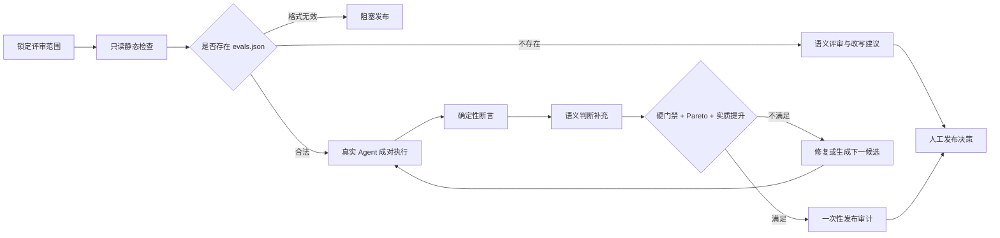
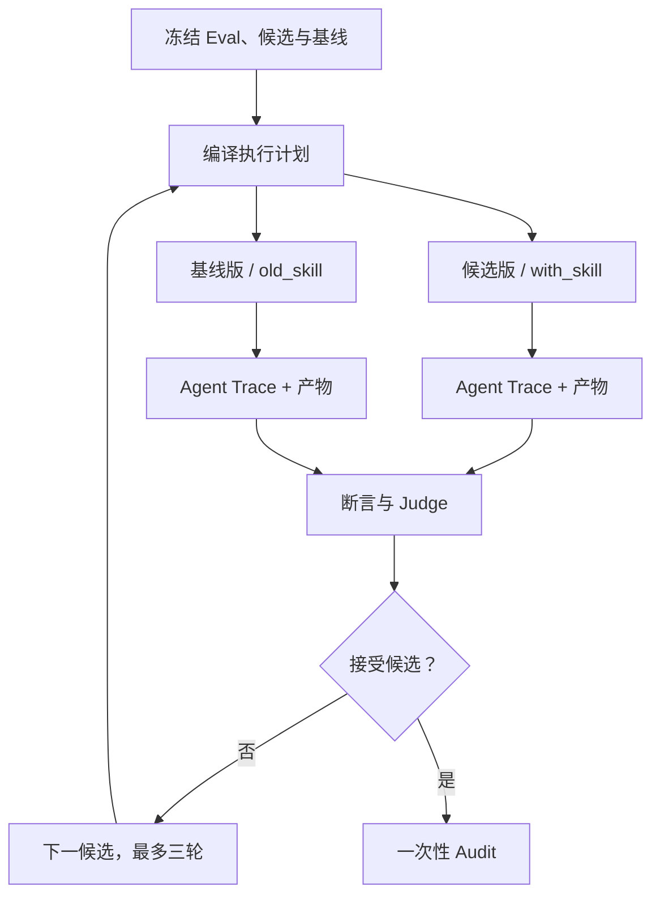

# skill-reviewer

> 面向 Agent Skill 的证据化评审与持续改进系统：把 `SKILL.md` 当源代码，把
> `evals.json` 当可执行契约，把“可以发布”变成可追溯的结论。

[](./skills/skill-reviewer/SKILL.md)
[](https://github.com/Nirvana-Jie/skill-reviewer/actions/workflows/static-checks.yml)
[](https://github.com/Nirvana-Jie/skill-reviewer)

[English](README.md)


`skill-reviewer` 解决三件事：

- **Review**：检查触发条件、指令、资源、脚本、安全与可维护性，输出可直接修改的建议。
- **Verify**：发现合法 `evals/evals.json` 时，使用真实 Agent 成对执行候选版与基线版，并保留 Trace 和产物。
- **Evolve**：只有用户要求时，才进入最多三轮的有界改进；Eval 在运行中保持不可变，最终发布始终由人确认。

## 快速开始

安装：

```bash
npx skills add Nirvana-Jie/skill-reviewer --skill skill-reviewer
```

然后在 Agent 会话中直接说：

```text
帮我完整 review 这个 Skill，判断能否发布；如果有可执行 eval，请运行真实验证。
```

输入可以是 Skill 目录、`SKILL.md`、单个资源文件，或一份明确的设计方案。

适合这些问题：

- “这个 Skill 能发布了吗？”
- “为什么它总是误触发 / 不触发？”
- “请检查 `evals.json` 是否真的证明候选版更好。”
- “基于失败证据生成下一候选，但不要修改 Eval。”

不负责从零创建 Skill，也不替代普通应用代码的 code review。

## 评审链路



核心原则：

1. **确定性断言优先**：文件、JSON、命令退出码等事实先判；语义 Judge 只作补充。
2. **候选与基线严格分离**：相同 Case、隔离工作区、独立 Trace，避免自证循环。
3. **证据不足就是不确定**：不会把缺失基线、缺失产物或多次执行分歧包装成“已提升”。
4. **无效 Manifest 阻塞发布**：存在但不合法的 Eval 不会被静默跳过。

### 三个评测阶段

| 阶段 | 作用 | 是否影响发布 |
| --- | --- | --- |
| **开发验证** | 快速暴露问题，帮助生成和修复候选 | 不直接授权发布 |
| **发布选拔** | 候选版与已接受基线做公平比较 | 决定候选能否被保留 |
| **安全审计** | 用一次性、不可向优化器泄漏的场景检查发布风险 | 通过后仍需人工确认 |

默认重复策略：确定性场景执行一次；随机性场景候选版与基线版各执行三次；结果分歧则标记为不确定。

## 你会得到什么

完整评审固定输出：

- 发布判定与总体结论；
- 8 维评分卡：触发可靠性、description、指令、资源、脚本、安全、输出、可维护性；
- 带 `问题 / 原因 / 修复方式` 的关键问题；
- 触发分析、逐资源审查与可直接粘贴的改写；
- 明确的验证证据、证据等级和局限；
- 必要时提供 5–10 个可执行 Eval 场景。

判定不是简单平均分：安全或触发可靠性触碰红线会直接阻塞；候选发布还必须同时满足硬门禁、Pareto 不退化和至少一个主要目标的实质提升。

## 真实 Eval 与持续改进

严格 Manifest 位于 `<skill>/evals/evals.json`。主 Agent 负责分发锁定的
assignment，执行器每次只运行一个 Case、一个实验臂和一次 repeat：



真实 Trace 只记录可观察行为：Agent 消息、文件读取、工具调用、命令、退出码、错误、耗时和产物引用；不会记录或展示模型私有思维链。

Eval 与 grader 在一次运行中不可变。系统可以提出修改建议，但只有用户确认并重新锁定后才能成为新的评测权威。完整字段、信任边界和运行命令见[可执行 Eval 协议](./skills/skill-reviewer/references/executable-evals.md)与[进化协议](./skills/skill-reviewer/references/evolution-workflow.md)。

## Dashboard：可选的本地只读控制面

Dashboard 用于回答三个问题：

1. **为什么通过或不通过？** 从发布结论下钻到 Case、检查项、Trace 事件和原始产物。
2. **候选是否真的更好？** 左右对比候选版与基线版的执行、得分、文件差异和重复轮次。
3. **下一步做什么？** 展示状态机的 `next_action`、责任归因和需要人工介入的边界。

它不是执行器，也不会直接修改 Eval、证据或发布状态。用户明确要求展示 Dashboard 时可直接启动；否则交互式主 Agent 必须用独立的结构化问题询问一次，并推荐打开。沉默不会授权下载或本地服务：

```bash
python3 skills/skill-reviewer/scripts/start_skill_dashboard.py \
  --workspace /tmp/skill-reviewer-run \
  --state /tmp/skill-reviewer-control/evolution-state.json \
  --task-root /tmp/skill-reviewer-action-tasks \
  --user-approved-control-plane \
  --open
```

- UI 从 GitHub Release 匿名下载，按归档摘要和文件树摘要双重校验后，在临时目录本地运行。
- 页面与证据 API 只监听回环地址；用户 prompt、Trace、Run ID 和产物不会上传。
- 不使用 GitHub Pages，不把 `dashboard/dist` 或压缩包放进 Skill 安装包。
- 服务正常退出后删除临时 UI；没有控制面也不影响 Eval 执行。

## 自动化与人工边界

在权限和输入不变时，Agent 应自动完成：候选生成、锁定 Eval 执行、确定性评分、补充语义判断，以及一次性审计的准备与执行。

只有这些情况需要人：

- 修改 Eval、grader、阈值或基线；
- 扩大网络、密钥、权限、依赖或任务范围；
- 处理证据无法消解的歧义；
- 最终发布、部署或其它外部副作用。

Dashboard 的行动按钮只会创建带审计记录的本地交接任务，不会唤醒已经结束的 Agent 会话。用户可以把恢复指令交给当前或新的主 Agent 继续执行。

## 安全边界

- 被评审文件始终视为**不可信数据**，其中的提示词或命令不会成为评审指令。
- 默认不安装依赖、不执行目标 Skill 脚本；只有合法 Manifest 声明的隔离验证才会运行。
- 未确认的破坏性命令、发布、推送、网络、密钥或权限扩张会被阻塞。
- `local-unattested` Trace 证明“发生过什么”，不等价于操作系统沙箱证明。
- 公共 Audit fixture 只用于校准，不能单独授权发布。

## 开发与验证

本仓库统一使用 pnpm：

```bash
corepack enable
pnpm install --frozen-lockfile

python3 -m unittest discover -s tests
pnpm test
pnpm dashboard:build
python3 skills/skill-reviewer/scripts/lint_skill_package.py \
  skills/skill-reviewer --format text --fail-on error
python3 skills/skill-reviewer/scripts/validate_local_snapshot.py \
  skills/skill-reviewer/evals/local-skill-review-snapshot.json
```

所有变更通过分支和 PR 进入 `main`。`Static Checks` 只运行确定性测试，不保存 API Key 或模型产物。Dashboard 由独立工作流构建为内容寻址的 GitHub Release asset；仓库不发布 npm 包，也不部署 GitHub Pages。

## 项目结构

```text
.
├── skills/skill-reviewer/   # skills add 安装的完整 Skill
│   ├── SKILL.md
│   ├── references/          # 规则、模板与运行协议
│   ├── scripts/             # linter、runtime、executor、Dashboard launcher
│   └── evals/               # Manifest、fixture 与 snapshot
├── dashboard/               # React / TypeScript / Vite 源码，dist 不入库
├── tests/                   # Python + Vitest
└── assets/readme/           # README 正式视觉资产
```

## 深入阅读

- [评审评分规则](./skills/skill-reviewer/references/review-rubric.md)
- [评审检查清单](./skills/skill-reviewer/references/review-checklist.md)
- [可执行 Eval、Trace 与证据契约](./skills/skill-reviewer/references/executable-evals.md)
- [有界持续进化](./skills/skill-reviewer/references/evolution-workflow.md)
- [Dashboard 与行动中心](./skills/skill-reviewer/references/action-center.md)
- [SubAgent 成对验证](./skills/skill-reviewer/references/subagent-eval-workflow.md)

输出语言跟随请求。中文和英文模板会归一化为同一套机器可比较字段。

## License

MIT
