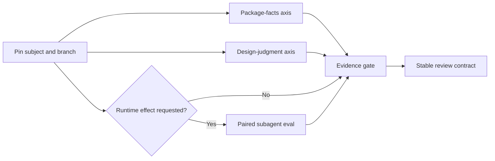

# skill-reviewer Quality Architecture

This document is the durable design map for `skill-reviewer`. It separates
deterministic package facts, semantic design judgment, behavioral evidence, and
release interpretation so one kind of evidence cannot impersonate another.

## Design inputs

The architecture adapts four ideas from
[`mattpocock/skills`](https://github.com/mattpocock/skills):

1. **Predictable process, not identical prose.** The
   [`writing-great-skills` reference](https://github.com/mattpocock/skills/blob/main/skills/productivity/writing-great-skills/SKILL.md)
   defines predictability as taking the same process every run and requires each
   step to end on a checkable completion criterion.
2. **Branch-based progressive disclosure.** Material needed by every branch
   stays in `SKILL.md`; language templates and runtime eval mechanics sit behind
   context pointers and load only when that branch fires.
3. **Independent axes.** The
   [`code-review` skill](https://github.com/mattpocock/skills/blob/main/skills/engineering/code-review/SKILL.md)
   keeps Standards and Spec subagents separate so one axis cannot hide failure
   on the other. `skill-reviewer` applies the same rule to package facts,
   semantic design, and effect evidence.
4. **Feedback at public seams.** The
   [`tdd` skill](https://github.com/mattpocock/skills/blob/main/skills/engineering/tdd/SKILL.md)
   rejects tautological tests and tests behavior at agreed seams. This project
   treats CLI JSON, review output sections, and retained eval artifacts as its
   public seams.

These are adaptations, not copied workflows. `skill-reviewer` remains a
model-invoked reviewer with a human-readable report and machine-readable
evidence artifacts.

## Pipeline



### Package-facts axis

Authority: `scripts/lint_skill_package.py`.

It checks only facts that should be deterministic:

- `SKILL.md` and front matter exist and parse at the supported structural level;
- `name` and `description` are present and `name` is kebab-case;
- local Markdown links resolve inside the package;
- resources are reachable from `SKILL.md` through exact or directory pointers;
- JSON eval manifests parse and behavior eval IDs are unique;
- dangerous command text and sensitive files are surfaced for semantic review.

It never executes reviewed scripts and never assigns semantic scores.

Public seam:

```json
{
  "schema_version": "skill-reviewer.static-analysis.v1",
  "subject": {"path": "...", "digest": "...", "files_scanned": 0},
  "passed": true,
  "summary": {"errors": 0, "warnings": 0, "info": 0},
  "findings": []
}
```

### Design-judgment axis

Authority: `references/review-rubric.md`.

The model scores eight dimensions, applies safety and trigger blockers first,
and produces paste-ready fixes. `references/review-checklist.md` is coverage
only; it cannot introduce thresholds or verdict rules.

### Effect-evidence axis

Authority: `references/subagent-eval-workflow.md`.

Runtime verification freezes the subject and baseline, starts paired
configurations in the same turn, keeps workers read-only, retains outputs, and
grades assertions. The lead agent owns aggregation and the final review.

Verification levels form an evidence lattice:

| Level | Proven claim |
|---|---|
| `not-run` | No behavioral claim; review/static inspection only |
| `inconclusive` | A run was attempted but evidence cannot support a claim |
| `behavior-verified` | Required assertions passed for tested `with_skill` cases |
| `regression-verified` | Paired baseline completed and required behavior did not regress |

## Quality gates

| Gate | Evidence | Failure consequence |
|---|---|---|
| G0 Package integrity | Static linter JSON | Structural `error` must be addressed; semantic averages cannot hide it |
| G1 Review integrity | Eight scores + rubric-derived verdict + paste-ready Critical Issues | Review is incomplete or internally inconsistent |
| G2 Effect integrity | Paired artifacts, digests, assertion grading | Missing/mismatched evidence becomes `inconclusive` |
| G3 Release integrity | Deterministic tests, snapshot validation, self-review artifacts | A failed declared check caps a requested production verdict at `Needs revision` |

## Sources of truth

Each behavior has one authority:

| Concern | Authority |
|---|---|
| Invocation branches | `SKILL.md` front matter |
| Process and completion criteria | `SKILL.md` |
| Scores, blockers, verdicts | `references/review-rubric.md` |
| Coverage | `references/review-checklist.md` |
| English/Chinese headings | `references/output-template-*.md` |
| Static result schema | `scripts/lint_skill_package.py` |
| Runtime eval mechanics | `references/subagent-eval-workflow.md` |
| Behavior cases | `evals/evals.json` |
| Calibration contract | `evals/local-skill-review-snapshot.json` |

Duplicating an authority is a maintenance defect. Supporting documents may
explain or link to an authority, but should not redefine it.

## Completion definition

A release-quality change is complete only when:

1. the package self-lints with zero structural errors;
2. legacy Python compatibility tests and Vitest linter/runner tests pass;
3. the snapshot contract validates;
4. the skill reviews its calibration fixtures at the expected verdicts;
5. an actual lead-agent run demonstrates the requested subagent branch and
   retains evidence, or truthfully reports why that branch is inconclusive;
6. a review viewer and machine-readable verification evidence are available;
7. generated workspaces, credentials, auth files, and secrets remain outside
   the repository.
