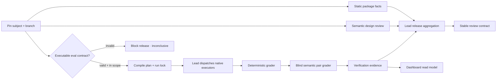
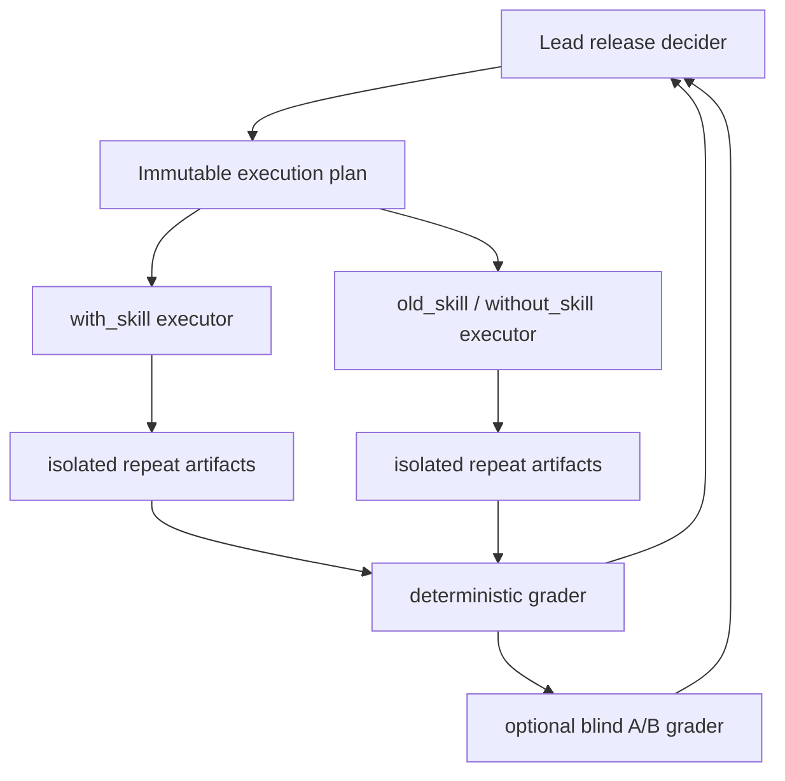
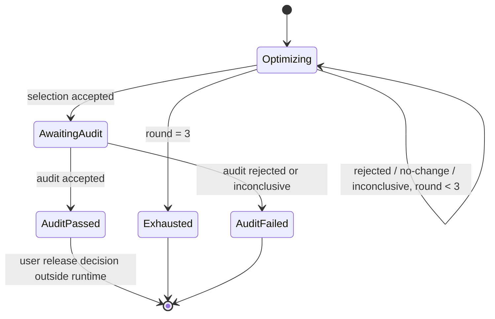

# skill-reviewer Quality Architecture

This document is the durable system map for `skill-reviewer`. It separates
package facts, semantic review, behavioral execution, mechanical acceptance,
bounded evolution, and evidence presentation so no layer can impersonate
another.

## Design thesis

A well-written skill is a hypothesis. Its effect is established only by paired
execution on the same task distribution, with frozen inputs and retained
artifacts. Static review remains valuable for finding trigger, safety, package,
and maintainability defects, but it cannot prove downstream utility.

The architecture therefore uses five independent evidence planes:

1. **Package facts** — deterministic, read-only inspection.
2. **Design judgment** — rubric-backed semantic analysis.
3. **Behavior evidence** — isolated paired execution and typed assertions.
4. **Release decision** — hard gates plus Pareto non-regression.
5. **Presentation and handoff** — a read-only evidence Dashboard plus an
   external task-intent ledger; neither may impersonate evidence or authority.

## Research inputs and project inferences

The implementation is informed by primary research, with project-specific
inferences called out rather than presented as paper claims:

| Source | Evidence used here | Project inference |
|---|---|---|
| [SkillLens](https://arxiv.org/html/2605.23899v1) | Text-only judge accuracy can be poor; the same skill can cause target-dependent negative transfer; paired utility is load-bearing | A semantic review cannot claim “better”; run candidate and baseline on the same case/repeat |
| [SkillOpt](https://arxiv.org/html/2605.23904v2) | Optimizer/target separation, bounded edits, train/selection/test separation, rejected candidate evidence | Evolution is an explicit propose → execute → grade → gate loop. Architecture rewrites are a deliberate deviation and reset continuity |
| [GEPA v2](https://arxiv.org/pdf/2507.19457v2) | Minibatch screening, full `Dpareto` scoring, ancestry, instance-wise candidate exploration | Release objective non-regression is a project gate, not a GEPA frontier reproduction |
| [SkillsBench v4](https://arxiv.org/html/2602.12670v4) | Same-task paired conditions, deterministic verifiers, task leakage from self-generated skills | Authoritative eval assets and graders stay frozen during one evolution run |
| [CoEvoSkills v2](https://arxiv.org/html/2604.01687v2) | Generator/verifier isolation, evolvable surrogate, and the limits of hidden-oracle approximation | Development surrogate may evolve under a separate digest; selection/audit authority remains frozen |
| [LLM-as-a-Judge](https://arxiv.org/html/2306.05685) | Position and verbosity bias; order swapping reduces some pairwise bias | Semantic A/B judgments must be blind and order-swapped; disagreement is inconclusive |
| [Zhao et al., EACL 2026](https://aclanthology.org/2026.eacl-long.100/) | Optimizer feedback and fake rewards can be poisoned | Optimizer feedback is structured and audit content never enters the improvement loop |

The three-round limit and one-shot audit are conservative engineering controls
for cost and adaptive overfitting. They are not claimed as a universal optimum.
The detailed research record and limitations live in
`docs/RESEARCH_SKILL_REVIEW_EVOLUTION.md`.

## End-to-end flow

The Python runtime owns E, G, the mechanical portion of I, acceptance decisions,
evolution state, and L. It does not own F: the lead agent uses whichever native
subagent surface the environment exposes. This keeps the executor portable
without erasing the lead-agent trust boundary.

## Deep module seams

The implementation is tested through five public transformations:

| Input | Module seam | Output |
|---|---|---|
| `evals/evals.json` + subject + baseline + external execution profile + optional opaque holdout pack | `compile` | `execution-plan.json` + `run-lock.json` |
| retained execution artifacts | `grade` | arm grading + `verification-evidence.json` |
| plan + verification evidence | `decide` | selection/audit acceptance decision |
| selection/audit plan + bound decision history | `evolution-init` / `evolution-authorize` / `evolution-advance` | query-authorized cross-run `evolution-state.json` |
| workspace evidence | `project-dashboard` | `dashboard-data.json` |

The React UI consumes only the final read model. It does not parse arbitrary
worker directories, execute a case, apply a candidate, or approve a release.
Projection may receive the external evolution control-state path to join bound
decisions from multiple immutable candidate run workspaces.

## Executable manifest and integrity boundary

Only the exact `skill-reviewer.evals` field set is executable. A present
malformed manifest, differently shaped manifest, or undeclared field is a
structural release blocker. Absence remains optional for an ordinary skill.

Compilation records:

- manifest digest;
- the frozen selection/audit manifest and public fixtures, deterministic-grader
  runtime, and semantic-grader contract authority digest;
- the separately digestible development manifest and fixtures;
- the normalized external execution profile covering target, harness,
  capabilities, isolation, and sampling;
- opaque holdout-pack and private fixture digests when an audit uses them;
- candidate runtime-surface digest (`SKILL.md`, `references/`, `scripts/`, and
  `assets/`, including empty directories and normalized read/execute modes);
- accepted baseline runtime-surface digest when present;
- every selected fixture digest;
- answer-key-free candidate/baseline skill snapshot digests;
- execution-plan digest;
- exactly one selected data split and its paired arms.

Compilation requires a fresh or empty workspace outside both candidate and
baseline packages. Declared fixture inputs are copied into arm/repeat-specific
read-only views containing only allow-listed files. Every case/arm/repeat also
receives its own read-only runtime skill snapshot containing only `SKILL.md`,
`references/`, `scripts/`, and `assets/`, rather than either source tree. A
package linter or directory walk therefore cannot read the eval manifest, audit
cases, or an adjacent `expected.md` answer key, and one worker cannot mutate a
snapshot shared by another.

The snapshot and isolated-input contracts cover canonical paths,
file/directory kind, read/execute mode, bytes, and empty directories. Every
readable tree must remain read-only; symlink, hard-link, special-file,
undeclared-entry, and permission drift are release-blocking integrity failures.

Before grading, the runtime reconstructs the complete plan, snapshot, input,
assignment, run-ID, and lock contract from the pinned manifest and package
authority; the lock cannot validate a coordinated rewrite of itself. Any drift
stops grading before `verification-evidence.json` is emitted. Each
`execution.json` is also bound to its run/case/arm/repeat, assignment digest,
and produced artifact digests. The intended response to drift is recompilation
into a new empty run workspace, never hand-editing the lock or evidence.

## Execution topology

Each case/arm/repeat has an isolated writable root. Candidate and baseline start
in the same lead-agent turn. A deterministic case runs once; a stochastic case
runs three paired repeats. If repeat deltas include both positive and negative
directions, the result is inconclusive even when the mean is positive. The
runtime binds the declared isolation profile but does not itself create an OS
container; `trusted-orchestrator` means the external dispatcher enforces the
policy, while `local-unattested` is explicitly weaker evidence.

Artifact identity, input identity, assignment identity, and the lead-supplied
execution-profile digest are the executor identity boundary. Worker-supplied
identity or build metadata is outside the accepted evidence schema.

## Assertion and evidence model

Deterministic assertions are typed and primary: file existence, text presence
or absence, regex, JSON Pointer comparisons, numeric ranges, forbidden events,
and digests. The grader computes required assertion pass rate and aggregates
declared numeric execution metrics without inventing missing values.

Semantic assertions use two blind, A/B-order-swapped judgments under a frozen
grader contract and task-specific rubric. The official judgment is bound to the
run, case, rubric, declared inputs, every repeat, and output digests. The
resolved winners must agree. No third-vote majority is allowed because
correlated judge bias does not become ground truth through repetition.

Verification levels remain intentionally narrow:

| Level | Supported claim |
|---|---|
| `not-run` | No behavior claim |
| `inconclusive` | Attempted evidence cannot support a claim |
| `behavior-verified` | Candidate required assertions passed on tested cases |
| `regression-verified` | A paired baseline completed and declared behavior did not regress |

## Release acceptance

An evolution selection decision is accepted only if all clauses are true:

1. input integrity is verified;
2. every candidate arm is complete;
3. every `must_pass` deterministic assertion passes;
4. no forbidden action or external side effect is recorded by any arm;
5. every required paired baseline is complete;
6. evidence has no stochastic direction or semantic-judge disagreement;
7. every declared objective stays within its non-regression tolerance;
8. at least one primary objective reaches its material-improvement delta.

This is a conjunction, not an average. A candidate can remain interesting for
research when it trades one objective for another, but it cannot be
automatically released.

Audit uses the same hard and non-regression gates but does not require a second
material delta; selection already established improvement. Release eligibility
also requires `holdout.visibility: opaque`. A public audit remains
`public-calibration`, fails the `audit:opaque-holdout` hard gate, and cannot
authorize release. An opaque manifest exposes only case identity and
`asset_id`; its prompt, logical fixtures, assertions, and objectives are
resolved from the external pack. Passing those behavioral gates produces
`audit-passed`, not a release action. Static/package/permission gates and the
user's final decision remain separate.

## Bounded evolution

Development data may guide the optimizer; selection decides candidate
advancement; audit runs once and never returns feedback to the optimizer.
Selection/audit manifest, fixtures, snapshots, graders, accepted baseline, and
execution profile remain immutable. A development surrogate may evolve only
under a separate digest. An authoritative eval-change proposal requires user
confirmation and a new run. Candidate changes may otherwise restructure the
full skill package. New external dependencies, network access, or wider
permissions also require user authority.

The evolution control state pins authoritative eval/grader identity, accepted
baseline, and execution-profile digest, not a single candidate run ID. The
initial selection plan is authorized at initialization. Each later selection
and the only audit needs a matching `evolution-authorize` record before its
decision can advance state. Selection query count is bounded by three; audit
query count is one. Candidate lineage binds parent/candidate digest, tree change
manifest, training trace IDs, and continuity epoch. Rejected candidates never
become active parents: every later authorization names the accepted baseline as
parent. Added or removed runtime paths mechanically require `continuity: reset`;
the lead applies the same reset to content-only architecture rewrites that a
tree diff cannot classify. Reset clears only the active optimizer rejected
buffer and preserves audit history.

Each candidate round and selection→audit transition may use a different
immutable run workspace, while an authority/profile change, unauthorized query,
or audit of a different candidate digest is rejected. Transitions are recorded
in a digest-chained local journal and state is a recoverable projection of that
journal. This enforces the workflow against executors and partial rollback under
a trusted lead. It is not an external monotonic anchor: detecting a same-owner
clone or deletion of the whole control directory requires a remote append-only
log. The Dashboard must disclose the local/trusted control boundary rather than
imply cryptographic one-shot audit.

## Dashboard product boundary

The Evidence Workbench is a React + TypeScript + Vite application with Vitest UI
tests. Its read model accepts exactly the `skill-reviewer.dashboard-data`
contract. Besides evidence, it projects the authoritative evolution
`next_action`, the three-part selection conjunction, deterministic failure
attribution, and a bounded action allowlist. These fields explain and route an
existing decision; the browser does not recompute acceptance. Candidate/baseline source diffs are
derived from locked runtime snapshots and rendered with `@pierre/diffs` using
virtualization and an explicitly mounted worker-pool provider; they do not read
mutable host paths. `dashboard-data.json` contains only diff metadata. Bounded
per-file sidecars are loaded only when selected; binary files and files above
the 512 KiB-per-side display budget remain digest/size summaries. This budget
protects the projection and browser memory path and never rejects a candidate.
The read model binds every lazy sidecar by SHA-256, and the local server hashes
the exact response bytes on every request. The per-side limit is enforced after
JSON parsing against UTF-8 content length, while the raw JSON guard reserves
the worst-case escape expansion. Live polling adopts a new read-model generation
only after all of its routes validate under one lock. Content-addressed sidecars
are retained per run and previously validated routes remain readable for
in-flight clients; a route-to-digest collision is blocking.

The presentation language is deliberately closer to an engineering review
workbench than a generic metrics dashboard: a low-saturation canvas, flat pane
chrome, hairline separators, compact system typography, and semantic color
only for state. Evidence is shown as a navigable record, not a field of
floating cards. At wide viewports the product uses a persistent case rail,
central evidence/diff/action canvas, and fact inspector; diff focus mode gives the
document surface the full workspace without changing the evidence model.

Display preferences are client-side presentation state, never evidence state.
The workbench exposes English and Simplified Chinese locales plus light and dark
monochrome themes. A first visit derives locale and theme from browser and
operating-system preferences; an explicit choice is stored locally and shared
across tabs. Locale updates the document language for assistive technology, and
theme updates both semantic CSS tokens and Pierre's syntax theme. Translation
is limited to product chrome and known enum labels: run identifiers, paths,
digests, source text, backend messages, and limitation records stay byte-faithful
to the retained artifacts. Vitest covers switching and restoration, while real
browser checks cover desktop and narrow-screen layouts in both locales and
themes.

Navigation and freshness are also presentation state. Stable IDs and bounded
enums are serialized into the URL for run guarding, case filters, evidence or
diff selection, layout, wrapping, and focus; raw prompts, artifact bodies, and
host paths are never embedded. A mismatched or newly presented run blocks the
view until the reviewer explicitly opens the current run. The browser records
projection generation time separately from last successful transport and last
attempt, preserves the last verified projection across refresh failures, and
allows automatic refresh to be paused. The command palette is a navigation and
presentation locator: its allowlist is limited to view navigation, filtering,
copy, projection download, reload, locale, and theme actions. It can navigate
to the Action Center but cannot submit a task implicitly.

Browser-created downloads are named and described as projection JSON, not as a
canonical evidence bundle. Portable evidence references bind the current run,
stable evidence ID, recorded status, available subject digest, and permalink.
Diff sidecars remain untrusted until their identity and metadata binding pass;
transport failures are retryable, while binding failures use an integrity
error state and never fall back to a mutable path. Copyable diagnostics expose
only already projected metadata and the failure reason.

`@pierre/diffs` remains the document renderer because this surface is a
read-only review flow and the library provides the required split/unified
views, virtualized rendering, worker execution, and render caching directly.
Monaco and CodeMirror merge views were evaluated as editor-oriented
alternatives; adopting an editing substrate would add a larger interaction
contract without improving this immutable review boundary. This is an
architectural fit decision, not a benchmark claim. Runtime tuning follows the
library's documented large-diff path: only the selected digest-bound sidecar
is mounted, file-list navigation does not render hidden documents, syntax
languages are derived from the current change set, two workers perform
highlighting, digest `cacheKey` values reuse AST results, and the worker LRU is
bounded. See [Pierre Diffs](https://diffs.com/docs), the
[Monaco diff editor API](https://microsoft.github.io/monaco-editor/typedoc/interfaces/editor_editor_api.editor.IDiffEditorOptions.html),
and [CodeMirror merge views](https://codemirror.net/docs/ref/#merge).

Pierre's Shadow DOM renderer creates theme elements and per-line layout
attributes dynamically. The local server therefore permits inline CSS through
the narrow `style-src-elem` and `style-src-attr` directives. It does not permit
inline script, does not pass reviewed content to the library's `unsafeCSS`
escape hatch, and retains `object-src 'none'`, `base-uri 'none'`, and
`frame-ancestors 'none'`. Reviewed source remains text content, never markup.

The layout follows the evidence chain:

- Run summary: release posture and hard-gate state;
- Case Rail: split filters, paired-run status, query budget, and lineage;
- Evidence Spine: run → gate → iteration → case → assertion → artifact;
- Evidence/Diff Canvas: evidence spine plus a searchable, virtualized,
  split/unified candidate diff;
- Action Center: hard gates + Pareto + material improvement, five-way blocker
  attribution, state-machine next action, and lead-Agent task handoff;
- Inspector: selected evidence, paired arms, provenance, and limitations;
- Focus mode: a document-first diff surface with nonessential panes removed.

The evidence plane accepts GET and HEAD only. The sole POST route is
`/dashboard-action-requests`, a separate control-plane gateway. It validates a
small JSON contract, exact run ID, exact expected `next_action`, current action
availability, same-origin browser requests, idempotency key, and the exact
projected evidence-ID list. It then appends an immutable, digest-chained task to a dedicated directory
outside the run workspace. The record is owned by `lead_agent` and binds the
current Dashboard digest. It does not execute work, advance evolution,
authorize audit, confirm release, edit Eval, or edit evidence. The task audit
log is exposed read-only at `/dashboard-action-requests.json`.

The task chain is a local/trusted audit record, not a remote anti-replay anchor.
The lead Agent must revalidate the authoritative state before consuming it;
stale `expected_next_action` values are rejected. Eval-change tasks are proposal
requests only and remain subject to explicit user confirmation and a new lock.

`dashboard-data.json` and task responses are served with `no-store`; static
assets may be cached briefly. A screenshot and an action task are not evidence:
the plan, lock, grading, decisions, and output files remain the source of truth.
Cross-run projection validates authority, baseline, decision digests, exact
authorized plan path/digest, bound evidence, and the state transition sequence
before rendering. A same-`run_id` clone from another workspace is rejected;
historical rounds cannot supply hard gates for a different current run.
Projection re-grades retained current-run artifacts, aggregates semantic and
paired-arm blockers into each case status, and writes the canonical run-workspace
`dashboard-data.json` plus derived bounded `dashboard-diffs/*.json` preview
sidecars. Each lazy route is registered from the read model, digest-checked at
startup and again over response bytes; projection cannot overwrite source or
evidence. A later projection is published to the server only as a validated
read-model/route generation, never as independently refreshed metadata.

## Authorities

| Concern | Authority |
|---|---|
| Invocation and branch policy | `SKILL.md` |
| Scores, blockers, ordinary verdicts | `references/review-rubric.md` |
| Executable manifest and artifact contracts | `references/executable-evals.md` |
| Native worker orchestration | `references/subagent-eval-workflow.md` |
| Bounded evolution state machine | `references/evolution-workflow.md` |
| Deterministic static facts | `scripts/lint_skill_package.py` |
| Compile/grade/decide/project behavior | `scripts/skill_eval_runtime.py` |
| React presentation contract | `dashboard/src/types.ts` |
| Calibration snapshot contract | `evals/local-skill-review-snapshot.json` |

Supporting documents may explain these authorities but must not redefine them.

## Release completion

A change to this project is complete only when:

1. Python unit tests and all Vitest suites pass;
2. the package linter reports no structural error;
3. executable JSON and local snapshot contracts validate;
4. the Dashboard typecheck and production build pass;
5. a real native-agent run retains candidate and baseline artifacts and can be
   graded/projected, or the exact external blocker is recorded;
6. no generated workspace, credential, auth state, or model artifact is added
   to the repository;
7. the branch passes repository static checks before merge.
