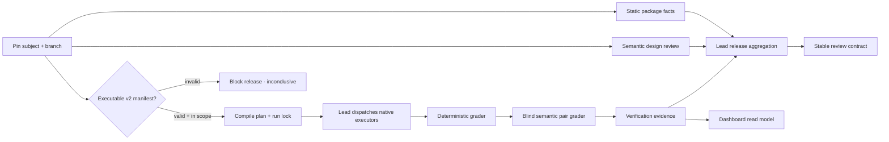
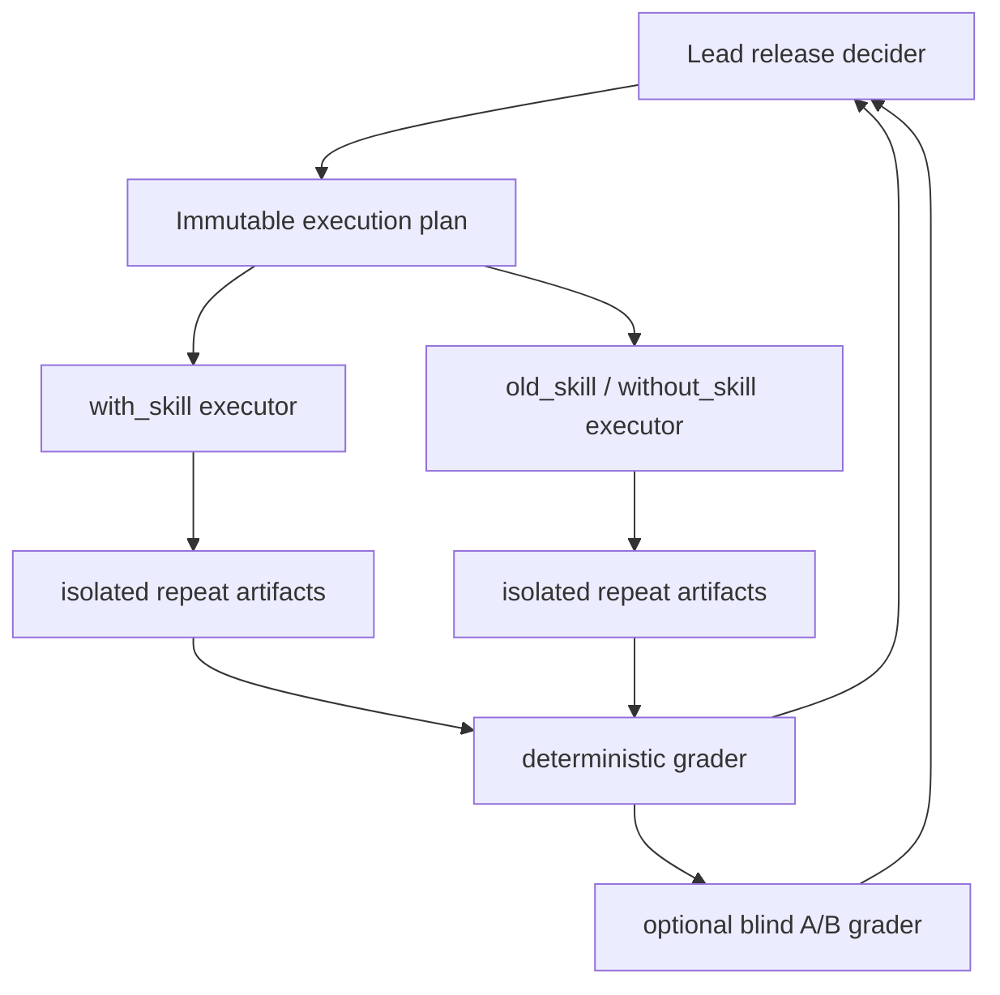
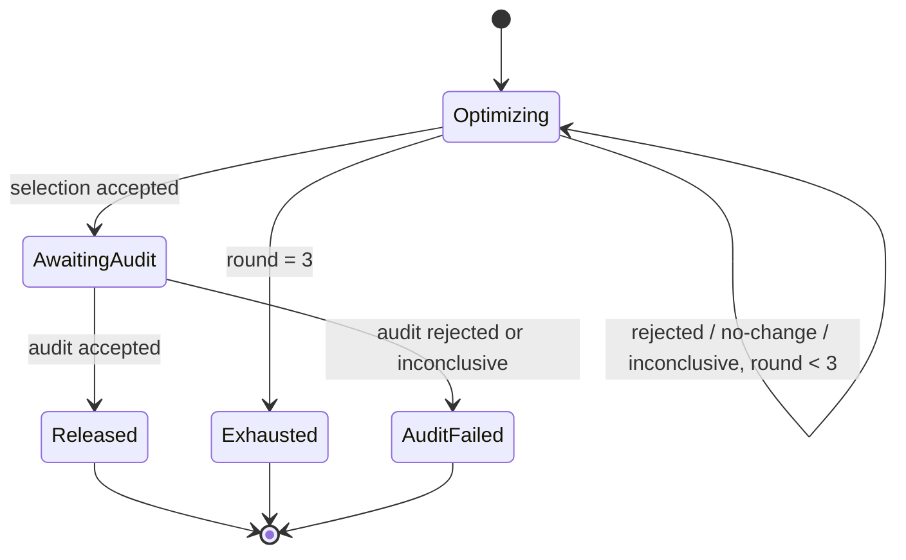

# skill-reviewer Quality Architecture

This document is the durable system map for `skill-reviewer`. It separates
package facts, semantic review, behavioral execution, mechanical acceptance,
bounded evolution, and evidence presentation so no layer can impersonate
another.

## Design thesis

A well-written skill is a hypothesis. Its effect is established only by paired
execution on the same task distribution, with frozen inputs and retained
artifacts. Static review remains valuable for finding trigger, safety, package,
and maintainability defects, but it cannot prove downstream utility.

The architecture therefore uses five independent evidence planes:

1. **Package facts** — deterministic, read-only inspection.
2. **Design judgment** — rubric-backed semantic analysis.
3. **Behavior evidence** — isolated paired execution and typed assertions.
4. **Release decision** — hard gates plus Pareto non-regression.
5. **Presentation** — a read-only Dashboard projected from evidence artifacts.

## Research inputs and project inferences

The implementation is informed by primary research, with project-specific
inferences called out rather than presented as paper claims:

| Source | Evidence used here | Project inference |
|---|---|---|
| [SkillLens](https://arxiv.org/html/2605.23899v1) | Text-only judge accuracy can be poor; the same skill can cause target-dependent negative transfer; paired utility is load-bearing | A semantic review cannot claim “better”; run candidate and baseline on the same case/repeat |
| [SkillOpt](https://arxiv.org/html/2605.23904v2) | Optimizer/target separation, bounded edits, train/selection/test separation, rejected candidate evidence | Evolution is an explicit, bounded propose → execute → grade → gate loop, not self-approved rewriting |
| [GEPA v2](https://arxiv.org/pdf/2507.19457v2) | Minibatch screening, full validation, ancestry, Pareto candidate exploration | Release may use Pareto non-regression, but exploration never bypasses safety or evidence gates |
| [SkillsBench](https://arxiv.org/html/2602.12670) | Same-task paired conditions, deterministic verifiers, task leakage from self-generated skills | Eval assets and graders stay frozen during one evolution run |
| [CoEvoSkills](https://arxiv.org/html/2604.01687) | Generator/verifier isolation and the limits of a surrogate verifier | Semantic graders remain supplemental; deterministic or human authority wins on resolvable facts |
| [LLM-as-a-Judge](https://arxiv.org/html/2306.05685) | Position and verbosity bias; order swapping reduces some pairwise bias | Semantic A/B judgments must be blind and order-swapped; disagreement is inconclusive |
| [Zhao et al., EACL 2026](https://aclanthology.org/2026.eacl-long.100/) | Optimizer feedback and fake rewards can be poisoned | Optimizer feedback is structured and audit content never enters the improvement loop |

The three-round limit and one-shot audit are conservative engineering controls
for cost and adaptive overfitting. They are not claimed as a universal optimum.
The detailed research record and limitations live in
`docs/RESEARCH_SKILL_REVIEW_EVOLUTION.md`.

## End-to-end flow

The Python runtime owns E, G, the mechanical portion of I, acceptance decisions,
evolution state, and L. It does not own F: the lead agent uses whichever native
subagent surface the environment exposes. This keeps the executor portable
without erasing the lead-agent trust boundary.

## Deep module seams

The implementation is tested through five public transformations:

| Input | Module seam | Output |
|---|---|---|
| `evals/evals.json` + subject + baseline | `compile` | `execution-plan.json` + `run-lock.json` |
| retained execution artifacts | `grade` | arm grading + `verification-evidence.json` |
| plan + verification evidence | `decide` | selection/audit acceptance decision |
| selection plan + bound decision history | `evolution-init` / `evolution-advance` | cross-run `evolution-state.json` |
| workspace evidence | `project-dashboard` | `dashboard-data.json` |

The React UI consumes only the final read model. It does not parse arbitrary
worker directories, execute a case, apply a candidate, or approve a release.
Projection may receive the external evolution control-state path to join bound
decisions from multiple immutable candidate run workspaces.

## Executable manifest and integrity boundary

Only `skill-reviewer.evals.v2` is executable. A present legacy or malformed
manifest is a structural release blocker. Absence remains optional for an
ordinary skill.

Compilation records:

- manifest digest;
- the complete eval-directory, deterministic-grader runtime, and semantic-grader
  contract authority digest;
- candidate runtime-surface digest (`SKILL.md`, `references/`, `scripts/`, and
  `assets/`, including empty directories and normalized read/execute modes);
- accepted baseline runtime-surface digest when present;
- every selected fixture digest;
- answer-key-free candidate/baseline skill snapshot digests;
- execution-plan digest;
- exactly one selected data split and its paired arms.

Compilation requires a fresh or empty workspace outside both candidate and
baseline packages. Declared fixture inputs are copied into arm/repeat-specific
read-only views containing only allow-listed files. Every case/arm/repeat also
receives its own read-only runtime skill snapshot containing only `SKILL.md`,
`references/`, `scripts/`, and `assets/`, rather than either source tree. A
package linter or directory walk therefore cannot read the eval manifest, audit
cases, or an adjacent `expected.md` answer key, and one worker cannot mutate a
snapshot shared by another.

The snapshot and isolated-input contracts cover canonical paths,
file/directory kind, read/execute mode, bytes, and empty directories. Every
readable tree must remain read-only; symlink, hard-link, special-file,
undeclared-entry, and permission drift are release-blocking integrity failures.

Before grading, the runtime reconstructs the complete plan, snapshot, input,
assignment, run-ID, and lock contract from the pinned manifest and package
authority; the lock cannot validate a coordinated rewrite of itself. Any drift
stops grading before `verification-evidence.json` is emitted. Each
`execution.json` is also bound to its run/case/arm/repeat, assignment digest,
and produced artifact digests. The intended response to drift is recompilation
into a new empty run workspace, never hand-editing the lock or evidence.

## Execution topology

Each case/arm/repeat has an isolated writable root. Candidate and baseline start
in the same lead-agent turn. A deterministic case runs once; a stochastic case
runs three paired repeats. If repeat deltas include both positive and negative
directions, the result is inconclusive even when the mean is positive.

`agent_provenance` is optional. Artifact identity and input identity are
required; a worker model version is not a hard gate.

## Assertion and evidence model

Deterministic assertions are typed and primary: file existence, text presence
or absence, regex, JSON Pointer comparisons, numeric ranges, forbidden events,
and digests. The grader computes required assertion pass rate and aggregates
declared numeric execution metrics without inventing missing values.

Semantic assertions use two blind, A/B-order-swapped judgments under a frozen
grader contract and task-specific rubric. The official judgment is bound to the
run, case, rubric, declared inputs, every repeat, and output digests. The
resolved winners must agree. No third-vote majority is allowed because
correlated judge bias does not become ground truth through repetition.

Verification levels remain intentionally narrow:

| Level | Supported claim |
|---|---|
| `not-run` | No behavior claim |
| `inconclusive` | Attempted evidence cannot support a claim |
| `behavior-verified` | Candidate required assertions passed on tested cases |
| `regression-verified` | A paired baseline completed and declared behavior did not regress |

## Release acceptance

An evolution selection decision is accepted only if all clauses are true:

1. input integrity is verified;
2. every candidate arm is complete;
3. every `must_pass` deterministic assertion passes;
4. no forbidden action or external side effect is recorded by any arm;
5. every required paired baseline is complete;
6. evidence has no stochastic direction or semantic-judge disagreement;
7. every declared objective stays within its non-regression tolerance;
8. at least one primary objective reaches its material-improvement delta.

This is a conjunction, not an average. A candidate can remain interesting for
research when it trades one objective for another, but it cannot be
automatically released.

Audit uses the same hard and non-regression gates but does not require a second
material delta; selection already established improvement.

## Bounded evolution

Development data may guide the optimizer; selection decides candidate
advancement; audit runs once and never returns feedback to the optimizer. Eval
manifest, fixtures, snapshots, graders, and accepted baseline remain immutable.
An eval-change proposal requires user confirmation and a new run. Candidate
changes may otherwise restructure the full skill package. New external
dependencies, network access, or wider permissions also require user authority.

The evolution control state pins eval/grader authority and the accepted
baseline, not a candidate run ID. Each candidate round and selection→audit
transition may therefore use a different immutable run workspace, while an
authority change or an audit of a different candidate digest is rejected.
Transitions are recorded in a digest-chained local journal and state is a
recoverable projection of that journal. This enforces the workflow against
executors and partial rollback under a trusted lead. It is not an external
monotonic anchor: detecting a same-owner clone or deletion of the whole control
directory requires a remote append-only log. The Dashboard must disclose the
local/trusted control boundary rather than imply cryptographic one-shot audit.

## Dashboard product boundary

The Evidence Lab is a React + TypeScript + Vite application with Vitest UI
tests. Its read model is versioned as `skill-reviewer.dashboard-data.v1`.

The layout follows the evidence chain:

- Run Rail: release posture, hard gates, split filters, case status;
- Evidence Spine: run → gate → iteration → case → assertion → artifact;
- Inspector: selected evidence, paired arms, provenance, and limitations.

The local server accepts GET and HEAD only. `dashboard-data.json` is served with
`no-store`; static assets may be cached briefly. A screenshot is not evidence:
the plan, lock, grading, decisions, and output files remain the source of truth.
Cross-run projection validates authority, baseline, decision digests, bound
plan/evidence, and the state transition sequence before rendering. Historical
rounds cannot supply hard gates for a different current run.
Projection re-grades retained current-run artifacts, aggregates semantic and
paired-arm blockers into each case status, and writes only the canonical
run-workspace `dashboard-data.json`; it cannot overwrite source or evidence.

## Authorities

| Concern | Authority |
|---|---|
| Invocation and branch policy | `SKILL.md` |
| Scores, blockers, ordinary verdicts | `references/review-rubric.md` |
| v2 manifest and artifact schema | `references/executable-evals.md` |
| Native worker orchestration | `references/subagent-eval-workflow.md` |
| Bounded evolution state machine | `references/evolution-workflow.md` |
| Deterministic static facts | `scripts/lint_skill_package.py` |
| Compile/grade/decide/project behavior | `scripts/skill_eval_runtime.py` |
| React presentation contract | `dashboard/src/types.ts` |
| Calibration snapshot contract | `evals/local-skill-review-snapshot.json` |

Supporting documents may explain these authorities but must not redefine them.

## Release completion

A change to this project is complete only when:

1. Python compatibility tests and all Vitest suites pass;
2. the package linter reports no structural error;
3. strict v2 JSON and local snapshot contracts validate;
4. the Dashboard typecheck and production build pass;
5. a real native-agent run retains candidate and baseline artifacts and can be
   graded/projected, or the exact external blocker is recorded;
6. no generated workspace, credential, auth state, or model artifact is added
   to the repository;
7. the branch passes repository static checks before merge.
