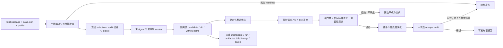

# Agent Skill 审查与自进化系统：竞争格局、算法边界与证据审计

> 调研日期：2026-07-16  
> 当前项目基线：`Nirvana-Jie/skill-reviewer@79ed1835000d627bf62b9c9dd5b1a7b651726e8c`  
> 用途：为产品设计、工程决策及飞书文章提供可核验的一手材料；不是对各项目的商业排名。

## 0. 结论先行

不存在脱离场景的“最好”。这些系统解决的是相邻但不同的问题：

- **Skill Reviewer** 最强的定位不是“自动写出分数最高的 Skill”，而是把一个多文件 Skill package 变成**可审查、可执行验证、可追溯、可阻断发布**的工程对象。它当前最有辨识度的组合是：确定性断言优先、原生 Agent 配对执行、随机场景重复与不确定态、硬门禁与多目标非退化、权威 eval 冻结、开发代理与最终审计隔离、证据化 Dashboard。
- **AutoSkill / SkillEvo** 更接近“从持续使用历史中积累并晋级 champion”的连续学习系统。若核心目标是长期吸收 replay、自动形成候选并不断晋级，它比 Skill Reviewer 当前的 bounded evolution 更原生；但其公开模块仍是 MVP，eval 规则由当前 Skill 与 lineage 启发式编译，且尚未自动回写主 SkillBank。
- **Sentient EvoSkill** 更接近“围绕 benchmark 进行多 Agent program search”。它拥有完整的 Executor / Proposer / Skill-Builder 角色分工、真实 benchmark harness 与论文结果；但当前代码的 frontier 是标量 top-K，而不是发布治理意义上的多目标 Pareto，也没有 Skill Reviewer 的包完整性、权威 eval 变更治理与一锤定音审计。
- **Darwin Skill** 的优势是轻、直观、容易装进现有 Agent 工作流：用户确认测试 Prompt，子 Agent 对照执行，严格涨分才保留，并借助 Git 回退。它更像高质量的“人机共创改写流程”，不是强隔离的 release gate；公开流程允许 dry-run，9 维加权总分也可能掩盖单维退化。
- **SkillLens**、**SkillsBench**、**SkillOpt**、**CoEvoSkills**、**GEPA** 提供的是关键研究证据或算法部件，而不是都与 Skill Reviewer 同类的成品：前两者证明真实下游效用、配对对照和确定性 verifier 的必要性；后三者分别提供严格 held-out 选择、代理 verifier 共进化和 Genetic-Pareto 搜索思路。

因此，适合对外表达的结论不是“Skill Reviewer 全面优于所有工具”，而是：

> Skill Reviewer 把“Skill 看起来写得好”升级成“Skill 在冻结证据下被真实执行、被明确裁决，并能解释为什么可以发布”；连续经验吸收与大规模搜索则是下一阶段可接入的优化器能力。

---

## 1. 名称消歧：不要再把所有项目都叫作 skill-evo

“达尔文 Skill”可以高置信度对应到 `alchaincyf/darwin-skill`。但“skill-evo”至少对应三个不同项目，另有一个名称相近的方法论 Skill：

| 文档中的规范名称 | 准确身份 | 是否是可执行系统 | 与当前讨论的关系 |
|---|---|---:|---|
| Darwin Skill / 达尔文 Skill | [`alchaincyf/darwin-skill`](https://github.com/alchaincyf/darwin-skill) | 是，主体是一份 Agent Skill 指令 | 人机协作式 Skill 改写与对照测试 |
| OrangeViolin `skill-evolve` | [`OrangeViolin/skill-evolve`](https://github.com/OrangeViolin/skill-evolve) | 部分，公开仓库主要是方法论指令 | 名称最接近“skill-evo”，但没有 eval runner |
| AutoSkill / `SkillEvo` | [`ECNU-ICALK/AutoSkill/SkillEvo`](https://github.com/ECNU-ICALK/AutoSkill/tree/main/SkillEvo) | 是，代码级 MVP | replay 驱动的持续进化与 champion 晋级 |
| Sentient `EvoSkill` | [`sentient-agi/EvoSkill`](https://github.com/sentient-agi/EvoSkill) | 是，完整 CLI 与 benchmark harness | benchmark 驱动的多 Agent skill-program 搜索 |
| ICLR 2026 `SkillEvo` | [OpenReview 论文](https://openreview.net/forum?id=S1cIE9pe3k) | 研究系统 | 用强化学习进化 Web Agent 的低层技能，不是 `SKILL.md` 审查器 |

后文使用上述规范名称。除非给出链接，不使用无归属的“skill-evo”。

---

## 2. 证据规则

### 2.1 标记

- **F-A：强事实**——论文正文与官方代码/工件可以交叉核验，或官方代码直接表现出的行为。
- **F-B：一手声明**——作者论文、项目页或仓库作出的声明，但缺少独立复现、稳定性估计或完整工件。
- **I：工程推断**——从公开机制推导出的风险、适用边界或设计含义，不冒充论文结论。

“证据强弱”只描述一个具体主张的可核验程度，不代表项目整体质量。本文不把 GitHub star、作者自评、不同 benchmark 的原生分数拼成总体排名。

### 2.2 公平比较原则

1. **算法、实现、产品表面分开比较。** 论文中的理想协议、当前仓库的真实实现、Dashboard/CLI 的展示能力不是同一个维度。
2. **原生分数不可横比。** OfficeQA、SealQA、SkillsBench、WebArena-Lite 以及各项目自己的 eval，不共享任务、executor、oracle 和成本约束。
3. **“有 eval”不等于“eval 是权威裁决”。** 需要继续追问：谁能修改 eval、它是否冻结、是否执行真实环境、是否泄漏给优化器、是否有 held-out/opaque audit。
4. **“用了 Agent”不等于“复现了真实 Agent 行为”。** 纯文本 replay、无工具 dry-run、原生工具调用和业务环境执行应明确区分。
5. **产品截图不是效果证据。** 截图只能证明信息架构与交互，不证明算法收益。

---

## 3. Skill Reviewer 当前设计：它究竟在保证什么

### 3.1 五个平面

当前实现把质量链路拆为五个相互约束的平面：

1. **确定性包事实**：检查 manifest、资源、引用、路径、可安装性与结构完整性。
2. **语义审查**：依据 rubric 检查触发、指令、安全边界与输出质量；它用于诊断和补充，不替代真实效果验证。
3. **行为验证**：主 Agent 按 manifest 分发原生 worker，对 candidate、old skill、without skill 等 arm 做真实配对执行。
4. **发布裁决**：在冻结权威 eval/profile 下执行硬门禁、非退化检查、主目标改进与最终 opaque audit。
5. **证据呈现**：把 snapshot、run、artifact、diff、lineage 与 gate 原因投影到只读 Dashboard。

权威说明见当前提交的 [SKILL.md](https://github.com/Nirvana-Jie/skill-reviewer/blob/79ed1835000d627bf62b9c9dd5b1a7b651726e8c/skills/skill-reviewer/SKILL.md) 与 [Quality Architecture](https://github.com/Nirvana-Jie/skill-reviewer/blob/79ed1835000d627bf62b9c9dd5b1a7b651726e8c/docs/QUALITY_ARCHITECTURE.md)。

### 3.2 当前闭环

### 3.3 关键算法语义

- **F-A｜manifest 是可执行协议，不是示例数据。** 无效 manifest 是发布阻断项；不会静默跳过。
- **F-A｜确定性优先。** 能由 schema、文件、退出码、精确值、集合关系等判定的目标先用确定性断言；只有不能可靠程序化的部分才进入语义 judge。
- **F-A｜语义判断是保守补充。** 补充判断采用盲化 A/B 与 B/A 调序；两次方向不一致则结论为 `inconclusive`，不强行制造胜者。这一策略与已知的 LLM judge 位置偏差风险一致，但“分歧即不确定”是本项目的治理选择，不是论文规定的唯一方案。
- **F-A｜重复规则区分确定性与随机性。** 确定性场景默认 1 次；随机场景默认成对 3 次；方向冲突进入不确定态。
- **F-A｜接受条件是合取，不是均分。** 所有 hard gates 必须通过；任何目标不得超过容忍度退化；至少一个主目标须有实质改进。总平均分不能抵消安全、完整性或关键能力回退。
- **F-A｜eval 在一次授权闭环内不可变。** 系统可以提出新的 eval/断言建议，但不能把建议偷偷写入当前权威集合；用户确认后形成新的运行边界与 digest。
- **F-A｜开发代理与权威裁决严格分离。** 可演化的 development surrogate 有独立 digest；selection 与最终 audit 不随优化器反馈漂移。
- **F-A｜最终 audit 只执行一次。** 失败是终态，且失败细节不回流优化器，避免把最终验证集逐步训练成开发集。
- **F-A｜架构级重写被允许，但必须重置连续性。** Skill 可以大幅调整目录和模块，不受文本编辑幅度约束；若拓扑/架构变化破坏同源比较，则重建 baseline，而不是伪装成同一条连续 lineage。
- **F-A｜runtime 与 Agent 无关。** Python runtime 负责编译、记录、判定与投影；真正 worker 由外层主 Agent 分发，因此不会把某一种 subAgent API 或版本写死为证据的一部分。

### 3.4 当前优势与诚实边界

优势是“发布证据链”而非单一 optimizer：

- 包级对象、真实行为和发布裁决处在同一条可追踪链路中。
- evaluator、executor、optimizer 权责分离；worker 不自评。
- 每个 arm/repeat 可留存输入、输出、artifact、断言结果和 digest。
- Dashboard 是证据的只读投影，不会成为第二套真相来源；当前使用 React、Vite、Vitest 和虚拟化 diff 渲染，并支持中英文、明暗主题、固定链接、命令面板与 stale-state 提示。

仍需明确的边界：

- **F-A**：当前 runtime 不内置所有 Agent 平台的 universal sandbox；真实 worker 的工具权限与业务隔离仍由主 Agent/宿主 harness 提供。
- **F-A**：它实现的是受控、最多 3 轮的候选演化，不是监听生产 replay 并永久运行的自主学习 daemon。
- **F-A**：本地 journal 与 digest 提高篡改可见性，但不是远程 append-only transparency log。
- **F-A**：公开 fixture 用于验证框架，不是私有发布 oracle。
- **F-A**：当前没有公开、跨系统、同一任务集上的效果 benchmark；不能把治理完备性写成已证明的任务通过率优势。
- **I**：由于允许架构级重写，搜索空间比 SkillOpt 的受限文本编辑更大；连续性重置和强门禁能治理风险，但不能消除更高的搜索成本。

---

## 4. 直接竞品与相邻系统

## 4.1 Darwin Skill：低摩擦的人机共创 hill-climbing

一手来源：固定提交的 [SKILL.md](https://github.com/alchaincyf/darwin-skill/blob/7c7b7909b630dc3b5cbb91bd4bcb1b10bfb1f894/SKILL.md)；项目 [README](https://github.com/alchaincyf/darwin-skill/tree/7c7b7909b630dc3b5cbb91bd4bcb1b10bfb1f894)。

### 算法与闭环

- **F-A**：以单个可编辑 `SKILL.md` 为核心，先做静态与效果评估，再进入改写、对照测试、用户确认、保留或 Git 回退。
- **F-A**：采用 9 个维度的加权总分；新版本只有在总分严格上升时保留。
- **F-A**：通常生成并让用户确认 2–3 个测试 Prompt；分别让子 Agent 在 with-skill 与 baseline 条件下执行。
- **F-A**：默认最多 3 轮，但到上限后可以询问是否再增加 1 轮，因此它不是不可突破的发布上限。
- **F-A**：探索性完整重写需要额外用户批准；常规演化限制文件膨胀，并偏向每轮处理一个主维度。

### 优点

- 安装与认知成本低，能直接复用通用 Agent 的文件编辑、subAgent 与 Git 能力。
- 用户在测试 Prompt、探索性重写和最终保留等关键节点拥有清晰确认权。
- with-skill / baseline 的思路优于只读文本打分；Git rollback 简单可靠。
- 输出卡片与视觉叙事成熟，适合个人开发者快速理解一次改进。

### 边界与风险

- **F-A**：公开流程在 worker 不可用时允许 dry-run；因此“完成评估”不必然等于执行了真实工具链。
- **I**：单一加权总分允许一个维度的涨幅抵消另一个关键维度的回退，除非另设 hard gate。
- **F-A**：公开指令没有规定 digest 绑定、冻结的 selection/audit 权威、隐藏 final oracle 或 typed assertion registry。
- **F-A**：常规改写对象集中在 `SKILL.md`，并明确避免新增脚本/参考资源；它不以多文件 package 架构治理为主要目标。
- **F-B**：项目给出的受控退化案例与自评属于作者证据；尚无专属同行评审论文或独立 benchmark 复现。仓库引用 SkillLens 并不意味着 Darwin 的完整 9 维权重已被 SkillLens 验证。
- **I**：结果卡是优秀的沟通界面，但不是逐 run、逐 artifact、逐 gate 的证据工作台。

**最佳适用场景**：个人或小团队想快速改进一个以文本指令为主的 Skill，并愿意由人把关真实执行质量。  
**不宜替代**：对安全、结构完整性、隐藏验收、可审计发布证据有强要求的 package release gate。

## 4.2 OrangeViolin `skill-evolve`：方法论 Skill，不是 eval 平台

一手来源：[官方仓库](https://github.com/OrangeViolin/skill-evolve) 与 [SKILL.md](https://github.com/OrangeViolin/skill-evolve/blob/main/SKILL.md)。

- **F-A**：提供 OTF、JIT、Bootstrap 三类改进方式，用 3–5 个真实 Prompt 覆盖正常、边界与非触发场景。
- **F-A**：可以借助 subAgent 重复相同 Prompt，并由人决定保留改动。
- **F-A**：公开仓库主要由 `README.md`、`SKILL.md` 和许可证组成，没有 eval runner、`evals.json` 或系统论文。

**定位**：它适合作为写 Skill 时的反思清单；如果讨论的是“eval 可真实触发、replay pool、champion promotion”，目标通常不是这个项目。

## 4.3 AutoSkill / SkillEvo：最接近持续经验学习的公开实现

一手来源：固定提交的 [SkillEvo README](https://github.com/ECNU-ICALK/AutoSkill/blob/94c47ca488d4ba4117d20272e66d49b9877e68cf/SkillEvo/README.md)、[runner.py](https://github.com/ECNU-ICALK/AutoSkill/blob/94c47ca488d4ba4117d20272e66d49b9877e68cf/SkillEvo/runner.py)、[evals.py](https://github.com/ECNU-ICALK/AutoSkill/blob/94c47ca488d4ba4117d20272e66d49b9877e68cf/SkillEvo/evals.py)，以及 [AutoSkill 论文](https://arxiv.org/html/2603.01145v1)。

### 算法与闭环

- **F-A**：按 lineage 建立 replay pool，在一次进化运行内冻结；轨迹被编译为 3–6 条二元 eval 规则。
- **F-A**：规则可以由程序化检查或 Judge-LLM 判定，区分 hard/soft，并保留输出与 judge artifact。
- **F-A**：候选先在 `mutate_dev` 上搜索；最终只在独立的 `promotion_test` 上比较 candidate 与 champion。
- **F-A**：默认 mutation budget 8、promotion 3 次、晋级最小增益 0.05；候选平均分达到增益阈值且 hard-failure 数不高于 champion 时晋级。
- **F-A**：实际调用 responder LLM，把 Skill 指令注入 system prompt 后重放对话；它是模型执行，不只是静态评分。
- **F-A**：AutoSkill 总体系统支持从用户查询中抽取经验、add/merge/discard、Skill 检索及后台演化；具体 SkillEvo 模块是后续代码能力，不能把论文中 AutoSkill 的全部实验直接当作 SkillEvo 模块的独立验证。

### 优点

- 在本文比较对象中，它对“从持续真实使用历史形成 replay，再不断晋级 champion”的支持最原生。
- dev / promotion 分离、固定 replay、provenance 与 champion registry 比单轮自我反思更接近可持续工程闭环。
- 二元规则与 hard/soft 区分让失败原因比单一总分更可解释。

### 边界与风险

- **F-A**：模块 README 明确列为 MVP；检索专属 eval、自动回写主 SkillBank、大规模 tournament 尚未完成。
- **F-A**：promotion 的 hard 条件是“hard-failure 数量不比 champion 多”，不是“每一条 hard rule 均通过”。
- **I**：平均分增益与 hard-failure 计数可能掩盖规则身份的替换——候选修复一个 hard failure、同时引入另一个，计数仍可不变。
- **F-A**：eval 规则会从当前 Skill 与 lineage requirement memory 启发式编译；它们不是默认由用户冻结、独立持有的最终 oracle。
- **I**：若 baseline 自身有错误主张，由 baseline 派生规则可能把旧假设带入评估；需要额外的独立 selection/audit 权威来降低自证风险。
- **F-A**：当前“真实执行”主要是 LLM 对会话的 replay，不保证复现原生产 Agent 的完整工具、权限、文件系统和业务副作用。
- **F-A**：公开的 Skill snapshot 更偏指令、名称、描述、标签、触发器等结构，不以任意多文件 package 重构为主要搜索对象。

**最佳适用场景**：拥有稳定交互历史，希望从 replay 中持续优化个性化 SkillBank。  
**与 Skill Reviewer 的组合方式**：把 AutoSkill / SkillEvo 作为候选与 development surrogate 的来源；晋级生产前仍由 Skill Reviewer 的冻结 manifest、真实原生 worker、硬门禁和 opaque audit 做发布裁决。

## 4.4 Sentient EvoSkill：benchmark 驱动的 skill-program search

一手来源：固定提交的 [仓库](https://github.com/sentient-agi/EvoSkill/tree/36f6f04952293d7054145550c2b9f0b0411bff1c)、[架构文档](https://github.com/sentient-agi/EvoSkill/blob/36f6f04952293d7054145550c2b9f0b0411bff1c/docs/architecture.md)、[评估文档](https://github.com/sentient-agi/EvoSkill/blob/36f6f04952293d7054145550c2b9f0b0411bff1c/docs/evaluation.md) 与 [论文](https://arxiv.org/html/2603.02766v1)。

### 算法与闭环

- **F-A**：角色分为 Executor、Proposer、Skill-Builder。Executor 做真实 benchmark 任务；Proposer 读取失败与训练 ground truth 提出假设；Builder 只负责编写 Skill program。
- **F-A**：论文协议用 training 发现失败、held-out validation 选择候选、test remainder 做最终评估；候选进入固定容量 frontier，轮转选择父代。
- **F-A**：当前代码中的 frontier 依据标量 score 保留 top-K；这不是多目标意义上的 Pareto frontier。
- **F-A**：候选使用 Git branch 隔离，保留 diff、运行日志和失败历史，并接入 OfficeQA、SealQA 等 benchmark/harness。
- **F-B**：论文报告 OfficeQA `+7.3pp`、SealQA `+12.1pp`，以及 SealQA Skill 向 BrowseComp 零样本迁移 `+5.3pp`。OfficeQA 主配置因成本只运行一次，作者将方差评估列为后续工作。

### 优点

- 搜索对象是可组合的 skill program，而非仅有一段 prompt；多 Agent 分工和真实 benchmark 执行完整。
- Git 分支、frontier、父代轮转与失败历史使搜索过程比线性“改一次看一次”更系统。
- 在本文直接竞品中，它提供了最清晰的公开论文任务收益证据之一。

### 边界与风险

- **F-A**：当前仓库的准入是标量 top-K，不保证每个关键目标不退化，也没有发布级 hard safety/integrity gates。
- **F-A**：论文描述最终 test，但当前 CLI/代码路径与论文协议存在范围差异；阅读结果时需注明使用的是哪套协议。
- **F-A**：validation 在搜索中被反复查询；它是 selection set，不是只执行一次的 opaque audit。
- **F-A**：仓库把“无需 benchmark、从常规使用中持续进化”列为仍在推进的能力，不能描述成已落地的生产持续学习。
- **F-A**：产品表面以 CLI、终端状态、日志与 diff 为主，没有面向 release evidence 的完整可视化工作台。
- **I**：它更适合“寻找更高 benchmark 分数的 program”，而非独立承担企业 Skill package 的安装完整性、权限风险、eval 变更审批和发布签署。

**最佳适用场景**：有明确 benchmark、可靠 grader 与可重复 harness，希望探索多种 skill program。  
**与 Skill Reviewer 的组合方式**：EvoSkill 负责提出 frontier candidate，Skill Reviewer 负责把选中的 candidate 放到真实发布 profile 下做非退化与最终审计。

## 4.5 ICLR 2026 SkillEvo：Web Agent 强化学习，不是 Skill package 审查器

一手来源：[OpenReview 论文页](https://openreview.net/forum?id=S1cIE9pe3k) 与 [官方 PDF](https://openreview.net/pdf?id=S1cIE9pe3k)。

- **F-B**：系统先用 WebGRPO 及推理/执行奖励模型学习轨迹，再由 SkillGenesis 把轨迹转化为可执行低层 Web skills，并组织成 Skill Path Graph。
- **F-B**：论文在 WebArena-Lite 上报告 Llama 3.1 8B 从 4.8% 到 60.4%、GLM-4 9B 从 6.1% 到 57.6%。这些是该论文协议内的结果，未在本文中做独立复现。
- **F-A**：它优化的是 Web Agent policy 与低层操作技能，需要 RL 训练和专用环境；不负责 `SKILL.md` package lint、eval manifest 治理或通用发布 Dashboard。

**结论**：它能启发“由高质量轨迹抽象技能图”，但与 Skill Reviewer 不是同层竞品，不能用 WebArena-Lite 分数评价 package reviewer。

---

## 5. 关键研究系统：哪些算法真正支撑了当前设计

## 5.1 SkillLens：文本看起来好，不等于下游真实有效

来源：[论文](https://arxiv.org/html/2605.23899v1) 与 [Microsoft 官方仓库](https://github.com/microsoft/SkillLens)。

- **F-A**：论文覆盖 5 个领域、6 个目标模型、5 个提取模型，共 150 个 domain × target × extractor 组合；同领域经验任务与 held-out test 按 1:1 划分，每种条件运行 3 次。
- **F-A**：Skill 的 utility 被定义为同一 held-out 条件下 `with_skill - no_skill` 的真实任务表现差，而不是文本分。
- **F-A**：150 个组合中 25% 出现负迁移；同一个 Skill 对不同目标模型可能产生相反效果。
- **F-A**：无 rubric 的 GPT-5.4 文本 judge 在 151 个高效用差 pair 上只有 46.4% 准确率，与随机判断不可区分。
- **F-A**：经真实 utility 校准后保留 Failure Mechanism Encoding、Actionable Specificity、High-Risk Action Blacklist 三维；同一批 151 个 pair 上 judge 准确率达到 73.8%。
- **F-A**：这 73.8% 不是外部独立测试集结果；论文研究的是领域级单 Skill 注入，不覆盖大型 Skill 库的检索、组合与互相干扰。

对 Skill Reviewer 的直接含义：

- **F-A 支撑**：静态/语义 review 只能提出质量假设，不能代替 target-agent 与 target-harness 上的配对执行。
- **F-A 支撑**：必须保留 without-skill 或旧版本对照，否则无法识别负迁移。
- **I 设计迁移**：rubric 应由真实 outcome 持续校准，但校准建议不能静默修改当前权威 eval。
- **不能声称**：SkillLens 验证了任意自定义 9 维或多维评分，更不能证明 Skill Reviewer 的所有门禁天然提高任务通过率。

## 5.2 SkillsBench：确定性 verifier、隔离环境与重复试验

来源：[论文](https://arxiv.org/html/2602.12670v4)、[官方仓库](https://github.com/benchflow-ai/SkillsBench) 与 [项目页](https://www.skillsbench.ai/)。

- **F-A**：包含 87 个任务、8 个领域，使用确定性 verifier、固定且新鲜的执行环境、匹配的 no-skill / curated-skill 条件和 3 次 trial。
- **F-B**：18 个模型/harness 配置的平均通过率从 33.9% 提升到 50.5%，即 `+16.6pp`；单配置增益从 `+4.1pp` 到 `+25.7pp`，表明平均数会掩盖局部差异。
- **F-A**：专门治理隐藏 oracle、Skill 与答案泄漏。论文还观察到，在三个专门配置中，自生成 Skill 低于 no-skill，原因包括未被发现、创作过程挤占执行以及错误 Skill pack。

对 Skill Reviewer 的直接含义：

- **F-A 支撑**：确定性断言优先、fresh workspace、配对 baseline、重复运行与泄漏检查。
- **I 设计迁移**：Dashboard 应展示逐场景/逐 profile 的差异，而不是只展示总体均值。
- **不能声称**：SkillsBench 是 Skill Reviewer 的公开 benchmark 结果；它是独立 benchmark 基础设施。

## 5.3 SkillOpt：冻结 harness 下的严格 held-out 文本优化

来源：[论文](https://arxiv.org/html/2605.23904v2) 与 [Microsoft 官方仓库](https://github.com/microsoft/SkillOpt)。

- **F-A**：冻结 target model、harness 和 evaluator；独立 optimizer 根据带分数的成功/失败 rollout 反思。
- **F-A**：用受限的 add/delete/replace 文本编辑生成 candidate；candidate 必须在 held-out selection 上严格优于当前版本，平局拒绝。
- **F-A**：rejected-edit buffer 保留有害尝试；最终部署 Skill 不增加额外推理调用。
- **F-A**：论文协议分 train / selection / test；仓库后来加入的 nightly offline evolution 应与论文已验证范围分开表述。

对 Skill Reviewer 的直接含义：

- **F-A 支撑**：冻结 target/harness/evaluator、独立 optimizer、严格提升、拒绝历史和 held-out test。
- **I 设计差异**：Skill Reviewer 允许 package 架构级重写，因此不能直接继承 SkillOpt 在受限文本编辑空间中的稳定性结论；需要拓扑变更后的 continuity reset。

## 5.4 CoEvoSkills：可演化的代理 verifier 与不可替代的隐藏 oracle

来源：[论文](https://arxiv.org/html/2604.01687v2) 与 [作者项目页](https://zhang-henry.github.io/CoEvoSkills/)。

- **F-A**：Skill Generator 与 Surrogate Verifier 在独立 LLM session 中运行；Verifier 只看到任务和输出文件，不看到生成者推理、代码或 Skill。
- **F-A**：Surrogate Verifier 演化确定性断言套件；隐藏 ground-truth oracle 在全新环境重放并保持权威。
- **F-A**：论文展示了 surrogate 15/15 但 oracle 仅 3/4 的案例，也展示后续 surrogate false negative；代理测试永远可能错。
- **F-B**：论文报告 SkillsBench 71.1% pass rate，并在主结果中采用多次运行和跨模型迁移；它仍是近期预印本，尚缺独立大规模复现。

对 Skill Reviewer 的直接含义：

- **F-A 支撑**：开发期可以进化 surrogate assertions，但它不能取代冻结的权威 oracle。
- **I 更保守的治理**：当前项目允许 surrogate 提建议、要求用户确认新的权威 eval，并让最终 audit 失败不回流优化器；这是对 CoEvoSkills 思路的治理化综合，不是论文原样复刻。

## 5.5 GEPA：Genetic-Pareto 用于探索，不等同于发布 Pareto 门禁

来源：[论文](https://arxiv.org/abs/2507.19457) 与 [官方仓库](https://github.com/gepa-ai/gepa)。

- **F-A**：GEPA 利用完整轨迹和自然语言反馈反思式变异，维护候选池与 ancestry，并按不同 validation instance 上的优势形成 Genetic-Pareto frontier。
- **F-B**：论文在 6 个任务上相对 GRPO 平均提升约 6%，最高节省约 35 倍 rollout；这是 prompt/program optimization 结果，不是 Skill package release 结果。
- **F-A**：GEPA 的 Pareto 主要用于**保持搜索多样性与样本级优势候选**；Skill Reviewer 的 Pareto 用于**禁止发布目标回退**。名称相似，算法职责不同。

对 Skill Reviewer 的直接含义：

- 可以引入 GEPA 式多父代、ancestry 与互补候选合并来提高探索效率。
- 不应把发布决策改回“frontier 中总有一个候选可进”；hard gates 与权威 selection 仍需独立。

## 5.6 Judge 偏差与反馈投毒：为什么语义裁判必须被约束

来源：[MT-Bench / Chatbot Arena judge 论文](https://arxiv.org/html/2306.05685)、[官方实现](https://github.com/lm-sys/FastChat/tree/main/fastchat/llm_judge) 与 EACL 论文 [Are My Optimized Prompts Compromised?](https://aclanthology.org/2026.eacl-long.100/)。

- **F-A**：LLM judge 存在位置、冗长和自增强偏差。A/B 与 B/A 调序可以检测一部分不稳定；Skill Reviewer 选择“调序分歧即不确定”是保守治理策略。
- **F-A**：反馈投毒研究表明，操纵 optimizer feedback 可显著提高攻击成功率，最大报告变化达到 `ΔASR 0.48`；反馈通道本身就是攻击面。
- **I**：因此 executor 自述、optimizer 反思、semantic judge 与权威断言不能混成同一个未标记字符串；需要来源、类型、digest 与读写权限隔离。
- **不能声称**：有 digest 或 A/B swap 就自动免疫 judge bias、prompt injection 或 feedback poisoning。

## 5.7 运行时 Skill 风险：发布审查不能替代调用时防护

来源：[STARS 论文](https://arxiv.org/html/2604.10286v1) 与 [官方仓库](https://github.com/123zgj123/STARS)。

- **F-B**：STARS 将 Skill 的静态能力风险与“当前请求是否会激活风险”分离，并用静态先验、上下文评分及校准融合做 invocation-time 判断。
- **I**：Skill Reviewer 可以在发布前发现危险能力、验证安全断言和展示证据，但它不是每次调用前的在线拦截器。

**组合建议**：发布前由 Skill Reviewer 审查 package 与 eval；运行时由权限系统、sandbox 和 STARS 类请求级风险决策共同防护。

---

## 6. 文章可直接使用的横向对比数据

### 6.1 核心产品系统

| 维度 | Skill Reviewer | Darwin Skill | OrangeViolin `skill-evolve` | AutoSkill / SkillEvo | Sentient EvoSkill |
|---|---|---|---|---|---|
| 核心对象 | 多文件 Skill package + eval + artifacts | 以单个 `SKILL.md` 为主 | Skill 写作方法与 Prompt | 结构化 Skill snapshot + replay | 多文件/多技能 program |
| 主问题 | 能否在可核验证据下发布 | 如何快速把 Skill 改得更好 | 如何有步骤地反思改写 | 如何从历史 replay 持续晋级 champion | 如何在 benchmark 上搜索高分 program |
| eval 权威 | 用户授权并冻结的 manifest/profile；变更须新确认 | 用户确认的 2–3 Prompt + 9 维 judge | 3–5 Prompt + 人工判断 | lineage replay 冻结；规则由 Skill/历史启发式编译 | benchmark train/validation/test |
| 真实执行 | 主 Agent 分发原生 worker；隔离 arms/repeats | with/baseline 子 Agent；可降级 dry-run | 可选 subAgent，偏人工工作流 | responder LLM 重放对话，不必然是原工具环境 | 真实 benchmark agent/harness |
| 确定性验证 | 优先；typed assertions | 非核心 | 无 runner | 程序化规则 + LLM judge | 由 benchmark grader 决定 |
| 语义验证 | 盲化 A/B + B/A；分歧为不确定 | 独立 judge/评分 | 人工 | Judge-LLM 二元规则 | benchmark score 与 Agent 分析 |
| 优化目标 | hard gate 全过 + 目标不退化 + 主目标实质提升 | 9 维加权总分严格提升 | 人决定 | 平均分增益达阈值 + hard-failure 数不增 | 标量 top-K frontier |
| 连续进化 | 有界最多 3 轮；非生产 daemon | 默认 3 轮，可人工延长 | 一次性/按需 | 最强：replay → dev mutation → promotion；MVP 尚未自动回写 | benchmark 循环；生产持续进化仍在开发 |
| 最终审计 | 一次 opaque audit，失败不回流 | 未规定隐藏 final audit | 无 | promotion test 可重复使用 | held-out test 见论文；当前代码路径需辨别 |
| 失败继承 | rejected candidate 永不成为父代 | Git revert | 人工丢弃 | champion registry | frontier/branch/history |
| 安全与完整性门禁 | manifest、digest、artifact、hard gates、隔离 | 人工确认、Git rollback | 人工把关 | provenance、dev/test 分离 | 角色分离、held-out split |
| 可解释性 | 逐 run/assertion/artifact/diff/lineage/gate | 评分报告与结果卡 | 文本记录 | replay、rule、judgment、promotion artifacts | CLI、日志、diff、frontier |
| 产品化表面 | React/Vite/Vitest 只读证据 Dashboard；i18n/主题/diff | Agent 内结果卡与图片 | 无独立 UI | AutoSkill 有 Web UI；SkillEvo 专属证据台未见 | CLI/终端工作流 |
| 最佳边界 | 企业级包审查与发布治理 | 低门槛单 Skill 改写 | 写作反思方法 | 持续经验积累与个性化 | 明确 benchmark 下的 program search |
| 主要短板 | 尚缺公开跨系统效果 benchmark；非持续 replay daemon | dry-run 与总分抵消风险；包治理弱 | 无可执行 eval/runtime | eval 权威由 baseline/历史派生；MVP 未闭环写回 | 标量准入、缺少 package release hard gates |

### 6.2 能力覆盖热力表

图例：`●` = 官方实现中明确存在；`◐` = 部分存在或依赖外部/人工；`○` = 在核验的公开实现中未见。它是**机制覆盖图，不是效果分数**。

| 能力 | Skill Reviewer | Darwin | skill-evolve | AutoSkill / SkillEvo | Sentient EvoSkill |
|---|:---:|:---:|:---:|:---:|:---:|
| 多文件 package 审查 | ● | ○ | ○ | ◐ | ● |
| 可执行 eval manifest | ● | ◐ | ○ | ● | ● |
| 原生 Agent/工具环境配对 | ◐ | ◐ | ◐ | ◐ | ● |
| 确定性断言优先 | ● | ○ | ○ | ◐ | ◐ |
| frozen authoritative eval | ● | ◐ | ○ | ◐ | ● |
| hard gate 与目标非退化 | ● | ○ | ○ | ◐ | ○ |
| one-shot opaque audit | ● | ○ | ○ | ○ | ◐ |
| replay 驱动持续学习 | ○ | ○ | ○ | ● | ○ |
| 多父代/frontier 搜索 | ○ | ○ | ○ | ○ | ● |
| 证据级可视化 Dashboard | ● | ◐ | ○ | ◐ | ◐ |
| 用户批准 eval 变更 | ● | ● | ◐ | ○ | ○ |

“原生 Agent/工具环境配对”对 Skill Reviewer 标为 `◐`，不是因为设计不支持，而是 runtime 本身保持 Agent 无关：实际工具隔离与 worker 能力由宿主 Agent/harness 提供。这个外部依赖应在产品文档中透明表达。

### 6.3 研究系统与可复用算法部件

| 系统 | 已验证的核心命题 | 可迁移到 Skill Reviewer 的部分 | 不能越界声称的部分 |
|---|---|---|---|
| SkillLens | 文本 judge 与真实 utility 可能脱节；25% 组合负迁移 | with/no-skill、target-specific 执行、rubric outcome 校准 | 其三维 rubric 不是所有 Skill 的完美 oracle |
| SkillsBench | 确定性 verifier、fresh env、配对条件与重复 trial | 断言优先、环境隔离、泄漏治理、逐场景展示 | 不是 Skill Reviewer 已跑出的 benchmark |
| SkillOpt | 冻结 harness、受限编辑、held-out strict improvement | 独立 optimizer、拒绝历史、selection/test 分离 | 受限文本编辑的稳定性不覆盖架构级重写 |
| CoEvoSkills | surrogate assertions 可进化，但隐藏 oracle 不可替代 | dev surrogate 与权威 audit 分离 | surrogate 通过不等于真实通过 |
| GEPA | 轨迹反思与 Genetic-Pareto 有利于搜索多样性 | 多父代、ancestry、互补候选合并 | 搜索 Pareto 不等于发布非退化门禁 |
| Judge bias 研究 | LLM judge 有顺序等系统偏差 | A/B 与 B/A、分歧不确定、确定性优先 | 调序不能消除全部偏差 |
| Feedback poisoning | optimizer feedback 是攻击面 | 信号分层、来源绑定、冻结权威与最小权限 | 当前门禁并非形式化安全证明 |
| STARS | 静态风险与请求激活风险不同 | 与运行时 risk gate 组合 | 发布审查不能替代每次调用的拦截 |

---

## 7. 谁在什么场景下更好

| 决策场景 | 首选 | 原因 | 推荐组合 |
|---|---|---|---|
| 多文件 Skill 要进入生产，需回答“为什么能发” | **Skill Reviewer** | 包完整性、真实验证、硬门禁、证据链与只读 Dashboard 是主路径 | + STARS 类运行时防护 |
| 从长期对话/任务历史持续学习 | **AutoSkill / SkillEvo** | replay、dev/promotion、champion registry 最贴近持续经验闭环 | 候选晋级后交给 Skill Reviewer 发布审计 |
| 有稳定 benchmark，要自动探索 skill program | **Sentient EvoSkill** | 多 Agent search、Git branch、frontier 与 benchmark harness 完整 | 优胜 program 再经过发布 profile 非退化验证 |
| 个人开发者快速改善一个文本 Skill | **Darwin Skill** | 安装轻、流程直观、用户确认、Git 回退 | 关键场景补充确定性 eval 或接 Skill Reviewer |
| 训练开源 Web Agent 与低层技能图 | **ICLR SkillEvo** | RL + Web skill extraction 是其问题设定 | 不与 package reviewer 直接比较 |
| 研究如何让测试随失败共同成长 | **CoEvoSkills** | Generator / Surrogate Verifier / Oracle 分层清晰 | 保留不可变权威 audit，surrogate 只服务开发 |
| 校准“什么样的 Skill 文本更可能有效” | **SkillLens** | 把 rubric 与真实 utility 联系起来 | rubric 仅作语义层，最终仍跑行为 eval |

### 7.1 Skill Reviewer 真正可凸显的优势

1. **不是“也能跑 eval”，而是给 eval 权力边界。** 谁能改、何时冻结、如何绑定输入/产物、何时只运行一次，比单纯存在 `evals.json` 更重要。
2. **不是“用了 subAgent”，而是把执行和裁判拆开。** 主 Agent 分发 worker；worker 只做场景，不自评；runtime 做编译与裁决。
3. **不是“平均分更高就升级”，而是任何关键目标都不能被平均数淹没。** hard gate、目标容忍度、实质改进共同决定接受。
4. **不是“Judge 说 A 更好”，而是允许系统诚实地说不确定。** 顺序互换与随机重复出现方向冲突时不强推结论。
5. **不是“生成一张漂亮报告”，而是让每个结论回到可检查 artifact。** Dashboard 是同一 snapshot 的证据投影，diff、lineage 与 gate 能互相定位。

### 7.2 不应宣传成优势的内容

- 不要写“Skill Reviewer 已经比 EvoSkill / Darwin 提升更多任务分数”，因为没有共同 benchmark。
- 不要写“全自动连续自进化已经落地”，因为当前是有界、由主 Agent 编排的受控闭环。
- 不要写“完全杜绝 eval 泄漏、judge 偏差或恶意 Skill”，因为 digest、隔离与 opaque audit 只是降低攻击面。
- 不要把“3 轮”“最终一次”包装成论文证明的普适最优超参数；它们是当前治理策略。
- 不要把 Dashboard 的完成度当成算法效果证据。

---

## 8. 公平的真实效果演示与截图方案

如果飞书文章需要“触发真实效果”，建议只做**可复现案例研究**，不要伪装成跨系统 benchmark。

### 8.1 公共实验协议

1. 选择一个公开、无敏感信息、确实包含脚本与 reference 的多文件 Skill。
2. 冻结同一组目标场景、executor profile、容器/权限、模型与预算；记录 commit、依赖锁和输入 digest。
3. 至少包含：正常触发、非触发、边界输入、工具失败、安全约束、产物结构六类场景。
4. 每个系统只负责**提出 candidate**；最终效果统一由同一隐藏 selection 与同一 executor 判定。
5. 确定性场景执行 1 次；含随机 judge 的场景执行成对 3 次；报告逐场景结果、分歧与成本，不只报均值。
6. 保留 no-skill、原 Skill 与 candidate 三个 arm；每个 arm 在独立 workspace 中运行。
7. 系统原生评分只用于解释其自身搜索过程，不与别的系统原生评分放在同一纵轴。
8. 最终隐藏 audit 只运行一次；若失败，照实展示为 release blocked，不把失败样本反馈给 candidate 生成器重做。

### 8.2 推荐截图清单

| 截图 | 要证明什么 | 画面重点 | 必须附的脚注 |
|---|---|---|---|
| Skill Reviewer Overview | 同一 snapshot 上的发布结论 | release gate、profile、digest、通过/不确定/阻断分布 | “展示证据结构，不代表跨系统效果领先” |
| 场景详情 | eval 被真实触发 | worker input/output、artifact、typed assertion、repeat | 标注 executor、权限与运行次数 |
| 文档/代码 Diff | candidate 改了什么 | 并排/统一 diff、文件树、行级导航 | 标注 base/candidate commit |
| Lineage | 哪个候选成为父代 | accepted/rejected/inconclusive 节点与原因 | 标注连续性重置点 |
| Darwin 结果卡 | 轻量人机共创体验 | 测试 Prompt、评分变化、保留/回退 | 若使用 dry-run，必须醒目标出 |
| AutoSkill promotion artifact | replay 驱动晋级 | replay split、rules、champion/candidate、3 repeats | 说明 replay 不是完整生产工具环境 |
| Sentient EvoSkill CLI | benchmark 搜索过程 | branch、frontier、failure history、diff | 说明其原生 benchmark 分不可横比 |

### 8.3 推荐文章图形

- **架构主图**：五层证据漏斗——Package Facts → Semantic Hypothesis → Paired Behavior → Release Decision → Evidence Projection。
- **信任边界图**：Optimizer、Executor、Grader、Eval Authority、Dashboard 五角色，以不同颜色表现读写权限。
- **系统地图**：横轴“从一次性审查到持续学习”，纵轴“从文本建议到真实环境裁决”。不要画无数据支撑的雷达总分。
- **证据时间线**：candidate 生成 → dev surrogate → selection → audit → release；在 audit 处画单向闸门，强调失败不回传。
- **场景矩阵**：每行一个 eval case，每列 old/candidate/without，使用 pass/fail/inconclusive 三态，而不是只画总分仪表盘。

### 8.4 可直接用于图注的文字

> 所有系统都可以“给 Skill 提建议”，但只有当 eval 的权威、执行环境、对照条件、晋级规则和证据归档被同时定义时，建议才变成可发布结论。

> Dashboard 不是装饰层。它把每个发布结论还原到输入、执行、断言、产物、差异和 lineage，让使用者能够复查系统为何通过、为何阻断，以及何时只能回答“不确定”。

---

## 9. 面向飞书文章的事实卡片

以下句子可以直接用于高亮块；每一条都应保留链接或脚注。

### 真实效果

> SkillLens 在 150 个 domain × target × extractor 组合中观察到 25% 负迁移；Skill 是否有效取决于目标模型与执行上下文，而不是文本看起来是否专业。  
> 来源：[SkillLens](https://arxiv.org/html/2605.23899v1)

### Judge 不是 Oracle

> 在 SkillLens 的 151 个高效用差 pair 上，无 rubric 的 GPT-5.4 文本判断准确率只有 46.4%；经真实 utility 校准的三维 rubric 提高到 73.8%，但仍不是完美 oracle，也不是独立外测结果。  
> 来源：[SkillLens](https://arxiv.org/html/2605.23899v1)

### 平均数会隐藏风险

> SkillsBench 中 Skill 带来的平均提升为 16.6 个百分点，但不同模型/harness 配置的增益从 4.1 到 25.7 个百分点。发布决策必须下钻到具体场景与具体 profile。  
> 来源：[SkillsBench](https://arxiv.org/html/2602.12670v4)

### 代理测试会犯错

> CoEvoSkills 展示过 surrogate 全部通过而隐藏 oracle 仍失败的案例。开发测试可以进化，最终权威不能被代理测试取代。  
> 来源：[CoEvoSkills](https://arxiv.org/html/2604.01687v2)

### 反馈也是攻击面

> Prompt 优化系统的反馈通道可以被投毒；把 executor 自述、optimizer 反思与权威 grader 混在一起，会让“自进化”同时变成“自我说服”。  
> 来源：[Are My Optimized Prompts Compromised?](https://aclanthology.org/2026.eacl-long.100/)

### Skill Reviewer 的一句话定位

> 我们不让一次漂亮的生成直接成为发布版本：candidate 必须在冻结场景里被真实执行，跨过硬门禁，证明关键目标不退化，并把每个结论还原到可复查证据。

---

## 10. 近期研究观察项

这些工作方向直接相关，但发表时间很新、尚缺充分代码或独立复现，不宜在主对比图中当成熟产品：

- **SkillCoach**：[论文](https://arxiv.org/html/2607.01874) 将评价对象从最终结果扩展到 Skill 选择、遵循、组合和证据化反思；通过局部 arbitration patch 演化任务级 rubric，并用 held-out validation 门禁。论文报告 gold-keypoint coverage、usability 与过滤一致性提升，但截至本次核验未确认官方开源实现。
- **MetaSkill-Evolve**：[论文](https://arxiv.org/html/2607.05297) 让 task skill 与负责分析、检索、分配、提议和演化的 meta-skill 在快慢时间尺度共同进化；用持久化 DAG 保留成功、失败和中性节点，并严格划分 train/validation/test。截至本次核验未确认官方开源仓库。

它们提示了两个后续方向：

1. review 不只检查最终产物，还要检查 Agent 是否正确选择、遵循和组合了 Skill；
2. optimizer 自身也应成为可版本化、可评估的对象，但它不能获得批准自身上线的权限。

---

## 11. 一手来源台账

### 当前项目

- [Skill Reviewer repository @ `79ed1835`](https://github.com/Nirvana-Jie/skill-reviewer/tree/79ed1835000d627bf62b9c9dd5b1a7b651726e8c)
- [Skill Reviewer `SKILL.md` @ `79ed1835`](https://github.com/Nirvana-Jie/skill-reviewer/blob/79ed1835000d627bf62b9c9dd5b1a7b651726e8c/skills/skill-reviewer/SKILL.md)
- [Skill Reviewer Quality Architecture @ `79ed1835`](https://github.com/Nirvana-Jie/skill-reviewer/blob/79ed1835000d627bf62b9c9dd5b1a7b651726e8c/docs/QUALITY_ARCHITECTURE.md)

### 直接系统

- [Darwin Skill repository](https://github.com/alchaincyf/darwin-skill)
- [Darwin Skill `SKILL.md` @ `7c7b7909`](https://github.com/alchaincyf/darwin-skill/blob/7c7b7909b630dc3b5cbb91bd4bcb1b10bfb1f894/SKILL.md)
- [OrangeViolin `skill-evolve`](https://github.com/OrangeViolin/skill-evolve)
- [AutoSkill repository](https://github.com/ECNU-ICALK/AutoSkill)
- [AutoSkill paper](https://arxiv.org/html/2603.01145v1)
- [AutoSkill / SkillEvo @ `94c47ca4`](https://github.com/ECNU-ICALK/AutoSkill/tree/94c47ca488d4ba4117d20272e66d49b9877e68cf/SkillEvo)
- [Sentient EvoSkill repository @ `36f6f049`](https://github.com/sentient-agi/EvoSkill/tree/36f6f04952293d7054145550c2b9f0b0411bff1c)
- [Sentient EvoSkill paper](https://arxiv.org/html/2603.02766v1)
- [ICLR 2026 SkillEvo](https://openreview.net/forum?id=S1cIE9pe3k)

### 研究与评估治理

- [SkillLens paper](https://arxiv.org/html/2605.23899v1)
- [Microsoft SkillLens repository](https://github.com/microsoft/SkillLens)
- [SkillOpt paper](https://arxiv.org/html/2605.23904v2)
- [Microsoft SkillOpt repository](https://github.com/microsoft/SkillOpt)
- [SkillsBench paper](https://arxiv.org/html/2602.12670v4)
- [SkillsBench repository](https://github.com/benchflow-ai/SkillsBench)
- [CoEvoSkills paper](https://arxiv.org/html/2604.01687v2)
- [CoEvoSkills project page](https://zhang-henry.github.io/CoEvoSkills/)
- [GEPA paper](https://arxiv.org/abs/2507.19457)
- [GEPA repository](https://github.com/gepa-ai/gepa)
- [LLM-as-a-Judge bias paper](https://arxiv.org/html/2306.05685)
- [FastChat judge implementation](https://github.com/lm-sys/FastChat/tree/main/fastchat/llm_judge)
- [Feedback poisoning paper](https://aclanthology.org/2026.eacl-long.100/)
- [STARS paper](https://arxiv.org/html/2604.10286v1)
- [STARS repository](https://github.com/123zgj123/STARS)
- [SkillCoach paper](https://arxiv.org/html/2607.01874)
- [MetaSkill-Evolve paper](https://arxiv.org/html/2607.05297)

---

## 12. 最终定位建议

对外介绍时，建议将产品归类为：

> **Skill Reviewer 是 Agent Skill 的 evidence-driven quality and release governance system。**  
> 它可以接收人工、Darwin、AutoSkill、EvoSkill、GEPA 或其他 optimizer 产生的 candidate，但不会把“是谁生成的”当成质量证据；所有 candidate 都要在同一冻结权威下接受真实执行、保守裁决与可追溯发布审计。

这一定义既凸显当前实现的独特优势，也为未来接入 replay-driven continuous evolution、Genetic-Pareto 多父代搜索和 invocation-time risk control 留出清晰接口，而不需要把 reviewer、optimizer、executor、oracle 和 Dashboard 混成一个无法审计的“全自动智能体”。
