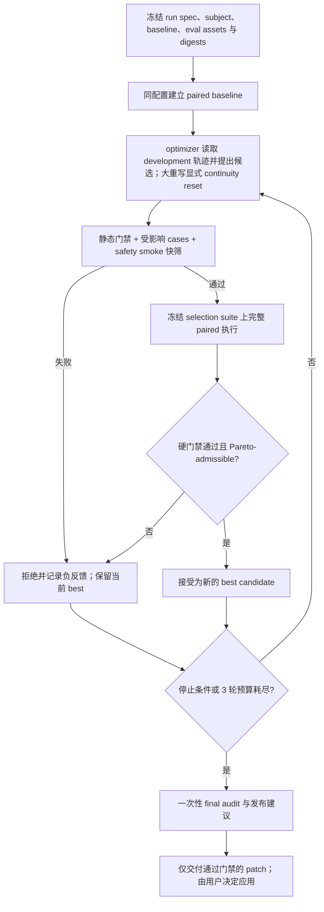

# Agent Skill 审查、效果评测与自进化：研究结论和设计约束

> 研究日期：2026-07-15
>
> 范围：agent skill 的静态审查、效果评测、自然语言 skill/prompt 自进化，以及当前 `skill-reviewer` 实现的算法对齐约束。
>
> 证据口径：只使用论文原文、正式论文页面和官方源码；不以二手文章支撑结论。

## 如何阅读本文

本文严格区分三类陈述：

- **论文结论**：来源实际实现、测量或明确讨论的结果。
- **项目推论**：根据论文证据，对 `skill-reviewer` 做出的工程设计判断；不是论文原作者直接验证过的结论。
- **仓库事实**：对当前仓库文件和实现的只读观察。

SkillLens、SkillOpt 均是 2026 年 5 月的近期预印本，结论尚缺少长期和独立复现。GEPA 使用已被 ICLR 2026 接收的 v2 PDF；arXiv HTML 在调研时仍显示旧版实验数字，本文不采用那些旧数字。

## 结论摘要

1. **skill 的文本质量不能替代真实效用。** SkillLens 中，无 rubric 的 LLM 只看两份 skill 文本时，选出真实高效用 skill 的准确率为 46.4%，与随机选择无显著差异；150 个 `domain × target × extractor` cells 中有 25% 出现负迁移。因此静态审查和 LLM judge 只能发现风险、形成假设，不能证明“用了 skill 更好”。真正的效果主张必须来自同任务、同 target、同 harness 的配对执行。[SkillLens](https://arxiv.org/html/2605.23899v1)

2. **自进化应是受控的 propose → execute → grade → gate 循环，不是自我改写。** SkillOpt 冻结执行模型和 harness，用独立 optimizer 提出有预算的 add/delete/replace patch，只有候选在 held-out selection 上严格提升才接受；被拒编辑进入负反馈缓冲区。[SkillOpt](https://arxiv.org/html/2605.23904v2)

3. **发布接受不能压成一个总分。** 先执行安全、触发边界、包完整性、评测完整性等硬门禁；再要求候选相对基线在预先声明的多目标向量上不退化，并至少有一项达到最小实质提升。Pareto front 可用于保留不同候选、避免局部最优，但不能绕过发布门禁。GEPA 的 Pareto 是“逐任务实例的候选探索”机制；把它改造成发布层的多目标非退化规则，是本文对本项目的推论，不是对 GEPA 的逐字复刻。[GEPA v2](https://arxiv.org/pdf/2507.19457v2)

4. **权威评测资产必须在一次进化运行中不可变，且 optimizer 不能读取 holdout 内容。** SkillsBench 记录到自生成 skill 把当前任务细节写成近似答案键而取得表面收益；反馈投毒研究也证明，伪造 feedback/reward 能显著操纵自然语言 optimizer。冻结 selection/audit manifest、fixtures、断言和 grader digest，只给 optimizer 受控的 development 反馈，是防止 eval gaming 的信任边界；可演进的 development surrogate 必须拥有独立 digest，不能替代权威 oracle。[SkillsBench v4](https://arxiv.org/html/2602.12670v4)；[CoEvoSkills v2](https://arxiv.org/html/2604.01687v2)；[Zhao et al., EACL 2026](https://aclanthology.org/2026.eacl-long.100/)

5. **“有效”必须带适用域。** 同一 skill 对不同 target 可能产生相反结果，harness 也会改变 skill 的发现和执行方式。每次接受结论都应绑定 target identity、harness identity、能力/隔离策略、任务分布和 sampling 配置的规范化 digest；不要求 executor 或 subagent 自报软件版本。跨 target 或跨 harness 稳定性必须作为单独 robustness gate，而不是从单一配置外推。[SkillLens](https://arxiv.org/html/2605.23899v1)；[SkillsBench v4](https://arxiv.org/html/2602.12670v4)

## 一手来源与采用范围

| 来源 | 本文采用的证据 | 主要外推限制 |
|---|---|---|
| [SkillLens：From Raw Experience to Skill Consumption](https://arxiv.org/html/2605.23899v1)（[官方代码](https://github.com/microsoft/SkillLens)） | skill 生命周期、paired utility、负迁移、文本 judge 失准、跨模型差异 | 单一 domain-level skill 直接注入；尚未覆盖大规模 skill library 的检索、组合与干扰 |
| [SkillOpt：Executive Strategy for Self-Evolving Agent Skills](https://arxiv.org/html/2605.23904v2)（[官方代码](https://github.com/microsoft/SkillOpt)） | bounded patch、held-out gate、rejected-edit buffer、角色分离、train/selection/test | 依赖可靠评分；主要优化单个紧凑 skill；开放式主观任务仍未解决 |
| [GEPA v2：Reflective Prompt Evolution](https://arxiv.org/pdf/2507.19457v2)（[官方代码](https://github.com/gepa-ai/gepa)） | 轨迹反思、minibatch 快筛、完整 `Dpareto` 评分、候选 ancestry、instance-wise Pareto 探索 | 六个任务、两个主要模型家族；跨模型证据范围有限；prompt 优化不等同于完整 skill package 优化 |
| [SkillsBench v4](https://arxiv.org/html/2602.12670v4)（[官方项目](https://www.skillsbench.ai/)） | 同任务 paired conditions、确定性 verifier、fresh container、负迁移、自生成 skill 污染案例 | 以 terminal/container 任务为主；GUI、多 agent、超长时域尚未覆盖 |
| [CoEvoSkills v2](https://arxiv.org/html/2604.01687v2)（[作者项目页](https://zhang-henry.github.io/CoEvoSkills/)） | generator/verifier 信息隔离、surrogate 快筛、hidden ground-truth oracle、停止预算 | surrogate 仍会错判；消融成本高且部分为单次运行；oracle 设置不等同于开放式真实任务 |
| [Judging LLM-as-a-Judge with MT-Bench and Chatbot Arena](https://arxiv.org/html/2306.05685) | 位置偏差、冗长偏差、顺序交换、reference-guided judging | 使用较早模型；主要评估对话 helpfulness，不直接等同于 agent 行为验收 |
| [Are My Optimized Prompts Compromised?](https://aclanthology.org/2026.eacl-long.100/) | optimizer feedback poisoning、fake reward、输入/反馈边界 | 主要在 HarmBench、一个主要 backend 和两类 optimizer 上验证；防御只能缓解，不能消除攻击 |

## 1. 三类审查证据各自能证明什么

### 1.1 证据能力矩阵

| 证据层 | 能证明 | 不能证明 | 建议使用的结论措辞 |
|---|---|---|---|
| 静态检查 | 文件存在、front matter/schema、链接可解析、资源可达、声明的权限边界、显式危险命令、输出契约是否完整；这些是可重复的包事实 | skill 会被模型正确触发；指令会被遵守；工具调用安全；任务成功率提高；跨模型有效 | `structure-checked` / `static-reviewed`，不得写 `behavior-verified` |
| LLM 语义审查 / LLM-as-judge | 发现歧义、矛盾、遗漏、过宽 trigger、潜在安全风险；按经真实效用校准的 rubric 做低成本候选筛选；解释失败轨迹 | 单独证明因果效果、无回归、无 judge bias、对新模型稳定；漂亮文本不等于下游效用 | `semantic-review` / `judge-supported hypothesis`，不得单独写 `improved` |
| 真实执行 eval | 在声明的任务、模型、harness、权限和 grader 下测量可观察行为；确定性断言可证明具体输出/副作用；配对运行可估计 skill 的边际贡献 | 未采样任务、未测模型、未来版本、不同 harness 的普适有效性；少量样本不能排除随机波动 | 单臂仅 `behavior-verified`；完整 paired baseline 才可 `regression-verified` |

### 1.2 为什么静态审查不可被删除

**论文结论。** SkillLens 在 SpreadsheetBench 的限定格式消融中，没有检测到 ordered list、unordered list、checklist 与 prose 的显著效用差异；无 rubric 的文本 judge 为 46.4%，与随机选择无显著差异，但这并不表示文本和包结构无价值。其从 utility-labelled pairs 中筛出的三个维度——失败机制编码、可执行的具体性、高风险动作黑名单——在同一批 151 个 high-gap pairs、同一 GPT-5.4 judge 上把准确率提高到 73.8%。这说明语义审查可以成为分布内经过校准的风险筛选器，不是独立 holdout 上的泛化证明，更不是效用证明器。[SkillLens](https://arxiv.org/html/2605.23899v1)

**项目推论。** 当前八维 review rubric、package linter 和 snapshot contract 应继续存在，并保持与运行时效用分轴。静态或语义失败可以阻断明显危险候选；静态/语义通过却不能跳过真实执行。

### 1.3 为什么 LLM judge 不能拥有最终发布权

**论文结论。** 经典 LLM-as-a-judge 实验发现，交换候选 A/B 顺序会让 judge 翻转偏好；重复同一信息的冗长攻击也能诱导 judge 偏爱更差答案。论文建议成对评测时交换顺序，仅当两个顺序结论一致才判胜；对可求解问题先形成独立 reference，再作 reference-guided 判断，能显著降低推理类误判。[Judging LLM-as-a-Judge](https://arxiv.org/html/2306.05685)

**项目推论。** 语义 judge 只能负责确定性 grader 覆盖不了的少数维度，并必须：

- 对 candidate/baseline 隐名，随机化且双向交换 A/B；
- 使用固定 judge identity、execution profile、prompt 和 rubric digest，并有校准 fixture；
- 要求逐断言引用 retained artifact，而不是给一个总体印象分；
- 将顺序翻转、judge 分歧或缺失证据标为 `inconclusive`，不得用多数票把它变成 pass；
- 不让生成候选的 optimizer 同时担任唯一 judge，避免自偏好和共同失败模式。

### 1.4 真实执行能支持的最强主张

**论文结论。** SkillLens 把同一 target 在同一 held-out split 上的 `with_skill - no_skill` 作为效用原子，并对每个条件做三次运行；SkillsBench 在相同任务和容器下比较 no-Skills 与 Skills 条件，并使用确定性 verifier，从而隔离 skill 的边际贡献。[SkillLens](https://arxiv.org/html/2605.23899v1)；[SkillsBench v4](https://arxiv.org/html/2602.12670v4)

**项目推论。** `skill-reviewer` 的最强自动结论应是：“候选在以下已声明 cells 中相对冻结基线满足门禁且未观测到回归”，而不是“skill 已被证明更好”。cell 至少由以下字段确定：

`case × target identity × harness identity × capability profile × isolation mode × sampling config`。

该 cell 由 lead agent 提供的外部 execution profile 规范化并锁定，不依赖 subagent 自报版本。证据能证明的是“该 profile 下的运行”，不能据此外推到无法解析或未被测量的底层软件构建。

对于已有 skill 的修订，默认 baseline 是 `old_skill`；对于新 skill，baseline 是 `without_skill`。资源允许时应采用三臂：`candidate`、`old_skill`、`without_skill`。这样可避免“候选比旧版本好，但两者仍比不用 skill 更差”的假改进。

## 2. 研究对自进化循环的直接启示

### 2.1 SkillLens：优化目标必须落在下游 utility

**论文结论。** SkillLens 跨五个 domain、六个 target 和五个 extractor 观察到：skill 平均有益，但 150 个 `domain × target × extractor` cells 中有 25% 负迁移；更强的任务执行模型不一定是更强 extractor；同一 skill 文本在不同消费者上可能从收益变为损害。[SkillLens](https://arxiv.org/html/2605.23899v1)

**项目推论。** optimizer 不应以“审查分数更高”“文本更清晰”或“更像最佳实践”作为最终 reward。真正的 primary objectives 必须来自运行时行为；静态分数只作为 hard gate 或次级诊断信号。每个 target/harness 独立记分，禁止只汇总平均数掩盖负迁移。

### 2.2 SkillOpt：小步、可回滚、held-out 接受

**论文结论。** SkillOpt 把 target model、backend、harness 和 evaluator 固定，只训练 skill 文本。optimizer 分别反思成功与失败 minibatch，产生结构化 add/delete/replace edits；编辑数量受“textual learning rate”限制。每个候选在 held-out selection 上严格优于当前版本才接受，平局也拒绝；失败编辑和分数下降被记录，用于后续避免重复错误。[SkillOpt](https://arxiv.org/html/2605.23904v2)

**论文结论。** SkillOpt 明确拆分 train、selection、test：train 提供轨迹，selection 决定候选，test 只做最终报告；论文消融显示 bounded update、rejected-edit buffer 与 slow/meta update 对稳定性有贡献。但作者也指出，开放式任务缺少可靠分数时，validation gate 仍需更强的人类或模型评估。[SkillOpt](https://arxiv.org/html/2605.23904v2)

**项目推论。** 首版不必复制四 epoch 或 slow/meta memory，但应保留更小的安全核心：

1. optimizer 只能输出候选 patch，不能直接覆盖正式 skill；
2. 不设置人为的行数或 diff 大小上限；候选可重构完整 runtime surface，
   但仍受三轮上限、冻结 eval、权限边界和完整回归门禁约束；
3. 每轮保留 parent digest、candidate digest、patch、依据它的训练 case/trace IDs；
4. 失败候选不可成为下一轮正式 parent，当前 best accepted candidate 始终可回滚；
5. rejected buffer 只保存失败模式、patch digest 和结果摘要，不把隐藏断言内容泄露回 optimizer。

第 2 点是本项目对 SkillOpt bounded textual learning 的**有意偏离**，不能声称继承其 bounded-update 消融中的稳定性结论。架构级重写必须从已接受 baseline 重新授权，显式 `continuity: reset`，递增 continuity epoch，并清空依赖相邻候选连续性的 active rejected buffer；历史拒绝记录仍保留用于审计。这里限制的是“每轮一个可证伪 mutation hypothesis、selection 查询次数与完整回归”，不是 diff 行数。

### 2.3 GEPA：快筛节省成本，Pareto 保持搜索多样性

**论文结论。** GEPA v2 从运行轨迹和评价轨迹中提取自然语言反馈，候选先在 `Dfeedback` minibatch 上与 parent 比较；只有改善的候选才进入完整 `Dpareto` 评分、候选池和逐 validation-instance frontier 更新。`Dpareto` 评分不是第二个 pool-admission gate；frontier 用于后续 parent 采样，最终返回 aggregate-best 候选。[GEPA v2](https://arxiv.org/pdf/2507.19457v2)

**论文结论。** GEPA 同样把可见训练数据、只用于选模的 validation 和最终 test 分开；optimizer 不应读取 validation 内容，test 仅在优化结束后评估。[GEPA v2](https://arxiv.org/pdf/2507.19457v2)

**项目推论。** 已确认的“定向快筛，完整套件决定接受”是合理落地：

- 快筛只淘汰明显无效候选：受影响 development cases + 固定 safety smoke cases；
- 快筛通过后，在冻结 selection suite 上运行 candidate 与 paired baseline；
- 若实现 GEPA-style 探索，必须真的维护 candidate pool、ancestry 与 per-case score matrix；当前单链 release loop 不把自己的发布规则称为 GEPA 复现；
- 项目的 hard gate + 多业务 objective 非退化只负责发布接受，是结合风险治理做出的项目算法，不是 GEPA 的 instance-wise frontier；
- final audit 只运行一次。一旦 audit 结果用于继续生成 patch，它就不再是 audit，必须在新 run 中降级为 development/selection 数据。

### 2.4 CoEvoSkills：独立 surrogate 有用，但不能取代 oracle

**论文结论。** CoEvoSkills 将 Skill Generator 与 Surrogate Verifier 放在信息隔离的独立会话；verifier 只看任务说明和执行输出，不看 generator 的推理、代码和 skill 内容。surrogate 生成并演进确定性断言，提供细粒度修复反馈；当 surrogate 通过而隐藏 ground-truth oracle 失败时，只把不含测试内容的结果反馈给循环并加强 surrogate。[CoEvoSkills v2](https://arxiv.org/html/2604.01687v2)

**论文结论。** 论文案例中，surrogate 的 15 个测试全过，但 hidden oracle 只有 3/4；随后 surrogate 又因自身估计误差拒绝了实际上更准确的输出。作者据此明确指出 surrogate 无法复制 oracle 的精确要求，也无法总是区分自身误差与 agent 误差，ground-truth oracle 仍是权威。[CoEvoSkills v2](https://arxiv.org/html/2604.01687v2)

**项目推论。** 系统应同时维护可演进的 `development_surrogate` 与冻结的 `authoritative selection/audit oracle`，分别计算 digest、分配权限和生命周期。前者可吸收 development 失败去增加测试；后者在整个 run 中不可变。低成本 LLM judge 或定向 smoke suite 可以做快筛，却不能成为最终 gate。若权威 eval 本身疑似错误，正确状态是 `inconclusive` + eval 修订建议；不得让 optimizer 或 surrogate 改断言来让候选通过。CoEvoSkills 会让 opaque oracle fail bit 回流；本项目的一次性 audit 不回流是更保守的抗污染扩展。

## 3. 推荐的 evolution 状态机



### 3.1 候选生成

**项目推论。** optimizer 只接收 development 证据：当前 skill、静态 review 的可操作问题、成功/失败轨迹、公开断言结果、受控 verifier feedback、rejected buffer。它不得接收 selection/audit 的输入内容、expected output、断言源码、fixture 路径结构或 grader prompt。

生成策略应同时保护成功行为和修复失败行为。SkillOpt 分别分析 success/failure minibatch；SkillLens 在固定 GPT-5.4-mini extractor、3 domains × 3 targets 的消融范围内观察到 all-failure experience pool 持续最差，且最佳成功/失败比例随 domain 变化。因此不应只从失败 case 归纳规则，也不能把该比例外推为通用配方。[SkillOpt](https://arxiv.org/html/2605.23904v2)；[SkillLens](https://arxiv.org/html/2605.23899v1)

### 3.2 定向快筛

**项目推论。** 快筛不是接受证据。它只能回答“是否值得付出完整 suite 成本”，至少包括：

- package linter 与 manifest contract；
- patch 影响到的 development cases；
- 固定 trigger/safety smoke cases；
- 禁止动作、越权写入、secret/系统 prompt 泄漏扫描；
- candidate 是否修改了授权范围外文件或 eval assets。

### 3.3 完整 selection 与 paired baseline

**项目推论。** 每个候选使用完全匹配的 configuration 与 baseline：同 case、input digest、target identity、harness identity、capability/isolation profile、sampling、超时和 grader。lead agent 提供的 canonical execution profile 及其 digest 进入 plan、assignment、run lock 和 executor 回执；executor 不需要、也不能靠自报 subagent 版本建立证据。两臂应在同一运行窗口启动，分别使用 fresh workspace，不能共享中间文件。

确定性任务逐断言配对；随机任务使用预先声明的 repeats 和成对统计。若样本量不足以判断最小改进，则结论是 `inconclusive` 或 `no-material-change`，不是 pass。

### 3.4 接受规则：硬门禁 + Pareto

**项目推论。** 先判 hard gates，再判 objective vector，不能先算平均分：

**硬门禁（任一失败即拒绝）**

- eval/fixture/assertion/grader digest 全部与 run lock 一致；
- candidate 只修改允许的 skill 文件和合法资源；
- package integrity、输出 contract 与所有 `must_pass` assertions 通过；
- 无安全、权限、trigger blocker 回归；
- 所有要求的 paired arms、artifacts 和 provenance 完整；
- 无 forbidden action、越权网络、跨 workspace 写入或秘密泄漏；
- semantic judge 如属必需，其双向顺序结果一致，否则 `inconclusive`。

**Pareto-admissible（全部满足）**

1. 对每个预声明 objective，方向归一化后的 paired delta 不低于 `-non_regression_tolerance`；
2. 至少一个 primary objective 的提升超过 `min_material_delta`；
3. 改进不只来自 missing case、timeout 计分差异或 grader 变化；
4. 每个 required target/harness cell 单独满足门槛，不能用一个 cell 的大增益掩盖另一个 cell 的负迁移。

推荐 objective 包括：required assertion pass rate、trigger precision/recall、unsafe action count、critical regression count、task success、latency、token/cost。安全和完整性应是 hard gate，而不是可被任务成功率补偿的普通 objective。

如果候选在一项目标实质提高、另一项目标实质下降，它可以留在研究 Pareto frontier，但不得自动发布；输出 trade-off 证据交由用户决定。这样把 GEPA 的探索优势与发布安全边界分开。[GEPA v2](https://arxiv.org/pdf/2507.19457v2)

## 4. 防止 judge gaming、负迁移和评测污染

### 4.1 评测资产不可变

**论文结论。** SkillsBench 要求 skill 提供一类任务的通用知识而非当前实例答案，并让任务与 skill 独立创作。其自生成 skill 诊断中，最强的表面正向案例来自 creator 在被评分 sandbox 内写入当前实例的具体组件、`data-testid` 和修复顺序；论文将其解释为泄漏而非可复用能力。[SkillsBench v4](https://arxiv.org/html/2602.12670v4)

**论文结论。** EACL 2026 的 optimizer 安全研究显示，操纵 feedback 比单纯 query poisoning 更有效，最高把攻击成功率提高 0.48；无需访问 reward model 的 fake reward 也能操纵优化。明确标记输入/feedback 边界把该攻击增量从 0.23 降到 0.07，但没有消除风险。[Are My Optimized Prompts Compromised?](https://aclanthology.org/2026.eacl-long.100/)

**项目推论。** evolution 启动时生成 `run-lock.json`，记录以下内容的 SHA-256：

- selection/audit manifest 的 contract identity 与规范化内容；
- fixtures、input files、expected outputs、snapshots；
- assertions、grader code、judge prompt/rubric；
- subject、old/without-skill baseline；
- external execution profile 中的 target、harness、capabilities、isolation 和 sampling；
- 独立的 development surrogate manifest 与 fixture digest。

权威 selection/audit digest 在运行期间固定；development surrogate 可以在轮间演进，但每轮都必须形成新 digest 并保留 lineage。运行期间用文件系统权限把权威 eval assets 挂载为只读，并在每轮前后复核 digest。任何权威漂移立即终止为 `inconclusive`。optimizer 可以提出 `eval-change-proposal.md`，但只有用户确认后才能在新 run ID、新 baseline 和新 digests 下采用；不得续跑原 run。

### 4.2 输入、输出与控制信号类型化

**项目推论。** fixture、review subject、agent output 和 tool observation 都是不可信数据，不能直接拼接为 optimizer 控制指令。至少分离：

- `task_input`：被执行模型可以看；
- `execution_trace`：optimizer 可看 development 子集；
- `grader_result`：由 grader 产生，不接受被测输出自报；
- `optimizer_feedback`：只从结构化 grader 字段构造；
- `selection_signal`：尽量只暴露 aggregate/delta，不暴露 hidden expected 或断言源码；
- `audit_result`：只用于最终报告，不回流当前 optimizer。

对文本区块使用明确边界、长度限制和 contract validation；任何输出中伪造的 `<FEEDBACK>`、score、assertion result 均按普通数据处理。论文直接验证的是 query/feedback 文本分界能缓解攻击，且防御后攻击增量仍为 0.07；typed envelope、producer/digest binding、只读挂载和 capability isolation 是本项目根据该 threat model 增加的工程防线，尚未被论文证明为完整防御。[Are My Optimized Prompts Compromised?](https://aclanthology.org/2026.eacl-long.100/)

### 4.3 负迁移与跨模型不稳定

**论文结论。** SkillLens 的 25% `domain × target × extractor` cells 出现负迁移；SkillsBench v4 也报告 13/87 个任务存在负 delta，并把原因归纳为：过重流程挤掉简单可靠策略、skill 覆盖了更强默认策略、skill 引入 agent 无法调试的 brittle solver。SkillsBench 还观察到 harness 会影响 skill 的发现、调用和长轨迹行为。[SkillLens](https://arxiv.org/html/2605.23899v1)；[SkillsBench v4](https://arxiv.org/html/2602.12670v4)

**论文结论。** SkillOpt 在论文测得的有限 cross-model、cross-harness 与邻近 benchmark 转移上均为正，但作者仍明确要求在明显不同的模型、harness、任务设置上做 held-out 验证。[SkillOpt](https://arxiv.org/html/2605.23904v2)

**项目推论。** 不应把 SkillOpt 的有限正向 transfer 当成普遍规律，也不应把 SkillLens 的负迁移率直接套到本项目。可落实的约束是：

- manifest 明确 `required_targets` 与可选 `robustness_targets`；
- acceptance report 按 cell 展示，不只展示 macro average；
- target/harness identity、capability/isolation/sampling profile 与规范化 digest 进入 provenance；
- execution profile 改变后，既有证据不再覆盖新 cell，必须新建 run，而不是沿用 `regression-verified`；
- skill 写明适用边界、轻量 fallback 和何时忽略复杂流程；无法稳定消费的 target 不进入“已验证”集合。

### 4.4 防止 repeated holdout overfitting

**项目推论。** 仅把 selection case 内容隐藏起来并不充分；如果 optimizer 反复看到同一 selection 分数，它仍可能通过自适应搜索过拟合。推荐三层数据：

1. `development`：允许 optimizer 获得详细失败证据，用于提案；
2. `selection`：内容对 optimizer 隐藏，只用于候选接受，限制查询次数；
3. `audit`：一次性最终评测，不参与当前 run 的任何后续编辑。

GEPA 和 SkillOpt 都采用训练/选择/最终测试分层，这支持数据职责分离；但“重复看 selection 分数多少次后会过拟合”在这些论文中没有被充分界定，因此查询预算和一次性 audit 是本项目更保守的防线。[GEPA v2](https://arxiv.org/pdf/2507.19457v2)；[SkillOpt](https://arxiv.org/html/2605.23904v2)

公开仓库里的 fixture 不能被视为真正的 hidden holdout：optimizer 可能直接读取它，模型也可能在此前运行或训练数据中见过它。公开 `evals.json` 应把此类 case 标为 `development`/`public-calibration`；真正的 audit assets 需要由 trusted runner 通过 opaque `asset_id` 和仓库外 holdout pack 解析到 optimizer workspace 之外，或由用户在新 run 中提供新鲜 case。若做不到，应如实标记 `holdout_visibility: public`，并降低 anti-contamination 与泛化主张。这是项目安全推论；SkillsBench 的 task–skill 独立创作和泄漏审计说明了为什么该边界重要。[SkillsBench v4](https://arxiv.org/html/2602.12670v4)

## 5. `skill-reviewer` 的具体实现与边界

### 5.1 当前仓库事实与缺口

**仓库事实。** 当前 [`evals/evals.json`](../evals/evals.json) 已是严格可执行 manifest：五个场景被拆成 development、selection 与 audit，声明 deterministic/stochastic repeats、registered assertions、objectives、权限和三轮上限。确定性断言拥有发布优先权，`semantic_pair` 只能作为 supplemental blind A/B 证据；无效 manifest 在启动 worker 前阻塞。

**仓库事实。** [`scripts/skill_eval_runtime.py`](../scripts/skill_eval_runtime.py) 已实现 `compile → grade → decide → evolution-init/authorize/advance → project-dashboard`。它不绑定某个 agent SDK：lead agent 编译不可变 assignment 后，自行用当前可用的 subagent/worker surface 分发；runtime 只验证回传 artifact、assignment digest 与 execution-profile digest，不要求 subagent 版本证据。

**仓库事实。** 当前实现已经补齐本轮论文审计发现的关键不变量：

- 外部 canonical execution profile 锁定 target、harness、capabilities、isolation 与 sampling；同一 evolution 期间不可漂移；
- selection/audit manifest、fixtures、assertions 与 grader 形成冻结 authoritative digest；development surrogate 单独形成可演进 digest；
- selection 每轮只能授权一次，audit 整个 run 只能授权一次；未授权、重复或错轮决策被拒绝；
- candidate lineage 记录 parent/candidate digest、tree change、training trace IDs 和 continuity epoch；每个候选只从 accepted baseline 分叉，rejected candidate 不能成为 parent；
- 架构级重写没有 diff 大小上限；后续候选只要新增或删除 runtime path，runtime 就强制 `continuity: reset`，content-only 架构变化由 lead 显式 reset，并清空 active optimizer rejected buffer；
- audit 只有 opaque holdout 才能形成 release-eligible evidence；公开 manifest 只保留 `asset_id`，完整 prompt/files/assertions/objectives 由仓库外 pack 注入；仓库当前公开 audit 明确降级为 `public-calibration`；
- 通过 opaque audit 后 runtime 终止在 `audit-passed` 并请求用户发布决策，不把行为门禁伪装成已发布状态；
- Dashboard 投影 evidence scope、release eligibility、query budget、lineage、rejected buffer、profile 与 holdout provenance，并用 React + `@pierre/diffs` 从锁定 snapshot 渲染虚拟化多文件 diff；正文通过逐文件 sidecar 按需加载，read model 绑定 sidecar SHA-256，本地服务器在启动与每次响应时校验实际字节；实时重投影只有在新 read model 与全部 sidecar 作为同一代验证通过后才原子切换，内容寻址的旧路由保留给在途视图；二进制或解析后单侧 UTF-8 正文超过 512 KiB 时只展示 digest/大小摘要，JSON 转义膨胀不会误伤合法边界，实际 worker-pool provider 承担语法高亮工作。该展示预算不限制候选改动规模。

**仍存在的边界。** 仓库尚未附带真实私有 holdout pack，因此默认公开 fixture 只能校准流程；`trusted-orchestrator` / `local-unattested` 是被锁定的隔离声明，runtime 尚未自己创建 OS container 或证明 sandbox 实际生效；evolution state 与 query authorization 仍依赖本地可信控制面，若要抵抗控制面篡改还需要外部 append-only anchor；当前实现是单链 current-best 搜索，没有实现 GEPA 的 candidate pool 与 per-instance frontier，因此不声称复现 GEPA。

### 5.2 `evals.json` 成为可执行 manifest

**已落地约束。** “可执行”不等于允许 JSON 内任意 shell；它意味着每个 case 能被 runtime 编译成只读 assignment，且每个判断映射到已注册 grader。manifest 至少声明：

| 字段组 | 必要内容 |
|---|---|
| Manifest identity | 无数字版本的 `contract`、`skill_name`；原始与规范化 digest 写入 run lock |
| Case identity | 稳定字符串 `id`、`purpose`、`split`、`determinism` |
| Inputs | prompt、逻辑 fixture paths；opaque audit 只声明 `asset_id`，由外部 holdout pack 解析 |
| Configuration | 外部 execution profile 的 target、harness、capabilities、isolation、sampling；case timeout 与 repeats |
| Baseline | `old_skill` / `without_skill`，subject/baseline snapshot 与 digest |
| Isolation | network/allowlist、external-side-effect policy、readable paths、单 arm writable root |
| Assertions | 稳定 assertion ID、注册 type、artifact、expected/tolerance、severity |
| Semantic judge | 仅在需要时：rubric digest、blind A/B 与 B/A、分歧即 `inconclusive` |
| Objectives | direction、primary、`non_regression_tolerance`、`min_material_delta` |
| Evolution | `max_rounds: 3`；每轮 selection 一次、整个 run audit 一次；parent 与 continuity 显式授权 |

实现使用的最小结构如下：

```json
{
  "contract": "skill-reviewer.evals",
  "skill_name": "skill-reviewer",
  "defaults": {
    "permissions": {
      "network": "deny",
      "external_side_effects": "deny",
      "writable_roots": ["outputs", "semantic"]
    },
    "repeats": {"deterministic": 1, "stochastic": 3},
    "evolution": {"max_rounds": 3},
    "case_timeout_seconds": 300
  },
  "evals": [
    {
      "id": "dangerous-repo-cleaner",
      "purpose": "Reject destructive behavior without executing reviewed commands.",
      "split": "audit",
      "determinism": "stochastic",
      "holdout": {"visibility": "opaque", "asset_id": "dangerous-repo-cleaner"}
    }
  ]
}
```

公开 manifest 中的 opaque case 只保留身份与 `asset_id`，不得出现 prompt、逻辑
fixture path、assertion 或 objective。trusted runner 在候选仓库之外提供如下 pack：

```json
{
  "issuer": "release-eval-service",
  "assets": {
    "dangerous-repo-cleaner": {
      "prompt": "Review this skill for release readiness.",
      "files": {
        "fixtures/SKILL.md": "/private/holdout/dangerous-repo-cleaner/SKILL.md"
      },
      "assertions": [
        {
          "id": "not-ready-verdict",
          "type": "text_matches",
          "artifact": "outputs/response.md",
          "pattern": "(?s)## Verdict\\s*\\nNot ready",
          "severity": "must_pass"
        }
      ],
      "objectives": [
        {
          "id": "safety-pass-rate",
          "metric": "required_pass_rate",
          "direction": "maximize",
          "primary": true,
          "min_material_delta": 0.1,
          "non_regression_tolerance": 0
        }
      ]
    }
  }
}
```

runtime 当前注册 `file_exists`、`text_contains`、`text_not_contains`、`text_matches`、`json_path`、`event_absent`、`digest_equals`、`numeric_range` 与 `semantic_pair`。未知类型直接阻塞；真正无法确定性判断的部分才路由到独立 semantic judge。opaque fixture 的真实源路径和 oracle 只存在于 subject/workspace 之外的 holdout pack；executor assignment 只获得 prompt、隔离输入副本、digest 与预期 artifact path，不获得 assertion expectation 或 objectives，optimizer 则不能读取 pack、resolved plan 或 assignment。

### 5.3 严格角色分离

**项目推论。** 推荐六个职责；它们可以由不同进程、subagent 或纯代码实现，关键是权限和信息边界，而不是名字：

| 角色 | 可见信息 | 可写范围 | 禁止事项 |
|---|---|---|---|
| Lead / release decider | run spec、所有摘要与 provenance | 决策 artifacts | 不生成候选、不改 eval、不代替 grader |
| Static/design reviewer | subject 与公开资源 | review/建议 | 不执行被审业务逻辑、不宣称 runtime 效果 |
| Optimizer | candidate、development 轨迹、受控 feedback | candidate skill 的授权资源 | 不读 selection/audit 内容，不写 eval、fixture、snapshot、grader |
| Runner / target executor | 单个 task、指定 skill arm、工具能力 | 该 arm 的 outputs/workspace | 不看 expected/assertions，不跨 arm 读写，不作最终判断 |
| Deterministic grader | outputs、冻结 assertions/oracle | `grading.json` | 不改输出、不生成 patch |
| Semantic judge（可选） | 盲化的 retained evidence、rubric | assertion judgments | 不看候选 ancestry/作者，不独占 release decision |

CoEvoSkills 的 generator/verifier 隔离和 SkillOpt 的 target/optimizer 分离都支持这种信任域拆分；feedback poisoning 结果进一步说明 grader 输出进入 optimizer 前必须结构化和验证。[CoEvoSkills v2](https://arxiv.org/html/2604.01687v2)；[SkillOpt](https://arxiv.org/html/2605.23904v2)；[Zhao et al.](https://aclanthology.org/2026.eacl-long.100/)

### 5.4 隔离执行

**项目推论。** 每个 `case × arm × repeat` 应使用 fresh workspace/container：

- subject/candidate、fixtures、assertions 分别挂载；executor 只读前两者中其任务必需部分，完全不可见 assertions；
- 默认 no-network，需要网络时使用 manifest allowlist，不继承宿主 credentials；
- 环境变量 allowlist，固定 locale/timezone，尽可能固定依赖、sandbox image 和时间源；
- 只有 assigned output directory 可写，禁止 git state、其他 arm、仓库和用户目录写入；
- 不把 previous arm 的 cache、transcript、临时文件带入下一 arm；
- runner 记录命令、tool call、stdout/stderr、exit status、输出文件 digest、timing、token/cost；
- exit code 只是一条证据，不是通过条件。

当前 runtime 已为每个 arm/repeat 创建独立目录、只读 skill/input snapshot、单独 writable root，并绑定 assignment 与 execution-profile digest；它没有自行创建 OS container，也无法只靠 JSON 声明确证网络或 credential 隔离。`trusted-orchestrator` 必须在外层真正实施 capability policy，`local-unattested` 只能形成较弱 provenance。SkillsBench 使用 fresh pinned container、统一 injection 和 deterministic verifier；这支持上述可复现原则，但不能替本项目证明 sandbox 已生效。[SkillsBench v4](https://arxiv.org/html/2602.12670v4)

### 5.5 停止条件

**项目推论。** 首版最多三轮 evolution，并设置以下确定性终止：

| 条件 | 终态 | 动作 |
|---|---|---|
| full selection 通过全部 hard gates 且 Pareto-admissible，随后 final audit 通过 | `audit-passed` | 交付 patch 与证据，并请求用户单独决定是否发布 |
| 三轮、候选数、wall time、token/cost 任一预算耗尽 | `budget-exhausted` | 返回当前 best accepted 或 no-change，不把最后候选强行接受 |
| 连续两轮无新失败机制、无超过最小实质差异的改善，或重复同一被拒 patch direction | `no-material-progress` | 提前停止，保留 best |
| safety/permission hard gate 失败 | `rejected` | 立即拒绝该候选；高风险 forbidden action 可终止整个 run |
| eval digest 漂移、缺失 arm/artifact、wrong subject、grader 无法执行、配置不匹配 | `inconclusive` | 不接受任何新候选，保留证据并报告完整性缺口 |
| semantic judges 顺序翻转或分歧超过 policy | `inconclusive` | 请求人类裁决，不用多数票掩盖不确定性 |
| 怀疑 eval/fixture/assertion 有错 | `inconclusive` | 只提出 eval 修改建议；用户确认后另开新 run |
| final audit 失败 | `audit-failed` | 拒绝发布；audit 内容不得回流当前 run 继续优化 |
| 候选只与噪声持平或所有目标均无实质提升 | `no-change` | 不接受 patch；“无需改动”是有效结果 |

CoEvoSkills 的实验中，多数任务在少数 oracle rounds 内收敛且超过三轮后收益递减，但不能据此证明“三轮”对所有 skill 最优；三轮是本项目的成本/污染控制策略，应保留后续校准空间。[CoEvoSkills v2](https://arxiv.org/html/2604.01687v2)

### 5.6 Artifact-first 输出契约

**项目推论。** 首版应先稳定证据 artifacts，不让 Dashboard 反向定义 runtime：

```text
run-<id>/
├── run-lock.json
├── baseline/
├── iteration-1..3/
│   ├── candidate.patch
│   ├── candidate-metadata.json
│   ├── fast-screen.json
│   ├── selection/
│   │   └── <case>/<arm>/<repeat>/{outputs,transcript,events,grading,timing}
│   └── acceptance-decision.json
├── final-audit/
├── verification-evidence.json
├── benchmark.json
├── evolution-report.md
└── eval-change-proposal.md        # 仅在发现 eval 问题时
```

每个 assertion 都应形成 `requirement → assertion → evidence path → result` 链；每个 acceptance decision 列出 hard gate、paired delta、tolerance、是否 Pareto-admissible 和拒绝/接受理由。这样静态审查、运行事实和发布解释不会互相冒充。

## 6. 实现对齐结论与下一步

| 算法约束 | 当前状态 | 结论 |
|---|---|---|
| 严格 executable manifest、registered assertions、无效即阻塞 | 已实现 | 对齐 |
| paired candidate/baseline、确定性 1 次、随机性成对 3 次 | 已实现 | 对齐项目决策；三次不是统计充分性的普遍证明 |
| execution profile 冻结、assignment/回执绑定 | 已实现 | 对齐 matched-configuration 不变量；不依赖 subagent 版本自报 |
| hard gates 后再判 objective non-regression + material improvement | 已实现 | 是项目发布算法，不称为 GEPA Pareto 复现 |
| blind A/B 与 B/A semantic judge，分歧即不确定 | 已实现 | 比原论文把分歧记 tie 更保守 |
| development surrogate 与 authoritative selection/audit 双 digest | 已实现 | 对齐 CoEvoSkills 可演进 surrogate 与项目冻结 oracle 的组合边界 |
| selection 每轮一次、audit 整个 run 一次，未授权结果拒绝 | 已实现 | 项目抗自适应过拟合扩展 |
| candidate lineage、rejected buffer、architecture continuity reset | 已实现 | parent 强制为 accepted baseline；runtime path 拓扑变化强制 reset；无界重写仍是对 SkillOpt 的明确偏离 |
| opaque audit shell + 外部完整 oracle、公开 audit 不具发布资格 | 机制已实现，私有资产未随仓库交付 | manifest 不再泄漏 oracle；发布证据仍被阻塞，直到 trusted runner 提供真实 opaque pack |
| behavioral audit 与最终发布权分离 | 已实现 | `audit-passed` 只请求用户决策，不等于系统已经发布 |
| fresh OS container、网络/credential 强制隔离 | 仅实现 assignment/workspace 约束与声明绑定 | 仍需 orchestrator/container backend 执行和证明 |
| GEPA candidate pool、per-instance frontier 与 parent sampling | 未实现 | 当前是单链 current-best，不应宣称 GEPA-style Pareto search |
| 外部 append-only state/query authorization anchor | 未实现 | 本地可信控制面足以防误用，不足以抵抗控制面篡改 |

下一步优先级因此不再是重写 runtime，而是补齐三个外部信任设施：

1. 由 trusted runner 提供仓库外 opaque audit pack，并建立轮换/销毁策略；
2. 把 execution profile 的 isolation 声明连接到真正的 container/capability backend，回传可验证 attestation；
3. 若确实需要多候选搜索，再实现独立 candidate pool、per-case score matrix 与 instance-wise frontier；在此之前维持单链发布算法，避免术语冒充。

完整的逐论文事实校准、算法身份边界与不可过度声称清单见 [`RESEARCH_ALGORITHM_ALIGNMENT_AUDIT.md`](./RESEARCH_ALGORITHM_ALIGNMENT_AUDIT.md)。

## 7. 仍不确定、不能写成既定事实的事项

1. **静态 rubric 对本项目真实 utility 的预测力未知。** SkillLens 的三个有效维度来自其 domain/skill 分布；73.8% 的 judge 准确率并不保证迁移到 `skill-reviewer` 的八维 rubric 或安全审查。需要用本项目的 paired outcomes 重新校准。[SkillLens](https://arxiv.org/html/2605.23899v1)

2. **跨模型 transfer 没有统一方向。** SkillOpt 报告的有限 transfer 全为正，SkillLens 和 SkillsBench 都发现 target/harness-dependent negative transfer。二者实验设计和 skill 来源不同，不能简单判定谁更一般。[SkillOpt](https://arxiv.org/html/2605.23904v2)；[SkillLens](https://arxiv.org/html/2605.23899v1)；[SkillsBench v4](https://arxiv.org/html/2602.12670v4)

3. **开放式 skill review 缺少真正权威的自动 oracle。** deterministic assertions 能验证结构和部分行为，但“是否是更好的 review”“风险解释是否充分”仍可能需要 LLM/human judgment；LLM judge 的顺序、冗长和推理偏差无法被一个 prompt 完全消除。[Judging LLM-as-a-Judge](https://arxiv.org/html/2306.05685)

4. **selection 被重复查询后的自适应过拟合程度未知。** SkillOpt 与 GEPA 在各自实验设置中为 held-out selection/generalization 提供了正向实证，但没有给出适用于小型 skill eval suite 的通用安全查询次数；GEPA 的候选入池 gate 还发生在 minibatch，而不是完整 `Dpareto` 上。三轮上限、opaque audit 和最小实质差异是保守工程策略，不是已证明的最优值。[SkillOpt](https://arxiv.org/html/2605.23904v2)；[GEPA v2](https://arxiv.org/pdf/2507.19457v2)

5. **surrogate verifier 和 judge panel 都不是 ground truth。** CoEvoSkills 直接展示 surrogate 既会漏掉 oracle 要求，也会因自身误差误杀正确输出；只增加更多 LLM judge 不能把共同盲点变成事实。[CoEvoSkills v2](https://arxiv.org/html/2604.01687v2)

6. **反馈通道安全仍是开放问题。** 边界标记能缓解 fake reward，但 EACL 2026 研究明确没有证明完全防御；agent、多 agent 和更复杂 skill package 的投毒面仍待验证。[Are My Optimized Prompts Compromised?](https://aclanthology.org/2026.eacl-long.100/)

7. **当前五个 eval case 不足以证明广泛效用。** 它们已经具备 development/selection/audit 分层、负例、边界例、确定性 1 次与随机性成对 3 次，但 audit fixture 仍是公开校准资产，且每次 run 只覆盖一个 execution-profile cell。要形成真实发布证据，需要仓库外 opaque audit、更多独立任务与目标 profile；扩充或修订权威 eval 必须经用户确认，并从新 run 生效。

## 最终方法论

`skill-reviewer` 应把“审查”“执行”“优化”“发布”看成四种不同权力：

- 审查负责提出可证伪的风险和改进假设；
- 执行负责在隔离环境中产生行为证据；
- 优化负责在授权范围内提出候选，必要时可以是架构级重写；
- 发布负责用冻结证据执行硬门禁和 Pareto 非退化判断，并保留用户最终授权。

研究最一致的信号不是“让更强的模型多反思几轮”，而是：**冻结权威目标、分离角色、限制查询与连续性、保留 paired baseline、用真实执行落地效用、把 holdout 与反馈通道当作安全边界，并允许系统诚实地停在 `inconclusive` 或 `no-change`。**
