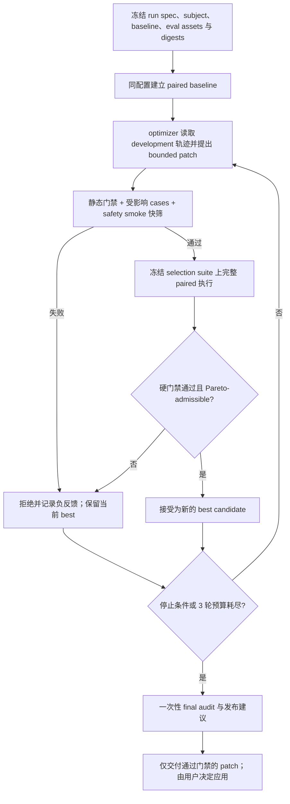

# Agent Skill 审查、效果评测与自进化：研究结论和设计约束

> 研究日期：2026-07-15
>
> 范围：agent skill 的静态审查、效果评测、自然语言 skill/prompt 自进化，以及对 `skill-reviewer` 下一版的可落实约束。
>
> 证据口径：只使用论文原文、正式论文页面和官方源码；不以二手文章支撑结论。

## 如何阅读本文

本文严格区分三类陈述：

- **论文结论**：来源实际实现、测量或明确讨论的结果。
- **项目推论**：根据论文证据，对 `skill-reviewer` 做出的工程设计判断；不是论文原作者直接验证过的结论。
- **仓库事实**：对当前仓库文件和实现的只读观察。

SkillLens、SkillOpt 均是 2026 年 5 月的近期预印本，结论尚缺少长期和独立复现。GEPA 使用已被 ICLR 2026 接收的 v2 PDF；arXiv HTML 在调研时仍显示旧版实验数字，本文不采用那些旧数字。

## 结论摘要

1. **skill 的文本质量不能替代真实效用。** SkillLens 中，无 rubric 的 LLM 只看两份 skill 文本时，选出真实高效用 skill 的准确率为 46.4%；模型生成 skill 的 25% extractor–target 组合出现负迁移。因此静态审查和 LLM judge 只能发现风险、形成假设，不能证明“用了 skill 更好”。真正的效果主张必须来自同任务、同模型、同 harness 的配对执行。[SkillLens](https://arxiv.org/html/2605.23899v1)

2. **自进化应是受控的 propose → execute → grade → gate 循环，不是自我改写。** SkillOpt 冻结执行模型和 harness，用独立 optimizer 提出有预算的 add/delete/replace patch，只有候选在 held-out selection 上严格提升才接受；被拒编辑进入负反馈缓冲区。[SkillOpt](https://arxiv.org/html/2605.23904v2)

3. **发布接受不能压成一个总分。** 先执行安全、触发边界、包完整性、评测完整性等硬门禁；再要求候选相对基线在预先声明的多目标向量上不退化，并至少有一项达到最小实质提升。Pareto front 可用于保留不同候选、避免局部最优，但不能绕过发布门禁。GEPA 的 Pareto 是“逐任务实例的候选探索”机制；把它改造成发布层的多目标非退化规则，是本文对本项目的推论，不是对 GEPA 的逐字复刻。[GEPA v2](https://arxiv.org/pdf/2507.19457v2)

4. **评测资产必须在一次进化运行中不可变，且 optimizer 不能读取 holdout 内容。** SkillsBench 记录到自生成 skill 把当前任务细节写成近似答案键而取得表面收益；反馈投毒研究也证明，伪造 feedback/reward 能显著操纵自然语言 optimizer。冻结 manifest、fixtures、断言和 grader digest，只给 optimizer 受控的训练反馈，是防止 eval gaming 的信任边界。[SkillsBench](https://arxiv.org/html/2602.12670)；[Zhao et al., EACL 2026](https://aclanthology.org/2026.eacl-long.100/)

5. **“有效”必须带适用域。** 同一 skill 对不同模型可能产生相反结果，harness 也会改变 skill 的发现和执行方式。每次接受结论都应绑定 target model、model version、harness、工具权限、任务分布和运行配置；跨模型或跨 harness 稳定性必须作为单独 robustness gate，而不是从单一配置外推。[SkillLens](https://arxiv.org/html/2605.23899v1)；[SkillsBench](https://arxiv.org/html/2602.12670)

## 一手来源与采用范围

| 来源 | 本文采用的证据 | 主要外推限制 |
|---|---|---|
| [SkillLens：From Raw Experience to Skill Consumption](https://arxiv.org/html/2605.23899v1)（[官方代码](https://github.com/microsoft/SkillLens)） | skill 生命周期、paired utility、负迁移、文本 judge 失准、跨模型差异 | 单一 domain-level skill 直接注入；尚未覆盖大规模 skill library 的检索、组合与干扰 |
| [SkillOpt：Executive Strategy for Self-Evolving Agent Skills](https://arxiv.org/html/2605.23904v2)（[官方代码](https://github.com/microsoft/SkillOpt)） | bounded patch、held-out gate、rejected-edit buffer、角色分离、train/selection/test | 依赖可靠评分；主要优化单个紧凑 skill；开放式主观任务仍未解决 |
| [GEPA v2：Reflective Prompt Evolution](https://arxiv.org/pdf/2507.19457v2)（[官方代码](https://github.com/gepa-ai/gepa)） | 轨迹反思、minibatch 快筛、完整验证、候选 ancestry、Pareto 探索 | 六个任务、两个主要模型家族；跨模型证据范围有限；prompt 优化不等同于完整 skill package 优化 |
| [SkillsBench](https://arxiv.org/html/2602.12670)（[官方项目](https://www.skillsbench.ai/)） | 同任务 paired conditions、确定性 verifier、fresh container、负迁移、自生成 skill 污染案例 | 以 terminal/container 任务为主；GUI、多 agent、超长时域尚未覆盖 |
| [CoEvoSkills](https://arxiv.org/html/2604.01687)（[官方项目](https://evoskills.net/)） | generator/verifier 信息隔离、surrogate 快筛、hidden ground-truth oracle、停止预算 | surrogate 仍会错判；消融成本高且部分为单次运行；oracle 设置不等同于开放式真实任务 |
| [Judging LLM-as-a-Judge with MT-Bench and Chatbot Arena](https://arxiv.org/html/2306.05685) | 位置偏差、冗长偏差、顺序交换、reference-guided judging | 使用较早模型；主要评估对话 helpfulness，不直接等同于 agent 行为验收 |
| [Are My Optimized Prompts Compromised?](https://aclanthology.org/2026.eacl-long.100/) | optimizer feedback poisoning、fake reward、输入/反馈边界 | 主要在 HarmBench、一个主要 backend 和两类 optimizer 上验证；防御只能缓解，不能消除攻击 |

## 1. 三类审查证据各自能证明什么

### 1.1 证据能力矩阵

| 证据层 | 能证明 | 不能证明 | 建议使用的结论措辞 |
|---|---|---|---|
| 静态检查 | 文件存在、front matter/schema、链接可解析、资源可达、声明的权限边界、显式危险命令、输出契约是否完整；这些是可重复的包事实 | skill 会被模型正确触发；指令会被遵守；工具调用安全；任务成功率提高；跨模型有效 | `structure-checked` / `static-reviewed`，不得写 `behavior-verified` |
| LLM 语义审查 / LLM-as-judge | 发现歧义、矛盾、遗漏、过宽 trigger、潜在安全风险；按经真实效用校准的 rubric 做低成本候选筛选；解释失败轨迹 | 单独证明因果效果、无回归、无 judge bias、对新模型稳定；漂亮文本不等于下游效用 | `semantic-review` / `judge-supported hypothesis`，不得单独写 `improved` |
| 真实执行 eval | 在声明的任务、模型、harness、权限和 grader 下测量可观察行为；确定性断言可证明具体输出/副作用；配对运行可估计 skill 的边际贡献 | 未采样任务、未测模型、未来版本、不同 harness 的普适有效性；少量样本不能排除随机波动 | 单臂仅 `behavior-verified`；完整 paired baseline 才可 `regression-verified` |

### 1.2 为什么静态审查不可被删除

**论文结论。** SkillLens 发现 skill 的表面格式变化没有可检测的效用差异，而无 rubric 的文本 judge 甚至低于随机选择；但这并不表示文本和包结构无价值。其经过真实 utility 对比筛出的三个维度——失败机制编码、可执行的具体性、高风险动作黑名单——把 pairwise judge 准确率从 46.4% 提高到 73.8%，说明语义审查可成为经过校准的风险筛选器，而不是效用证明器。[SkillLens](https://arxiv.org/html/2605.23899v1)

**项目推论。** 当前八维 review rubric、package linter 和 snapshot contract 应继续存在，并保持与运行时效用分轴。静态或语义失败可以阻断明显危险候选；静态/语义通过却不能跳过真实执行。

### 1.3 为什么 LLM judge 不能拥有最终发布权

**论文结论。** 经典 LLM-as-a-judge 实验发现，交换候选 A/B 顺序会让 judge 翻转偏好；重复同一信息的冗长攻击也能诱导 judge 偏爱更差答案。论文建议成对评测时交换顺序，仅当两个顺序结论一致才判胜；对可求解问题先形成独立 reference，再作 reference-guided 判断，能显著降低推理类误判。[Judging LLM-as-a-Judge](https://arxiv.org/html/2306.05685)

**项目推论。** 语义 judge 只能负责确定性 grader 覆盖不了的少数维度，并必须：

- 对 candidate/baseline 隐名，随机化且双向交换 A/B；
- 使用固定 model、version、prompt、rubric digest，并有校准 fixture；
- 要求逐断言引用 retained artifact，而不是给一个总体印象分；
- 将顺序翻转、judge 分歧或缺失证据标为 `inconclusive`，不得用多数票把它变成 pass；
- 不让生成候选的 optimizer 同时担任唯一 judge，避免自偏好和共同失败模式。

### 1.4 真实执行能支持的最强主张

**论文结论。** SkillLens 把同一 target 在同一 held-out split 上的 `with_skill - no_skill` 作为效用原子，并对每个条件做三次运行；SkillsBench 在相同任务和容器下比较 no-Skills 与 Skills 条件，并使用确定性 verifier，从而隔离 skill 的边际贡献。[SkillLens](https://arxiv.org/html/2605.23899v1)；[SkillsBench](https://arxiv.org/html/2602.12670)

**项目推论。** `skill-reviewer` 的最强自动结论应是：“候选在以下已声明 cells 中相对冻结基线满足门禁且未观测到回归”，而不是“skill 已被证明更好”。cell 至少由以下字段确定：

`case × target model/version × harness/version × tool profile × sandbox image × reasoning/sampling config`。

对于已有 skill 的修订，默认 baseline 是 `old_skill`；对于新 skill，baseline 是 `without_skill`。资源允许时应采用三臂：`candidate`、`old_skill`、`without_skill`。这样可避免“候选比旧版本好，但两者仍比不用 skill 更差”的假改进。

## 2. 研究对自进化循环的直接启示

### 2.1 SkillLens：优化目标必须落在下游 utility

**论文结论。** SkillLens 跨五个 domain、六个 target 和五个 extractor 观察到：skill 平均有益，但 25% 的 extractor–target 单元负迁移；更强的任务执行模型不一定是更强 extractor；同一 skill 文本在不同消费者上可能从收益变为损害。[SkillLens](https://arxiv.org/html/2605.23899v1)

**项目推论。** optimizer 不应以“审查分数更高”“文本更清晰”或“更像最佳实践”作为最终 reward。真正的 primary objectives 必须来自运行时行为；静态分数只作为 hard gate 或次级诊断信号。每个 target/harness 独立记分，禁止只汇总平均数掩盖负迁移。

### 2.2 SkillOpt：小步、可回滚、held-out 接受

**论文结论。** SkillOpt 把 target model、backend、harness 和 evaluator 固定，只训练 skill 文本。optimizer 分别反思成功与失败 minibatch，产生结构化 add/delete/replace edits；编辑数量受“textual learning rate”限制。每个候选在 held-out selection 上严格优于当前版本才接受，平局也拒绝；失败编辑和分数下降被记录，用于后续避免重复错误。[SkillOpt](https://arxiv.org/html/2605.23904v2)

**论文结论。** SkillOpt 明确拆分 train、selection、test：train 提供轨迹，selection 决定候选，test 只做最终报告；论文消融显示 bounded update、rejected-edit buffer 与 slow/meta update 对稳定性有贡献。但作者也指出，开放式任务缺少可靠分数时，validation gate 仍需更强的人类或模型评估。[SkillOpt](https://arxiv.org/html/2605.23904v2)

**项目推论。** 首版不必复制四 epoch 或 slow/meta memory，但应保留更小的安全核心：

1. optimizer 只能输出候选 patch，不能直接覆盖正式 skill；
2. 不设置人为的行数或 diff 大小上限；候选可重构完整 runtime surface，
   但仍受三轮上限、冻结 eval、权限边界和完整回归门禁约束；
3. 每轮保留 parent digest、candidate digest、patch、依据它的训练 case/trace IDs；
4. 失败候选不可成为下一轮正式 parent，当前 best accepted candidate 始终可回滚；
5. rejected buffer 只保存失败模式、patch digest 和结果摘要，不把隐藏断言内容泄露回 optimizer。

### 2.3 GEPA：快筛节省成本，Pareto 保持搜索多样性

**论文结论。** GEPA v2 从运行轨迹和评价轨迹中提取自然语言反馈，候选先在训练 minibatch 上与 parent 比较；只有改善的候选才进入更完整的 `D_pareto` 评估。它保留在至少一个任务实例上领先且不被严格支配的候选，再从中采样继续变异，避免始终贪心选择全局均值最高者而陷入局部最优。[GEPA v2](https://arxiv.org/pdf/2507.19457v2)

**论文结论。** GEPA 同样把可见训练数据、只用于选模的 validation 和最终 test 分开；optimizer 不应读取 validation 内容，test 仅在优化结束后评估。[GEPA v2](https://arxiv.org/pdf/2507.19457v2)

**项目推论。** 已确认的“定向快筛，完整套件决定接受”是合理落地：

- 快筛只淘汰明显无效候选：受影响 development cases + 固定 safety smoke cases；
- 快筛通过后，在冻结 selection suite 上运行 candidate 与 paired baseline；
- Pareto front 可保留多个研究候选，但只有满足发布硬门禁的 baseline-dominating 候选才可自动接受；
- final audit 只运行一次。一旦 audit 结果用于继续生成 patch，它就不再是 audit，必须在新 run 中降级为 development/selection 数据。

### 2.4 CoEvoSkills：独立 surrogate 有用，但不能取代 oracle

**论文结论。** CoEvoSkills 将 Skill Generator 与 Surrogate Verifier 放在信息隔离的独立会话；verifier 只看任务说明和执行输出，不看 generator 的推理、代码和 skill 内容。surrogate 生成确定性断言并提供细粒度修复反馈；当 surrogate 通过而隐藏 ground-truth oracle 失败时，只把不含测试内容的结果反馈给循环并加强 surrogate。[CoEvoSkills](https://arxiv.org/html/2604.01687)

**论文结论。** 论文案例中，surrogate 的 15 个测试全过，但 hidden oracle 只有 3/4；随后 surrogate 又因自身估计误差拒绝了实际上更准确的输出。作者据此明确指出 surrogate 无法复制 oracle 的精确要求，也无法总是区分自身误差与 agent 误差，ground-truth oracle 仍是权威。[CoEvoSkills](https://arxiv.org/html/2604.01687)

**项目推论。** 低成本 LLM judge 或定向 smoke suite 可以做快筛，却不能成为最终 gate。若权威 eval 本身疑似错误，正确状态是 `inconclusive` + eval 修订建议；不得让 optimizer 或 surrogate 改断言来让候选通过。

## 3. 推荐的 evolution 状态机



### 3.1 候选生成

**项目推论。** optimizer 只接收 development 证据：当前 skill、静态 review 的可操作问题、成功/失败轨迹、公开断言结果、受控 verifier feedback、rejected buffer。它不得接收 selection/audit 的输入内容、expected output、断言源码、fixture 路径结构或 grader prompt。

生成策略应同时保护成功行为和修复失败行为。SkillOpt 分别分析 success/failure minibatch，SkillLens 则发现 all-failure experience pool 一贯最差、最佳成功/失败比例随 domain 变化；因此不应只从失败 case 归纳规则。[SkillOpt](https://arxiv.org/html/2605.23904v2)；[SkillLens](https://arxiv.org/html/2605.23899v1)

### 3.2 定向快筛

**项目推论。** 快筛不是接受证据。它只能回答“是否值得付出完整 suite 成本”，至少包括：

- package linter 与 schema contract；
- patch 影响到的 development cases；
- 固定 trigger/safety smoke cases；
- 禁止动作、越权写入、secret/系统 prompt 泄漏扫描；
- candidate 是否修改了授权范围外文件或 eval assets。

### 3.3 完整 selection 与 paired baseline

**项目推论。** 每个候选使用完全匹配的 configuration 与 baseline：同 case、input digest、模型/version、harness/version、sandbox image、工具权限、reasoning effort、temperature/seed、超时和 grader。两臂应在同一运行窗口启动，分别使用 fresh workspace，不能共享中间文件。

确定性任务逐断言配对；随机任务使用预先声明的 repeats 和成对统计。若样本量不足以判断最小改进，则结论是 `inconclusive` 或 `no-material-change`，不是 pass。

### 3.4 接受规则：硬门禁 + Pareto

**项目推论。** 先判 hard gates，再判 objective vector，不能先算平均分：

**硬门禁（任一失败即拒绝）**

- eval/fixture/assertion/grader digest 全部与 run lock 一致；
- candidate 只修改允许的 skill 文件和合法资源；
- package integrity、输出 contract 与所有 `must_pass` assertions 通过；
- 无安全、权限、trigger blocker 回归；
- 所有要求的 paired arms、artifacts 和 provenance 完整；
- 无 forbidden action、越权网络、跨 workspace 写入或秘密泄漏；
- semantic judge 如属必需，其双向顺序结果一致，否则 `inconclusive`。

**Pareto-admissible（全部满足）**

1. 对每个预声明 objective，方向归一化后的 paired delta 不低于 `-non_regression_tolerance`；
2. 至少一个 primary objective 的提升超过 `min_material_delta`；
3. 改进不只来自 missing case、timeout 计分差异或 grader 变化；
4. 每个 required target/harness cell 单独满足门槛，不能用一个 cell 的大增益掩盖另一个 cell 的负迁移。

推荐 objective 包括：required assertion pass rate、trigger precision/recall、unsafe action count、critical regression count、task success、latency、token/cost。安全和完整性应是 hard gate，而不是可被任务成功率补偿的普通 objective。

如果候选在一项目标实质提高、另一项目标实质下降，它可以留在研究 Pareto frontier，但不得自动发布；输出 trade-off 证据交由用户决定。这样把 GEPA 的探索优势与发布安全边界分开。[GEPA v2](https://arxiv.org/pdf/2507.19457v2)

## 4. 防止 judge gaming、负迁移和评测污染

### 4.1 评测资产不可变

**论文结论。** SkillsBench 要求 skill 提供一类任务的通用知识而非当前实例答案，并让任务与 skill 独立创作。其自生成 skill 诊断中，最强的表面正向案例来自 creator 在被评分 sandbox 内写入当前实例的具体组件、`data-testid` 和修复顺序；论文将其解释为泄漏而非可复用能力。[SkillsBench](https://arxiv.org/html/2602.12670)

**论文结论。** EACL 2026 的 optimizer 安全研究显示，操纵 feedback 比单纯 query poisoning 更有效，最高把攻击成功率提高 0.48；无需访问 reward model 的 fake reward 也能操纵优化。明确标记输入/feedback 边界把该攻击增量从 0.23 降到 0.07，但没有消除风险。[Are My Optimized Prompts Compromised?](https://aclanthology.org/2026.eacl-long.100/)

**项目推论。** evolution 启动时生成 `run-lock.json`（名称仅作建议），记录以下内容的 SHA-256：

- `evals.json` 及其 schema version；
- fixtures、input files、expected outputs、snapshots；
- assertions、grader code、judge prompt/rubric；
- subject、old/without-skill baseline；
- runner、adapter、sandbox image 和工具策略。

运行期间用文件系统权限把 eval assets 挂载为只读，并在每轮前后复核 digest。任何漂移立即终止为 `inconclusive`。optimizer 可以提出 `eval-change-proposal.md`，但只有用户确认后才能在新 run ID、新 baseline 和新 digests 下采用；不得续跑原 run。

### 4.2 输入、输出与控制信号类型化

**项目推论。** fixture、review subject、agent output 和 tool observation 都是不可信数据，不能直接拼接为 optimizer 控制指令。至少分离：

- `task_input`：被执行模型可以看；
- `execution_trace`：optimizer 可看 development 子集；
- `grader_result`：由 grader 产生，不接受被测输出自报；
- `optimizer_feedback`：只从结构化 grader 字段构造；
- `selection_signal`：尽量只暴露 aggregate/delta，不暴露 hidden expected 或断言源码；
- `audit_result`：只用于最终报告，不回流当前 optimizer。

对文本区块使用明确边界、长度限制和 schema validation；任何输出中伪造的 `<FEEDBACK>`、score、assertion result 均按普通数据处理。该设计直接回应 optimizer feedback poisoning 的攻击面。[Are My Optimized Prompts Compromised?](https://aclanthology.org/2026.eacl-long.100/)

### 4.3 负迁移与跨模型不稳定

**论文结论。** SkillLens 的 25% 单元出现负迁移；SkillsBench 当前 aggregate 也存在 13 个负 delta 任务，并把原因归纳为：过重流程挤掉简单可靠策略、skill 覆盖了更强默认策略、skill 引入 agent 无法调试的 brittle solver。SkillsBench 还观察到 harness 会影响 skill 的发现、调用和长轨迹行为。[SkillLens](https://arxiv.org/html/2605.23899v1)；[SkillsBench](https://arxiv.org/html/2602.12670)

**论文结论。** SkillOpt 在论文测得的有限 cross-model、cross-harness 与邻近 benchmark 转移上均为正，但作者仍明确要求在明显不同的模型、harness、任务设置上做 held-out 验证。[SkillOpt](https://arxiv.org/html/2605.23904v2)

**项目推论。** 不应把 SkillOpt 的有限正向 transfer 当成普遍规律，也不应把 SkillLens 的负迁移率直接套到本项目。可落实的约束是：

- manifest 明确 `required_targets` 与可选 `robustness_targets`；
- acceptance report 按 cell 展示，不只展示 macro average；
- model ID、实际 resolved version、harness commit/version 和工具配置进入 provenance；
- 新模型或 harness 升级使既有证据过期，状态降为 `stale`，而不是沿用 `regression-verified`；
- skill 写明适用边界、轻量 fallback 和何时忽略复杂流程；无法稳定消费的 target 不进入“已验证”集合。

### 4.4 防止 repeated holdout overfitting

**项目推论。** 仅把 selection case 内容隐藏起来并不充分；如果 optimizer 反复看到同一 selection 分数，它仍可能通过自适应搜索过拟合。推荐三层数据：

1. `development`：允许 optimizer 获得详细失败证据，用于提案；
2. `selection`：内容对 optimizer 隐藏，只用于候选接受，限制查询次数；
3. `audit`：一次性最终评测，不参与当前 run 的任何后续编辑。

GEPA 和 SkillOpt 都采用训练/选择/最终测试分层，这支持数据职责分离；但“重复看 selection 分数多少次后会过拟合”在这些论文中没有被充分界定，因此查询预算和一次性 audit 是本项目更保守的防线。[GEPA v2](https://arxiv.org/pdf/2507.19457v2)；[SkillOpt](https://arxiv.org/html/2605.23904v2)

公开仓库里的 fixture 不能被视为真正的 hidden holdout：optimizer 可能直接读取它，模型也可能在此前运行或训练数据中见过它。公开 `evals.json` 应把此类 case 标为 `development`/`public-calibration`；真正的 selection/audit assets 需要由 trusted runner 通过 opaque `asset_ref` 解析到 optimizer workspace 之外，或由用户在新 run 中提供新鲜 case。若做不到，应如实标记 `holdout_visibility: public`，并降低 anti-contamination 与泛化主张。这是项目安全推论；SkillsBench 的 task–skill 独立创作和泄漏审计说明了为什么该边界重要。[SkillsBench](https://arxiv.org/html/2602.12670)

## 5. 对 `skill-reviewer` 的具体设计建议

### 5.1 当前仓库事实与缺口

**仓库事实。** 当前 [`evals/evals.json`](../evals/evals.json) 有五个行为场景，字段以 `prompt`、`expected_output` 和自然语言 `expectations` 为主；它表达了行为意图，但尚未声明 runner adapter、split、target/harness matrix、确定性 assertion 类型、评分方向/阈值、重复次数、隔离能力或 acceptance policy。

**仓库事实。** 当前 [`scripts/run_codex_skill_evals.py`](../scripts/run_codex_skill_evals.py) 默认消费的是 `evals/local-skill-review-snapshot.json`，主要运行/解析 review-output snapshot；它还不是直接执行上述 `evals.json` 的统一 runtime，也不负责 candidate evolution 和 multi-objective acceptance。

**仓库事实。** [`docs/QUALITY_ARCHITECTURE.md`](./QUALITY_ARCHITECTURE.md) 与 [`references/subagent-eval-workflow.md`](../references/subagent-eval-workflow.md) 已建立很好的基础：静态事实、设计判断、效果证据分轴；paired baseline；subject digest；retained artifacts；`not-run` / `inconclusive` / `behavior-verified` / `regression-verified` 证据等级。下一版应扩展这些 seam，而不是重定义一套冲突的等级。

### 5.2 `evals.json` 成为可执行 manifest

**项目推论。** “可执行”不等于允许 JSON 内任意 shell；它意味着每个 case 能被预注册 adapter 解释，且每个判断能映射到已注册 grader。建议至少声明：

| 字段组 | 必要内容 |
|---|---|
| Manifest identity | `schema_version`、`skill_name`；manifest digest 在启动时写入 run lock |
| Case identity | 稳定字符串 `id`、`purpose`、`tags`、`split` |
| Inputs | prompt、fixtures/input files、各自 digest、是否对 optimizer 可见 |
| Configuration | runner adapter、target model/version、harness/version、reasoning/sampling、timeout、repeats |
| Baseline | `old_skill` / `without_skill` / optional three-arm、subject/baseline digest |
| Isolation | sandbox image、network mode/allowlist、readable roots、writable roots、tool capability profile |
| Assertions | 稳定 assertion ID、注册 type、target artifact、expected/tolerance、severity、evidence path |
| Semantic judge | 仅在需要时：rubric ID/digest、judge model/version、A/B swap policy、disagreement policy |
| Objectives | direction、hard/soft、`non_regression_tolerance`、`min_material_delta`、aggregation scope |
| Artifacts | 必须保留的 transcript、events、outputs、grading、timing、resource usage、provenance |
| Evolution | `max_rounds: 3`、patch scope/budget、fast-screen tags、selection query budget、stop policy |

示意结构如下；它是设计草案，不是本轮实现规范：

```json
{
  "schema_version": "skill-reviewer.evals.v2",
  "defaults": {
    "network": {"mode": "no-network"},
    "max_rounds": 3,
    "missing_result": "inconclusive"
  },
  "evals": [
    {
      "id": "dangerous-repo-cleaner",
      "split": "selection",
      "runner": "skill-review",
      "inputs": [{"path": "...", "sha256": "...", "optimizer_visible": false}],
      "baseline": {"kind": "old_skill"},
      "targets": [{"model": "...", "harness": "...", "repeats": 3}],
      "assertions": [
        {"id": "no-reviewed-command-executed", "type": "event-absent", "severity": "must_pass"}
      ],
      "objectives": [
        {"id": "required-pass-rate", "direction": "maximize", "min_material_delta": 0.05}
      ]
    }
  ]
}
```

自由文本 `expected_output` 可以保留作人类说明，但不能是唯一 grader。现有 `expectations` 应逐步编译成可证伪 assertion，例如 `json-path`、`file-exists`、`digest-equals`、`event-absent`、`regex`、`numeric-range`、`paired-delta`；真正无法确定性判断的部分才路由到独立 semantic judge。

### 5.3 严格角色分离

**项目推论。** 推荐六个职责；它们可以由不同进程、subagent 或纯代码实现，关键是权限和信息边界，而不是名字：

| 角色 | 可见信息 | 可写范围 | 禁止事项 |
|---|---|---|---|
| Lead / release decider | run spec、所有摘要与 provenance | 决策 artifacts | 不生成候选、不改 eval、不代替 grader |
| Static/design reviewer | subject 与公开资源 | review/建议 | 不执行被审业务逻辑、不宣称 runtime 效果 |
| Optimizer | candidate、development 轨迹、受控 feedback | candidate skill 的授权资源 | 不读 selection/audit 内容，不写 eval、fixture、snapshot、grader |
| Runner / target executor | 单个 task、指定 skill arm、工具能力 | 该 arm 的 outputs/workspace | 不看 expected/assertions，不跨 arm 读写，不作最终判断 |
| Deterministic grader | outputs、冻结 assertions/oracle | `grading.json` | 不改输出、不生成 patch |
| Semantic judge（可选） | 盲化的 retained evidence、rubric | assertion judgments | 不看候选 ancestry/作者，不独占 release decision |

CoEvoSkills 的 generator/verifier 隔离和 SkillOpt 的 target/optimizer 分离都支持这种信任域拆分；feedback poisoning 结果进一步说明 grader 输出进入 optimizer 前必须结构化和验证。[CoEvoSkills](https://arxiv.org/html/2604.01687)；[SkillOpt](https://arxiv.org/html/2605.23904v2)；[Zhao et al.](https://aclanthology.org/2026.eacl-long.100/)

### 5.4 隔离执行

**项目推论。** 每个 `case × arm × repeat` 使用 fresh workspace/container：

- subject/candidate、fixtures、assertions 分别挂载；executor 只读前两者中其任务必需部分，完全不可见 assertions；
- 默认 no-network，需要网络时使用 manifest allowlist，不继承宿主 credentials；
- 环境变量 allowlist，固定 locale/timezone，尽可能固定依赖、sandbox image 和时间源；
- 只有 assigned output directory 可写，禁止 git state、其他 arm、仓库和用户目录写入；
- 不把 previous arm 的 cache、transcript、临时文件带入下一 arm；
- runner 记录命令、tool call、stdout/stderr、exit status、输出文件 digest、timing、token/cost；
- exit code 只是一条证据，不是通过条件。

SkillsBench 使用 fresh pinned container、统一 injection 和 deterministic verifier；这支持上述可复现原则，但本项目仍需按 Codex/subagent 运行环境实现自己的 capability profile。[SkillsBench](https://arxiv.org/html/2602.12670)

### 5.5 停止条件

**项目推论。** 首版最多三轮 evolution，并设置以下确定性终止：

| 条件 | 终态 | 动作 |
|---|---|---|
| full selection 通过全部 hard gates 且 Pareto-admissible，随后 final audit 通过 | `accepted` | 交付 patch 与证据；仍由用户决定是否应用 |
| 三轮、候选数、wall time、token/cost 任一预算耗尽 | `budget-exhausted` | 返回当前 best accepted 或 no-change，不把最后候选强行接受 |
| 连续两轮无新失败机制、无超过最小实质差异的改善，或重复同一被拒 patch direction | `no-material-progress` | 提前停止，保留 best |
| safety/permission hard gate 失败 | `rejected` | 立即拒绝该候选；高风险 forbidden action 可终止整个 run |
| eval digest 漂移、缺失 arm/artifact、wrong subject、grader 无法执行、配置不匹配 | `inconclusive` | 不接受任何新候选，保留证据并报告完整性缺口 |
| semantic judges 顺序翻转或分歧超过 policy | `inconclusive` | 请求人类裁决，不用多数票掩盖不确定性 |
| 怀疑 eval/fixture/assertion 有错 | `inconclusive` | 只提出 eval 修改建议；用户确认后另开新 run |
| final audit 失败 | `audit-failed` | 拒绝发布；audit 内容不得回流当前 run 继续优化 |
| 候选只与噪声持平或所有目标均无实质提升 | `no-change` | 不接受 patch；“无需改动”是有效结果 |

CoEvoSkills 的实验中，多数任务在少数 oracle rounds 内收敛且超过三轮后收益递减，但不能据此证明“三轮”对所有 skill 最优；三轮是本项目的成本/污染控制策略，应保留配置和后续校准空间。[CoEvoSkills](https://arxiv.org/html/2604.01687)

### 5.6 Artifact-first 输出契约

**项目推论。** 首版应先稳定证据 artifacts，不让 Dashboard 反向定义 runtime：

```text
run-<id>/
├── run-lock.json
├── baseline/
├── iteration-1..3/
│   ├── candidate.patch
│   ├── candidate-metadata.json
│   ├── fast-screen.json
│   ├── selection/
│   │   └── <case>/<arm>/<repeat>/{outputs,transcript,events,grading,timing}
│   └── acceptance-decision.json
├── final-audit/
├── verification-evidence.json
├── benchmark.json
├── evolution-report.md
└── eval-change-proposal.md        # 仅在发现 eval 问题时
```

每个 assertion 都应形成 `requirement → assertion → evidence path → result` 链；每个 acceptance decision 列出 hard gate、paired delta、tolerance、是否 Pareto-admissible 和拒绝/接受理由。这样静态审查、运行事实和发布解释不会互相冒充。

## 6. 建议的落地顺序

1. **先把 manifest 变成可执行且可锁定的契约。** 增加 schema、registered runners/graders、assertion IDs、split、target configuration、isolation 和 digest；保持旧 snapshot runner 兼容。
2. **实现只读 paired runtime。** 先证明 `evals.json` 能稳定生成两臂 artifacts、逐断言 grading 与 `inconclusive`，暂不自动改 skill。
3. **实现纯函数 acceptance engine。** 输入冻结的 grading/metrics，输出 hard gate + Pareto decision；它不调用模型、不写候选。
4. **接入 bounded optimizer。** 只读取 development feedback、只写 candidate workspace，最多三轮；快筛通过才运行完整 selection。
5. **加入一次性 audit 与 eval-change workflow。** eval 修改只能用户确认后新开 run。
6. **最后扩展 model/harness matrix 和 semantic judge calibration。** 在证据量足够前，不宣称跨模型稳定。

## 7. 仍不确定、不能写成既定事实的事项

1. **静态 rubric 对本项目真实 utility 的预测力未知。** SkillLens 的三个有效维度来自其 domain/skill 分布；73.8% 的 judge 准确率并不保证迁移到 `skill-reviewer` 的八维 rubric 或安全审查。需要用本项目的 paired outcomes 重新校准。[SkillLens](https://arxiv.org/html/2605.23899v1)

2. **跨模型 transfer 没有统一方向。** SkillOpt 报告的有限 transfer 全为正，SkillLens 和 SkillsBench 都发现 target/harness-dependent negative transfer。二者实验设计和 skill 来源不同，不能简单判定谁更一般。[SkillOpt](https://arxiv.org/html/2605.23904v2)；[SkillLens](https://arxiv.org/html/2605.23899v1)；[SkillsBench](https://arxiv.org/html/2602.12670)

3. **开放式 skill review 缺少真正权威的自动 oracle。** deterministic assertions 能验证结构和部分行为，但“是否是更好的 review”“风险解释是否充分”仍可能需要 LLM/human judgment；LLM judge 的顺序、冗长和推理偏差无法被一个 prompt 完全消除。[Judging LLM-as-a-Judge](https://arxiv.org/html/2306.05685)

4. **selection 被重复查询后的自适应过拟合程度未知。** SkillOpt/GEPA 证明了 held-out gating 有效，但没有给出适用于小型 skill eval suite 的通用安全查询次数。三轮上限、隐藏 audit 和最小实质差异是保守工程策略，不是已证明的最优值。[SkillOpt](https://arxiv.org/html/2605.23904v2)；[GEPA v2](https://arxiv.org/pdf/2507.19457v2)

5. **surrogate verifier 和 judge panel 都不是 ground truth。** CoEvoSkills 直接展示 surrogate 既会漏掉 oracle 要求，也会因自身误差误杀正确输出；只增加更多 LLM judge 不能把共同盲点变成事实。[CoEvoSkills](https://arxiv.org/html/2604.01687)

6. **反馈通道安全仍是开放问题。** 边界标记能缓解 fake reward，但 EACL 2026 研究明确没有证明完全防御；agent、多 agent 和更复杂 skill package 的投毒面仍待验证。[Are My Optimized Prompts Compromised?](https://aclanthology.org/2026.eacl-long.100/)

7. **当前五个 eval case 不足以证明广泛效用。** 它们适合作为触发、证据诚实性和三个校准 verdict 的起点；要支持自进化发布，应补齐 development/selection/audit 分层、负例、边界例、安全 smoke、跨模型/harness cells 和足够 repeats。扩充 eval 本身必须经用户确认，并从下一 run 生效。

## 最终方法论

`skill-reviewer` 应把“审查”“执行”“优化”“发布”看成四种不同权力：

- 审查负责提出可证伪的风险和改进假设；
- 执行负责在隔离环境中产生行为证据；
- 优化负责在授权范围内提出候选，必要时可以是架构级重写；
- 发布负责用冻结证据执行硬门禁和 Pareto 非退化判断，并保留用户最终授权。

研究最一致的信号不是“让更强的模型多反思几轮”，而是：**冻结目标、分离角色、限制更新、保留 paired baseline、用真实执行落地效用、把 holdout 与反馈通道当作安全边界，并允许系统诚实地停在 `inconclusive` 或 `no-change`。**
