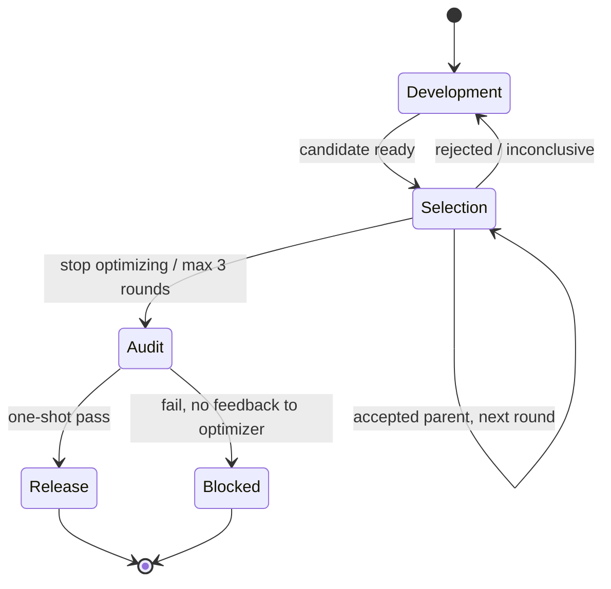
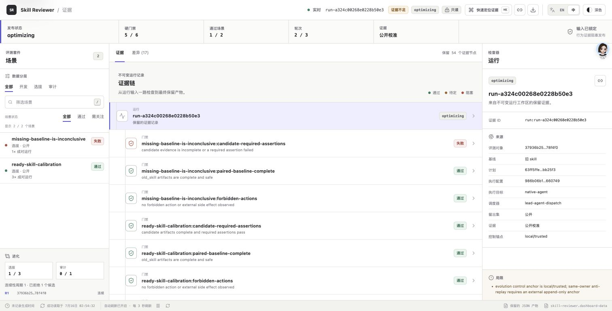
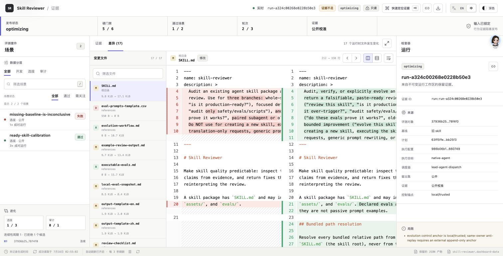

# Skill 不该靠「看起来不错」发布

> **skill-reviewer：面向 Agent Skill 的证据化质量与发布治理系统**  
> 它不关心 candidate 是由人、Darwin、AutoSkill、EvoSkill 还是其他 optimizer 生成；它只追问一件事：**在冻结的验证权威下，这个 Skill 是否真的让目标 Agent 变得更好，而且没有牺牲不可退让的能力？**


很多 Skill review 停在两个瞬间：读完 `SKILL.md`，觉得结构清楚；跑完一个 demo，看到输出不错。问题是，这两种信号都很容易制造错觉。

[SkillLens](https://arxiv.org/html/2605.23899v1) 在 150 个 domain × target × extractor 组合中观察到 **25% 的负迁移**；同一个 Skill 可能帮助一种目标模型，却伤害另一种模型。没有真实对照执行，我们无法知道所谓「写得更好」是否真的变成了「做得更好」。

这也是 skill-reviewer 的起点：把 Skill 从一份提示词，重新定义为一个需要被编译、执行、裁决和审计的**外部行为系统**。

---

## 01｜先给结论：Review 的对象不是文档，而是行为变化

一个可发布的 Skill 至少需要回答三类问题：

| 证据层 | 关键问题 | skill-reviewer 如何回答 |
|---|---|---|
| Package facts | 文件、引用、脚本、权限与安装包是否完整？ | 严格 lint、manifest 校验、资源图与安装 smoke test |
| Design hypothesis | 触发、指令、安全边界与输出设计是否合理？ | rubric 驱动的静态与语义审查，输出可证伪 finding |
| Behavioral evidence | 目标 Agent 在真实场景里是否更好？ | candidate / baseline 配对执行、typed assertions、硬门禁与审计 |

> **设计原则**  
> 静态审查负责发现风险，语义审查负责补充判断，真实执行负责证明效果。三者是并列证据，不能用平均分互相抵消。

因此，skill-reviewer 不是一个「给 Skill 打分」的工具，而是一条从 package 到 release decision 的质量链路。

---

## 02｜一张图看懂：五个角色，只有一个发布结论



这套架构刻意把权力拆开：

- **Eval Authority** 决定什么是问题、哪些输入可见、哪些门槛不可退让；`evals.json`、execution profile、baseline 与 holdout 会被 digest 冻结。
- **Lead Agent** 把编译后的 sanitized assignment 分发给原生 worker；runtime 本身不绑定某一种 Agent SDK。
- **Executor** 只完成场景并产生产物，不读取答案，不修改 eval，也不判断自己是否应该发布。
- **Grader / Gate** 先跑确定性断言，再做盲化语义补充，最后执行硬门禁与多目标非退化裁决。
- **Dashboard** 只读取证据投影，不执行、不批准，也不成为第二套真相来源。

这也解释了一个容易被误解的问题：**首个完整 executor 不需要绑定某种 subAgent 实现。** 主 Agent 可以使用当前宿主提供的 worker surface 做分发；证据需要绑定 assignment、execution profile、输入与产物 digest，而不是记录某个 subAgent 的产品版本自述。

---

## 03｜算法底座：把「更好」写成可拒绝的条件

### 3.1 硬门禁先于优化目标

candidate 被接受，需要同时满足：

```text
Accept(c) = all_hard_gates_pass
         ∧ every_objective_non_regressing
         ∧ at_least_one_primary_objective_materially_improves
```

也就是说：

1. 安全、完整性、必需断言等 hard gate 必须全部通过；
2. 每一个声明目标都不能超过容忍度退化；
3. 至少一个主目标必须达到「实质改进」阈值；
4. 平局、证据缺失或方向分歧都不会被包装成胜利。

它与简单加权总分的区别很关键：一个漂亮的文案分数，不能抵消危险权限、丢失资源或关键能力回退。

### 3.2 确定性断言优先，语义断言补充

[SkillsBench](https://arxiv.org/html/2602.12670v4) 的实践说明，固定环境、确定性 verifier、配对条件和重复 trial 是可靠评测的基础。skill-reviewer 因此优先使用 schema、文件、退出码、精确值、集合关系和正则等 typed assertions。

只有无法可靠程序化的质量，才交给语义 judge。语义比较采用匿名 A/B 与调序后的 B/A 两次判断：

- 两次方向一致：保留为补充证据；
- 两次方向冲突：结论为 `inconclusive`；
- 不增加第三票强行打破分歧。

这不是假设 Judge 不会犯错，而是承认它会犯错。[LLM-as-a-Judge 研究](https://arxiv.org/html/2306.05685) 已观察到位置、冗长和自增强偏差；调序只能暴露部分不稳定，不能把 Judge 变成 Oracle。

### 3.3 重复规则不是「多跑几次取平均」

- 确定性场景：默认 1 次；
- 含随机性的场景：candidate 与 baseline 默认成对 3 次；
- 重复之间方向冲突：进入不确定态，而不是只保留平均值。

Dashboard 会保留逐 case、逐 arm、逐 repeat 的事实，让总体均值无法隐藏局部失败。

---

## 04｜`evals.json` 是真实可触发的场景协议


`evals.json` 不是给人阅读的样例目录，而是 runtime 的唯一行为入口。一个有效 case 同时声明：真实用户 prompt、输入文件、确定性等级、断言、优化目标、权限与数据 split。

```json
{
  "id": "safe-refactor",
  "split": "selection",
  "prompt": "在真实仓库中完成重构并保留验证产物",
  "determinism": "stochastic",
  "assertions": [
    { "type": "exit_code", "expected": 0, "severity": "must_pass" },
    { "type": "file_exists", "artifact": "outputs/report.md", "severity": "must_pass" }
  ],
  "objectives": [
    { "metric": "required_pass_rate", "direction": "maximize", "primary": true }
  ]
}
```

编译器会把 case 展开成 `case × arm × repeat` assignments，并为每个 worker 创建独立只读 Skill / input snapshot 与可写产物目录。worker 只拿到必要输入，不会看到 assertion 的期望值、校准答案、另一 arm 的结果或最终 audit 内容。

> **无效 manifest 是发布阻断项。**  
> 发现 `evals.json` 就意味着系统必须编译并执行其契约；字段错误、资源漂移或 digest 不一致不能静默跳过。eval 本身在当前授权闭环内不可变；系统可以提出改进建议，但只有用户确认后才能形成新的权威集合和新的 run。

---

## 05｜连续进化：让 optimizer 有创造权，但没有批准权

skill-reviewer 支持受控演化，但不会让同一个角色同时改 candidate、改考试题、阅卷并宣布自己上线。



核心边界是：

- development surrogate 可以学习失败、提议新断言、帮助生成下一 candidate；
- selection 权威在一次闭环里冻结，候选必须绑定已接受父代；
- rejected candidate 永远不能成为下一轮父代；
- 最终 opaque audit 只运行一次，失败细节不回流 optimizer；
- 默认最多 3 轮 selection，不把验证集训练成开发集。

Skill 本身允许大幅架构调整，而不仅是小段文本 patch。若目录拓扑、模块职责或执行面变化已经破坏同源比较，系统会重置 continuity 和 baseline，而不是用一个旧版本号伪装成同一条 lineage。

[CoEvoSkills](https://arxiv.org/html/2604.01687v2) 证明了开发期 surrogate verifier 可以随失败共同进化，也展示了 surrogate 全部通过而隐藏 oracle 仍失败的情况。我们的取舍更保守：**代理测试可以成长，但不能接管最终权威。**

---

## 06｜Dashboard 不是报告皮肤，而是验证链路的产品界面

当前 Dashboard 使用 React、TypeScript、Vite、Vitest 与 `@pierre/diffs` 构建，是一个只读 evidence workbench：

- 左侧定位 case、gate、assertion 与 artifact；
- 中间查看证据或 candidate / baseline 文档 diff；
- 右侧检查 run、profile、digest、repeat、lineage 与限制；
- 支持中英文、明暗主题、split / unified diff、自动换行、focus mode、命令面板与固定链接；
- 大文件按需加载，diff 使用 worker 高亮与虚拟化渲染；
- 刷新失败时保留最后一次已验证投影，并明确标记 stale state。





> Dashboard 展示的是同一证据链的只读投影。截图能证明信息结构和交互，不能单独证明算法收益；发布结论仍要回到 retained JSON、artifact 与 gate decision。

---

## 07｜一次真实运行：系统最有价值的回答可能是「不通过」

为了让截图不是 mock，我们用当前 candidate 与 `main` 上的 accepted baseline 编译了一次新的 selection run：`run-a324c00268e0228b50e3`。

- 2 个公开 selection case；
- 2 个隔离 arm：`with_skill` / `old_skill`；
- 1 个确定性 case 各执行 1 次，1 个随机性 case 各执行 3 次，共 **8 次原生 worker execution**；
- worker 只看到 sanitized assignment、冻结 Skill snapshot 与声明输入；没有看到 assertion 期望值、另一 arm 输出或发布结论；
- 确定性 grading 后，唯一的 semantic pair 由两个独立 blind grader 做 A/B 与 B/A 调序，匿名结果为 `B` 与 `A`，映射后两次都偏好 `old_skill`。

最终结果不是一个为了文章而制造的「大获全胜」：

| 证据 | candidate | baseline | 结论 |
|---|---:|---:|---|
| `missing-baseline-is-inconclusive` required pass rate | 0.75 | 0.75 | candidate hard gate 失败 |
| `ready-skill-calibration` required pass rate | 1.00 | 1.00 | 两侧确定性断言全部通过 |
| blind semantic pair | — | preferred | 两次调序映射后均偏好 baseline |
| primary objective delta | 0 | 0 | 没有实质提升 |

因此 6 个硬门禁只通过 5 个，selection decision 为 `inconclusive`，candidate 被记录为 rejected，不能成为下一父代。这个 run 使用公开 calibration 数据，`release_eligible=false`，没有冒充一次 opaque final audit。

一条有效验证链路不以「candidate 一定获胜」为成功标准。真实 run 若发现 candidate 没有实质提升、某一 repeat 方向冲突、semantic judge 不稳定，或者 audit 阻断发布，这恰恰证明治理层没有为了展示效果而篡改结论。

---

## 08｜与 Darwin、skill-evolve、SkillEvo、EvoSkill 怎么比较

「skill-evo」不是唯一项目。为了避免混淆，本文区分 [OrangeViolin skill-evolve](https://github.com/OrangeViolin/skill-evolve)、[AutoSkill / SkillEvo](https://github.com/ECNU-ICALK/AutoSkill/tree/main/SkillEvo) 与 [Sentient EvoSkill](https://github.com/sentient-agi/EvoSkill)。它们和 [Darwin Skill](https://github.com/alchaincyf/darwin-skill) 解决的是相邻但不同的问题。

| 系统 | 最擅长回答 | 主要优点 | 公开实现中的边界 |
|---|---|---|---|
| **skill-reviewer** | 这个多文件 Skill 为什么可以或不可以发布？ | 冻结 eval 权威、原生 Agent 配对、typed assertions、硬门禁、一次 audit、证据 Dashboard | 不是长期 replay daemon；尚无跨系统共同 benchmark |
| **Darwin Skill** | 如何低成本把一个文本 Skill 迭代得更好？ | 用户确认测试 Prompt、with/baseline 子 Agent、Git 回退、体验轻 | 可降级 dry-run；9 维加权总分可能掩盖单维退化；包级治理较弱 |
| **OrangeViolin skill-evolve** | 如何有步骤地反思和改写 Skill？ | OTF / JIT / Bootstrap 方法简单，适合人工协作 | 公开仓库未提供 eval runner 或独立证据台 |
| **AutoSkill / SkillEvo** | 如何从长期 replay 中持续晋级 champion？ | replay pool、dev mutation、promotion test、provenance | 当前模块仍是 MVP；规则受 baseline / 历史启发，未自动回写主 SkillBank |
| **Sentient EvoSkill** | 如何在明确 benchmark 上搜索高分 skill program？ | Executor / Proposer / Builder 分工、Git branch、frontier、公开论文结果 | 当前 frontier 是标量 top-K；缺少包级 release hard gates 与一次 opaque audit |

所以不存在脱离场景的「谁全面更好」：

- 个人快速改写一个指令型 Skill：Darwin 更轻；
- 从长期使用历史持续学习：AutoSkill / SkillEvo 更原生；
- 有稳定 benchmark，要搜索 program：Sentient EvoSkill 更完整；
- 多文件 Skill 要进入生产，必须回答「为什么能发」：skill-reviewer 的治理链路更匹配。

最合理的组合不是互斥，而是让 Darwin、AutoSkill、EvoSkill、GEPA 等系统负责**提出 candidate**，再由 skill-reviewer 在统一冻结权威下负责**发布裁决**。

---

## 09｜论文如何真正落到设计里

| 研究 | 关键发现 | 在 skill-reviewer 中的落点 |
|---|---|---|
| [SkillLens](https://arxiv.org/html/2605.23899v1) | 文本质量不等于下游 utility；25% 组合负迁移 | with / no-skill 或 old-skill 配对；rubric 只作假设，行为结果才是效用证据 |
| [SkillsBench](https://arxiv.org/html/2602.12670v4) | 确定性 verifier、fresh env、重复 trial 与泄漏治理 | typed assertion 优先、独立 workspace、成对重复、逐 profile 展示 |
| [SkillOpt](https://arxiv.org/html/2605.23904v2) | 冻结 harness、held-out strict improvement、rejected buffer | 权威冻结、严格提升、失败候选不继承；架构重写时额外 continuity reset |
| [CoEvoSkills](https://arxiv.org/html/2604.01687v2) | surrogate 可以共进化，但不能替代隐藏 oracle | development suggestion 与 selection / audit authority 分离 |
| [GEPA](https://arxiv.org/abs/2507.19457) | Genetic-Pareto 有利于探索多样性 | 可用于未来多父代搜索；发布门禁仍坚持每个关键目标不退化 |

尤其需要避免一个误读：GEPA 的 Pareto frontier 用于保留在不同样本上有优势的候选；skill-reviewer 的 Pareto 约束用于禁止发布目标回退。它们都叫 Pareto，但职责不同。

---

## 10｜使用方式：从一分钟静态审查到完整发布验证

### 安装

```bash
npx skills add Nirvana-Jie/skill-reviewer --skill skill-reviewer
```

安装包会携带 `SKILL.md`、scripts、references、eval fixtures 与可直接运行的 Dashboard 静态资源，不依赖仓库根目录的兼容副本。

### 路径 A：静态 / 设计审查

直接让 Agent 使用 skill-reviewer 审查目标 Skill；如果明确说「只做静态审查，不运行 eval」，输出会把行为验证标记为 `not-run`，不会伪造 runtime 结论。

### 路径 B：执行已有 `evals.json`

```bash
python3 skills/skill-reviewer/scripts/skill_eval_runtime.py compile \
  --manifest <skill>/evals/evals.json \
  --subject <candidate> \
  --execution-profile <profile.json> \
  --baseline-kind old_skill \
  --baseline-path <accepted-skill> \
  --split selection \
  --workspace /tmp/skill-reviewer-run
```

主 Agent 随后分发 assignment，收集 artifact，运行 `grade` 与 `decide`。不要把 worker completion 当作通过；只有绑定且通过的断言证据才能改变 verification level。

### 路径 C：查看证据 Dashboard

```bash
python3 skills/skill-reviewer/scripts/skill_eval_runtime.py project-dashboard \
  --workspace /tmp/skill-reviewer-run \
  --state /tmp/skill-reviewer-control/evolution-state.json \
  --output /tmp/skill-reviewer-run/dashboard-data.json

python3 skills/skill-reviewer/scripts/serve_skill_dashboard.py \
  --workspace /tmp/skill-reviewer-run
```

---

## 11｜最佳实践：让证据比结论更难伪造

1. **先冻结权威，再启动 worker。** baseline、manifest、profile、fixture 与 holdout 都要绑定 digest。
2. **同一场景配对、同一轮分发。** candidate 与 baseline 使用相同输入和预算，各自在 fresh workspace 中执行。
3. **把 executor、grader、optimizer 分开。** executor 不能自评，optimizer 不能改最终 oracle，Dashboard 不能批准发布。
4. **确定性能程序化就不要交给 LLM。** 语义 judge 只负责无法可靠编码的补充质量。
5. **允许 `inconclusive`。** 缺 baseline、丢 artifact、调序冲突、repeat 方向分歧时，诚实地停止推断。
6. **eval 修改需要用户确认。** 系统可以建议新增场景，但不能为了让 candidate 通过而静默改题。
7. **区分 selection 与 audit。** selection 服务有限搜索；最终 audit 一次性、不可见、失败不回流。
8. **架构变化就重置比较连续性。** 大改不是问题，假装仍与旧 baseline 完全同源才是问题。
9. **展示逐场景事实，不只展示总分。** 把 case、arm、repeat、artifact、diff 与 gate 放在同一导航脊柱上。
10. **把发布治理与运行时防护组合。** package review 不能替代 sandbox、权限系统和调用时风险拦截。

---

## 12｜边界与下一步

skill-reviewer 当前实现的是有界、可审计的 candidate evolution 与 release governance，不是永久监听生产 replay 的自治学习 daemon；native worker 的真实工具隔离也仍需要宿主 Agent / harness 执行。公开 fixture 用于校准协议，不能替代组织自己的 opaque holdout。

下一阶段值得建设的能力包括：

- 引入 GEPA 式多父代与 ancestry，提高探索多样性，但不放松发布门禁；
- 接入 AutoSkill 类 replay source，把长期经验变成 development candidate；
- 把开发期 surrogate assertion 建议做成独立审批流；
- 将本地 digest journal 锚定到外部 append-only transparency log；
- 扩展跨模型、跨 harness 的 profile matrix，系统识别 target-specific 负迁移；
- 与 STARS 类 invocation-time 风险控制组合，覆盖「安全地发布」和「安全地调用」。

> **最终定位**  
> Skill Reviewer 是 Agent Skill 的 **evidence-driven quality and release governance system**。它不承诺每次都把 Skill 改得更好；它承诺任何「更好」都必须经过真实执行、保守裁决和可追溯证据。

---

## 延伸阅读与致谢

- [SkillLens：From Raw Experience to Skill Consumption](https://arxiv.org/html/2605.23899v1)
- [SkillsBench](https://arxiv.org/html/2602.12670v4)
- [SkillOpt](https://arxiv.org/html/2605.23904v2)
- [CoEvoSkills](https://arxiv.org/html/2604.01687v2)
- [完整竞争与论文调研](./RESEARCH_COMPETITIVE_SKILL_SYSTEMS.md)

特别感谢 ByteTech 文章《从玄学调 Prompt 到科学评测，我只用了一个 skill》对自进化架构与评测表达方式的启发。本文借鉴了其「问题—实验—结论」的叙事与视觉节奏；本文中的系统结论、对比边界和实现事实均基于 skill-reviewer 当前代码与一手论文重新核验。
